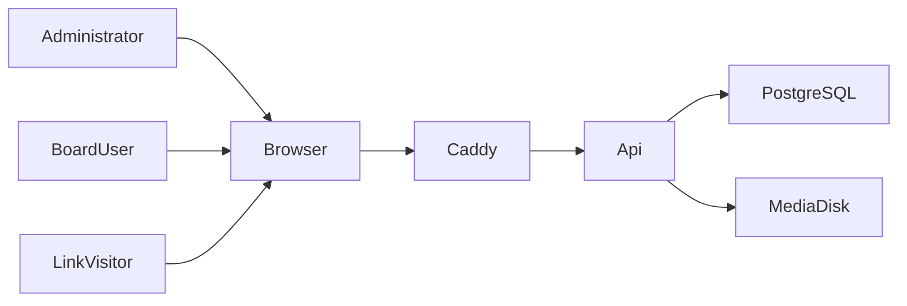
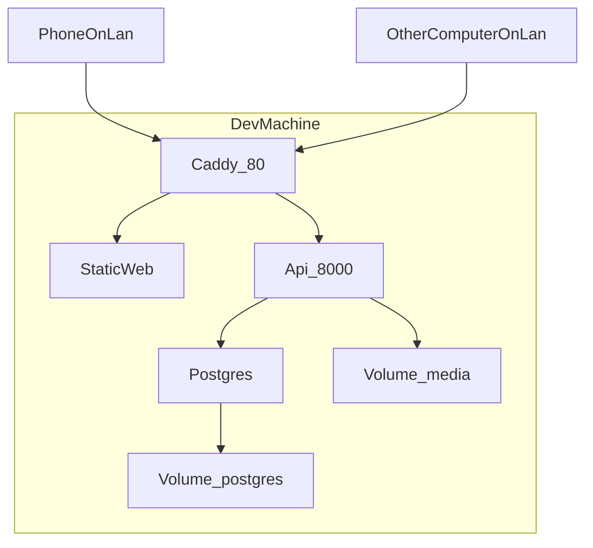
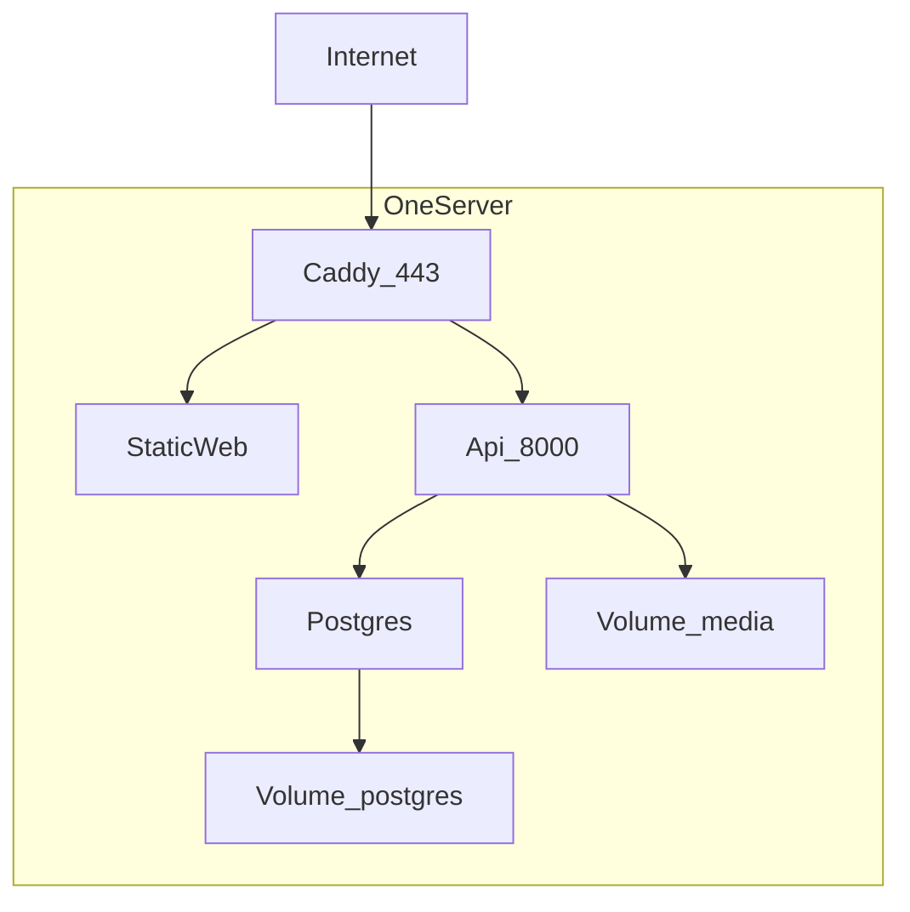

# Архитектура онлайн-доски

Документ описывает, как устроена система из [REQUIREMENTS.md](REQUIREMENTS.md). Это целевая архитектура первой версии, а не описание уже написанного кода.

## 1. Решения

| Тема | Решение |
| --- | --- |
| Где работает в разработке | Весь стек в Docker Compose на машине разработчика. Порт открыт в локальную сеть: доску проверяют с телефона и других компьютеров этой сети по адресу машины |
| Где работает дальше | Тот же Compose на одном сервере с публичным HTTPS |
| Одновременно на доске | До 10 человек |
| Клиенты | Браузер на компьютере и та же сборка в адаптивной вёрстке на телефоне. Язык интерфейса — английский |
| Интерфейс | TypeScript, React, Vite |
| Сервер | Python 3.12, FastAPI, один процесс приложения |
| Данные | PostgreSQL для учётных записей, списка досок и журнала правок. Файлы доски — на диске того же сервера |
| Совместное редактирование | Общий документ доски в формате Yjs. Сервер хранит и рассылает обновления через WebSocket |
| Вход по ссылке | Длинный случайный токен в адресе. Имя участника живёт в сессии браузера и не создаёт учётную запись |

Один процесс сервера достаточен для этой нагрузки: все соединения одной доски живут в памяти этого процесса, отдельная шина сообщений не нужна. Несколько копий API на одном сервере в эту архитектуру не входят. Когда соединений станет больше, рассылку обновлений можно вынести в Redis, не меняя документ доски.

## 2. Контекст



Три роли из требований попадают в один веб-интерфейс.

- Администратор открывает `/admin` и управляет учётными записями (ADM-01…ADM-07).
- Пользователь досок входит по почте и паролю и видит свои доски, папки и шаблоны (ACC-01…ACC-04, BRD-01…BRD-15).
- Участник по ссылке открывает `/b/{token}`, называет себя и работает на холсте (SHR-01…SHR-07). Списка чужих досок у него нет.

Caddy принимает входящий HTTP или HTTPS и отдаёт статическую сборку интерфейса. Запросы к `/api` и WebSocket к `/api/ws` он передаёт в API. В разработке это HTTP на порту, доступном в локальной сети. На публичном сервере Caddy сам получает сертификат и слушает 443.

## 3. Состав репозитория

```text
apps/web          React-приложение
apps/api          FastAPI
deploy/compose    Docker Compose, Caddyfile, переменные окружения
```

Общие контракты HTTP описаны схемами Pydantic и публикуются как OpenAPI. Типы для интерфейса генерируются из этой схемы. Сообщения WebSocket описаны рядом с серверным кодом и продублированы узким TypeScript-модулем в `apps/web`: полный общий пакет на два языка здесь не окупается.

## 4. Интерфейс

Одно приложение на React. Маршруты:

| Путь | Кто открывает | Назначение |
| --- | --- | --- |
| `/login` | Пользователь досок | Почта и пароль |
| `/` | Пользователь досок | Список досок, папки, избранное, поиск |
| `/boards/{id}` | Пользователь досок | Холст своей доски |
| `/templates` | Пользователь досок | Личные шаблоны |
| `/t/{token}` | Пользователь досок | Копия доски по ссылке «поделиться как шаблоном» |
| `/admin/login` | Администратор | Вход в панель |
| `/admin/users` | Администратор | Учётные записи |
| `/b/{token}` | Участник по ссылке | Запрос имени, затем холст |
| `/b/{token}/embed` | Внешняя страница | Та же доска во фрейме |
| `/b/{token}?object={id}` | Участник по ссылке | Холст с переходом к объекту |

Строки интерфейса написаны по-английски прямо в компонентах. Слоя перевода нет.

### Холст

Холст — это камера над бесконечной плоскостью и сцена из объектов. Камера хранит сдвиг и масштаб. Колесо мыши, клавиши и кнопки меняют камеру (CVS-02, CVS-03). На телефоне один палец двигает камеру, щипок меняет масштаб, долгое нажатие начинает выделение (MOB-02, MOB-03). Касание ладони отфильтровывается, стилус может сразу рисовать (MOB-04, MOB-05).

Объекты рисуются DOM-элементами внутри слоя с CSS-преобразованием камеры. Редактирование текста остаётся обычным полем ввода браузера: так закрываются документы, таблицы, стикеры и меню «/» без отдельного текстового движка. Для десяти участников и виджетов из требований этого достаточно. Отдельный графический движок на WebGL в первую версию не входит. Если одна доска станет тяжёлой по числу штрихов, слой рисования можно позже перенести на Canvas, не меняя документ доски.

Инструменты — модули с одним контрактом: жест на камере создаёт или меняет объект в документе. Левая панель показывает закреплённый набор и полный список (CVS-24). На узком экране панель, меню и комментарии перестраиваются (MOB-01).

Миникарта читает границы объектов и прямоугольник камеры (CVS-04). Последние сдвиг и масштаб пишутся в `localStorage` по идентификатору доски (CVS-05). Поиск по доске идёт по тексту уже загруженного документа на клиенте (CVS-08). Поиск списка досок и папок выполняет сервер (BRD-05, BRD-06).

Отмена и повтор — локальный стек Yjs UndoManager. В стек попадают только правки этого клиента, чужие правки команда Undo не откатывает (CVS-07).

### Экспорт

PNG, JPEG, SVG и PDF собирает браузер с текущего вида или с выделенных объектов и отдаёт файл на скачивание (BAK-03…BAK-05). Сервер для этого не рендерит доску. В SVG и PDF попадают фигуры, текст и изображения. Видео, аудио и iframe в статическом файле остаются ссылкой или кадром-заглушкой. Обложка из фрейма — тот же клиентский рендер, загруженный обратно как файл обложки (BRD-08).

## 5. Сервер

FastAPI отдаёт JSON по HTTP и держит WebSocket. Фоновые задачи того же процесса снимают снимки доски и сжимают журнал правок.

Модули:

| Модуль | Требования | Ответственность |
| --- | --- | --- |
| `identity` | ADM-*, ACC-* | Администратор, пользователи досок, пароли, сессии |
| `library` | BRD-* | Доски, папки, избранное, обложки, шаблоны, список |
| `sharing` | SHR-* | Токен доски, сброс ссылки, ссылка на объект, ссылка-шаблон |
| `realtime` | COL-01…COL-06, COL-09 | Приём обновлений Yjs, рассылка, присутствие, курсоры |
| `history` | COL-07, COL-08 | Снимки, восстановление доски, лента действий, корзина объектов |
| `media` | IMG-*, FIL-* | Загрузка и выдача файлов с диска |
| `backup` | BAK-01, BAK-02 | Файл резервной копии на диск пользователя и восстановление из него |

Пароли хранятся как хэш Argon2id. Сравнение идёт за постоянное время. Сессия — случайный идентификатор в cookie `HttpOnly` и `SameSite=Lax`. Флаг `Secure` включается, когда `PUBLIC_BASE_URL` начинается с `https://`. На локальной сети в разработке сайт открыт по `http://`, поэтому cookie остаётся без `Secure` и принимается браузером телефона. Срок сессии пользователя досок не ограничен, пока он не выйдет (ACC-03). Сессия участника по ссылке привязана к доске и хранит имя, которое он ввёл; cookie участника своя у каждой доски.

Первый администратор создаётся при пустой базе из переменных `ADMIN_EMAIL` и `ADMIN_PASSWORD`. Дальше учётки пользователей досок появляются только из панели.

Отключённая учётка не проходит вход. Её доски, файлы и ссылки остаются (ADM-05, ADM-06). Повторная почта отклоняется ограничением базы (ADM-07).

### Ссылка

У доски одна действующая ссылка. Токен — 32 случайных байта в URL-безопасной кодировке. Сброс записывает новый токен поверх прежнего и в той же транзакции удаляет все сессии участников этой доски, а открытые каналы участников закрываются (SHR-06). Прежние токены не хранятся, поэтому отозванный и несуществующий токен неразличимы. Отозванный адрес отвечает отказом, без проверки «существует ли доска» (SHR-05).

Участник по ссылке перед холстом вводит имя (SHR-03). Сервер кладёт имя в сессионную cookie этой доски. Учётная запись не создаётся. Дальше HTTP и WebSocket принимают эту cookie так же, как сессию владельца: создавать, менять и удалять объекты, комментировать, запускать таймер и голосование, скачивать экспорт и резервную копию (SHR-04, BAK-06).

Ссылка на объект — тот же токен плюс идентификатор объекта. Клиент после загрузки документа двигает камеру к нему (SHR-07). Ссылка «поделиться как шаблоном» ведёт на `/t/{token}` и доступна только вошедшему пользователю досок: сервер копирует снимок и файлы в новую доску этого пользователя (BRD-15). Участник без учётки по этой ссылке получает отказ.

Встраивание на внешнюю страницу открывает `/b/{token}/embed`. Этот ответ разрешает показ во фрейме. Остальные страницы фрейм запрещают (EMB-04). Токен по-прежнему нужен.

## 6. Документ доски

Содержимое холста — один документ Yjs на доску. Метаданные списка (название, папка, обложка, избранное, токен) лежат в PostgreSQL и в документ не входят.

Совместимая библиотека на сервере — `pycrdt`. Клиент использует `yjs`. Сервер не интерпретирует каждый жест: он проверяет право на доску, дописывает бинарное обновление в журнал и рассылает его остальным соединениям этой доски. Так несколько человек правят один объект, включая текст, без блокировки (COL-01).

Структура документа:

```text
objects   Y.Map   id -> объект сцены
trash     Y.Map   id -> { object, deletedAt, deletedBy }
comments  Y.Map   id -> ветка комментария
presence  не хранится в документе
timer     Y.Map   одно общее состояние таймера
votes     Y.Map   id сессии голосования -> голоса
notes     Y.XmlFragment   заметка доски
settings  Y.Map   фон и шаг сетки (CVS-06)
```

Присутствие, курсоры и режим «смотреть глазами участника» идут отдельным типом сообщения WebSocket и пропадают вместе с соединением (COL-02…COL-04, COL-09). Их нет в снимках и в резервной копии.

Объект сцены — JSON с дискриминатором `type`. Координаты дочернего объекта задаются относительно родителя. Родитель — фрейм, группа, ячейка таблицы или столбец канбана. Порядок слоёв — целое поле `z`. Типы первой версии совпадают с разделом объектов в требованиях: текст, документ, стикер, стопка стикеров, фигура, BPMN-фигура, соединитель, рисунок, лазер не сохраняется, фрейм, таблица, канбан, карточка, интеллект-карта, реакция, флип-карточка, кубик, изображение, файл, PDF, видео, аудио, iframe, карточка ссылки.

Лазерная указка — сообщение присутствия с коротким сроком жизни. В `objects` она не пишется (DRW-05).

Удаление объекта переносит его из `objects` в `trash` и добавляет запись в ленту действий. Восстановление возвращает запись из `trash` (COL-08). Комментарий хранит привязку к объекту или к точке холста, сообщения, цвет и признак «решён» (CMT-01…CMT-04). Таймер и голосование лежат в документе, поэтому опоздавший участник видит текущее состояние (COL-05, COL-06).

Заметка доски — фрагмент в том же документе. Флаг «открывать всем при входе» хранится в `notes`. Ссылка на объект в заметке — идентификатор из `objects` (NTE-01…NTE-03).

### Журнал и снимки

Каждое обновление Yjs дописывается в таблицу `board_updates` по порядку. При подключении клиент присылает свою векторную версию. Сервер отдаёт недостающие обновления либо один полный снимок состояния, если журнал уже сжат.

Пока доска активна, процесс раз в несколько минут записывает полный снимок в `board_snapshots` и отрезает вошедшие в снимок обновления. Снимки остаются, пока доска не удалена. Просмотр истории открывает выбранный снимок только для чтения. Копирование объектов из снимка вставляет их копии в живой документ. Восстановление доски заменяет живой документ содержимым снимка и пишет об этом в ленту (COL-07).

Лента действий — таблица `board_events`: кто, когда, какой тип действия, идентификаторы объектов. Имя берётся из сессии. Это источник экрана активности, а не механизм синхронизации.

## 7. Данные PostgreSQL

```text
admins
  id, email unique, password_hash, created_at

users
  id, email unique, name, password_hash, disabled, created_at

sessions
  id, subject_type, subject_id, board_id nullable, display_name nullable, expires_at nullable

folders
  id, owner_id, parent_id nullable, title, position

boards
  id, owner_id, folder_id nullable, title, cover_media_id nullable,
  share_token, share_token_revoked_at,
  template_token nullable, template_sharing_enabled,
  created_at, updated_at, deleted_at nullable

favorites
  user_id, target_type, target_id, created_at

templates
  id, owner_id, title, description, cover_media_id nullable, snapshot bytea, created_at

board_updates
  board_id, seq, update bytea, created_at

board_snapshots
  id, board_id, state bytea, created_at

board_events
  id, board_id, actor_name, event_type, payload jsonb, created_at

media
  id, board_id, storage_key, original_name, mime, byte_size, created_at
```

Удаление доски ставит `deleted_at`. Файлы и журнал удаляются вместе с окончательным удалением из панели владельца. Отключение пользователя досок доски не удаляет.

Список «недавние» — сортировка по `boards.updated_at`. Обновление метки делает сервер, когда принимает правку документа. Избранное, фильтры и поиск по названию — запросы к `boards` и `folders` владельца. Чужие строки эти запросы не возвращают.

Шаблон хранит снимок документа и ссылки на скопированные файлы. Создание доски из шаблона копирует снимок и файлы в новые идентификаторы (BRD-12…BRD-14).

## 8. Файлы

Каталог на томе Docker, корень задаётся `MEDIA_ROOT`. Ключ хранения: `{board_id}/{media_id}`. В базу пишется ключ, исходное имя, MIME и размер. Наружу файл отдаётся по `/api/media/{id}` только при сессии этой доски.

Загрузка доступна владельцу и участнику по ссылке. Сервер проверяет объявленный тип и отклоняет файл больше лимита `MAX_UPLOAD_BYTES`. Стартовое значение лимита — 100 МБ, его меняют переменной окружения. Видео и PDF попадают в тот же каталог. Проигрывание идёт с этого URL в браузере участника, который нажал play. Сервер поток по сеансам не синхронизирует (FIL-05).

Обложка доски — обычный файл `media`, на который ссылается `boards.cover_media_id`.

## 9. Резервная копия

Файл резервной копии — ZIP.

```text
manifest.json    версия формата, название, дата
board.yjs        полный снимок документа
media/           файлы, на которые ссылается документ
```

Скачивание собирает ZIP на сервере и отдаёт его в браузер (BAK-01). Восстановление принимает ZIP от пользователя досок, проверяет `manifest`, создаёт новую доску, копирует файлы в новый каталог и записывает снимок как первое состояние. Теги внутри документа переезжают вместе со снимком (BAK-02). Участник по ссылке тоже может скачать ZIP. Загрузить его обратно в список досок может только вошедший пользователь досок: у участника сессии своего списка нет.

Формат версии записан в `manifest.json`. Чужую версию сервер отклоняет с понятной ошибкой.

## 10. Каналы связи

Обычные действия списка, панели и загрузки файлов идут по HTTP JSON того же происхождения, что и страница. В разработке это `http://` адрес машины в локальной сети. На публичном сервере тот же путь идёт по HTTPS. Клиент собирает адрес WebSocket из адреса страницы, без вписанного `localhost`.

Совместная работа идёт по одному WebSocket на открытую доску. Сообщения:

| Тип | Направление | Смысл |
| --- | --- | --- |
| `sync` | клиент и сервер | Вектор версии, обновление Yjs, полный снимок |
| `awareness` | клиент и сервер | Курсор, имя, выделенные объекты, за кем следит камера, штрих лазера |
| `presence` | сервер клиентам | Кто сейчас на доске |

Сервер применяет `sync` к своей копии документа и только потом рассылает. Повреждённое обновление соединению закрывается, документ остальных клиентов не меняется.

Пока сеть клиента молчит, интерфейс показывает холст из последней загруженной копии и копит локальные правки Yjs. После восстановления сокета клиент отдаёт накопившиеся обновления и получает чужие. Это поведение библиотеки синхронизации, отдельный офлайн-режим в требованиях не описан.

## 11. Развёртывание

Сервисы Compose одни и те же: `caddy`, `web`, `api`, `postgres`. Тома: данные PostgreSQL и `MEDIA_ROOT`. Оба тома входят в резервную копию машины. Это копия установки целиком, отдельно от ZIP одной доски из раздела 9.

Переменные, без которых процесс не стартует: `PUBLIC_BASE_URL`, `SECRET_KEY`, `DATABASE_URL`, `MEDIA_ROOT`, `ADMIN_EMAIL`, `ADMIN_PASSWORD`, `MAX_UPLOAD_BYTES`. `PUBLIC_BASE_URL` — адрес, которым пользуются браузеры. Из него сервер собирает ссылки на доски. Имя `SITE_DOMAIN` нужно только публичному профилю, чтобы Caddy получил сертификат.

Обновление версии — новый образ `api` и `web`, затем миграции Alembic до приёма трафика. Миграции только вперёд.

### Разработка: локальная сеть

На этапе разработки весь стек запускается на машине разработчика. С телефона и других компьютеров той же сети открывают доску по адресу этой машины, а не по `localhost`: телефон не видит `localhost` чужого компьютера.



Caddy публикует порт 80 на всех интерфейсах машины (`0.0.0.0`). Сертификат не запрашивается: в локальной сети нет публичного имени для Let's Encrypt. `PUBLIC_BASE_URL` задаётся как `http://` плюс локальный IP машины, например `http://192.168.1.20`. Ссылки на доски, которые копируют в мессенджер и открывают на телефоне, ведут на этот адрес. Межсетевой экран машины разрешает входящие подключения на порт 80 из локальной сети.

Интерфейс в этом профиле — собранная статика за Caddy, тот же путь, что увидит публичный сервер. Так проверяются и вход, и ссылка, и адаптивная вёрстка на телефоне.

### Публичный сервер

Тот же Compose позже ставится на сервер с публичным именем. Caddy слушает 443, имя берёт из `SITE_DOMAIN` и получает сертификат Let's Encrypt. `PUBLIC_BASE_URL` в этом профиле начинается с `https://`. Наружу опубликован порт 443.



## 12. Доступ к доскам

Список досок закрыт и в локальной сети, и на публичном сервере. Открыть чужую доску можно только по действующей ссылке.

- Ссылка — единственный секрет участника без учётки. Токен не последовательный и не содержит идентификатор доски в открытом виде.
- Сброс ссылки сразу лишает старый адрес и старую сессионную cookie доступа.
- Вход в панель и вход пользователя досок ограничены по частоте попыток с одного адреса.
- Cookie сессии не читаются скриптом страницы.
- Страницы, кроме `/b/{token}/embed`, не открываются внутри чужого фрейма.
- Загрузка файла требует живой сессии конкретной доски.
- Ошибки входа и ошибки ссылки сформулированы одинаково скупо, чтобы по ним нельзя было перебирать почты и токены.

Администратор и пользователи досок входят с того же адреса, с которого открывают доски: в разработке это адрес машины в локальной сети, на публичном сервере — имя сайта. Отдельная сеть VPN для разработки не требуется.

## 13. Что сознательно отложено

В эту версию не входят вторая копия API, Redis, объектное хранилище, отдельное мобильное приложение, самостоятельная регистрация, вход через внешние аккаунты, оплата, импорт из Miro и серверный рендер доски в картинку. Документ доски и каталог файлов выбраны так, чтобы эти части можно было заменить позже, не переписывая объекты холста.
