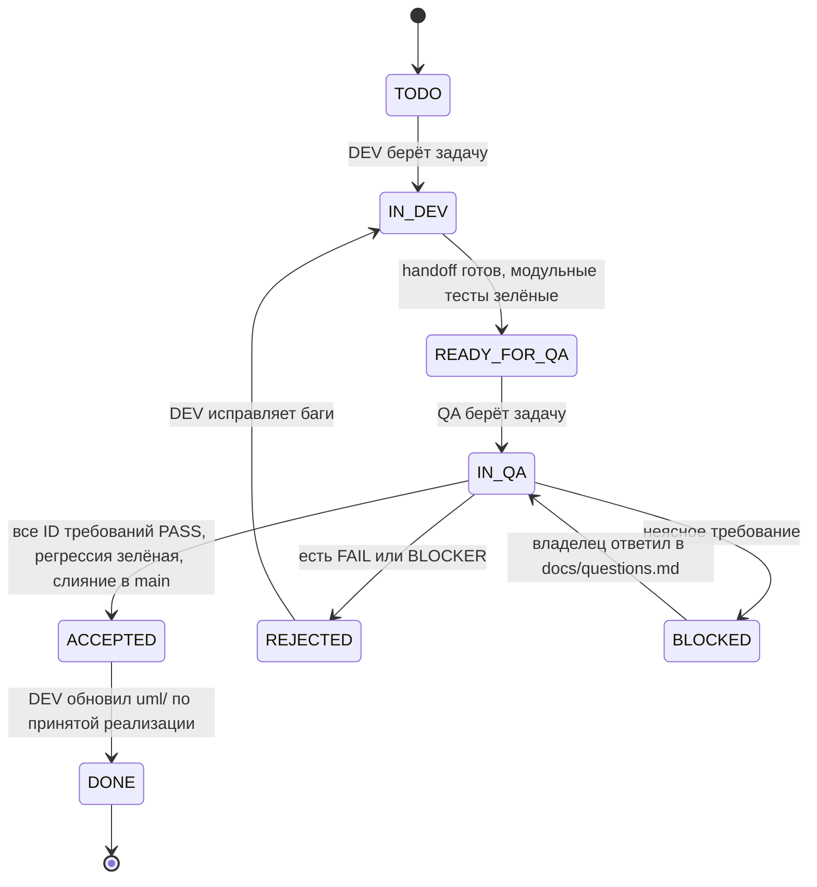

# Workflow: разработка и независимое тестирование

Документ фиксирует, как два агента — **DEV** (разработчик) и **QA** (тестировщик) — передают друг другу задачи из [PLAN.md](PLAN.md). Поведение продукта берётся только из [REQUIREMENTS.md](REQUIREMENTS.md), устройство — из [ARCHITECTURE.md](ARCHITECTURE.md). Ни один агент эти два документа не меняет: изменения в них вносит только владелец проекта (человек).

## 1. Роли и границы

| | DEV | QA |
| --- | --- | --- |
| Пишет | `apps/web`, `apps/api`, `deploy/`, модульные тесты рядом с кодом (`apps/api/tests/test_<module>.py`, `*.test.ts(x)`) и UML-схемы в `uml/` | Приёмочные тесты в `acceptance/`, отчёты и баги в `docs/tasks/` и в `docs/bugs/` |
| Не трогает | `acceptance/`, раздел «QA-отчёт» карточки задачи | Код продукта, модульные тесты DEV и `uml/` (только читает) |
| Отвечает за | Реализацию требования, зелёные модульные тесты и актуальность `uml/` | Вердикт PASS / FAIL по каждому ID требования |
| Меняет статус | `TODO → IN_DEV → READY_FOR_QA`, `REJECTED → IN_DEV`, `ACCEPTED → DONE` | `READY_FOR_QA → IN_QA → ACCEPTED` или `→ REJECTED` |

Модульные тесты DEV проверяют модуль изнутри (правила `.cursor/rules/tests.mdc`). Приёмочные тесты QA проверяют систему снаружи — только через публичные интерфейсы: HTTP, WebSocket, браузер. QA не импортирует код из `apps/` и не опирается на внутренние функции.

## 2. Правила разработки

Для DEV обязательны правила из `.cursor/rules/`:

- `development.mdc`:
  - код пишется по best practice языка (Python — PEP 8 и типизация, TypeScript — строгий режим);
  - комментарии краткие и по делу;
  - clean code и single responsibility: одна функция, компонент или модуль отвечает за одно;
  - без переусложнения: самое простое решение, закрывающее требование;
  - код читабельный;
  - при реализации функционала обновляется единая папка `uml/` (порядок — раздел 4.4).
- `tests.mdc`: модуль не готов без тестов его наблюдаемого поведения; тесты пишутся в том же изменении и прогоняются перед передачей.

Поведение продукта берётся из `REQUIREMENTS.md`, устройство — из `ARCHITECTURE.md` (см. `CLAUDE.md`). QA нарушение правил разработки фиксирует замечанием в отчёте; FAIL ставится, только если нарушено требование.

## 3. Артефакты

```text
PLAN.md                         задачи и их статусы (колонка «Статус» в сводной таблице)
docs/tasks/<TASK-ID>.md         карточка задачи: handoff от DEV + QA-отчёт
docs/bugs/BUG-<NNN>.md          дефект, найденный QA
docs/questions.md               неясности в требованиях, на которые отвечает владелец
docs/qa/traceability.md         матрица «ID требования → приёмочный тест → вердикт»
acceptance/api/test_<area>.py   pytest + httpx + websockets против запущенного стека
acceptance/e2e/<area>.spec.ts   Playwright: профили desktop и mobile (ширина телефона, touch)
uml/                            UML-схемы принятой реализации (правила — uml/README.md)
```

Ветки git:

- `dev/<TASK-ID>` — код и модульные тесты DEV.
- `qa/<TASK-ID>` — приёмочные тесты QA, ответвляется от `main`, а не от ветки DEV.
- `uml/<TASK-ID>` — обновление схем DEV после приёмки, ответвляется от `main` после слияния задачи.
- Код попадает в `main` только после вердикта PASS: QA сливает `dev/<TASK-ID>` и `qa/<TASK-ID>` и ставит `ACCEPTED`. Затем DEV сливает `uml/<TASK-ID>` и ставит `DONE`.

## 4. Жизненный цикл задачи



### 4.1. DEV: от TODO до READY_FOR_QA

1. Берёт первую задачу в `TODO`, у которой все зависимости в `DONE`. Ставит `IN_DEV` в `PLAN.md`.
2. Создаёт ветку `dev/<TASK-ID>` от `main`.
3. Реализует пункты блока «Разработка» задачи. В коде указывает ID закрываемых требований.
4. Пишет модульные тесты в том же изменении и прогоняет тесты затронутых модулей.
5. Поднимает стек `docker compose` с нуля (пустые тома) и сам проходит сценарии блока «Тестирование» хотя бы вручную — smoke-проверка перед передачей.
6. Заполняет раздел «Handoff» в `docs/tasks/<TASK-ID>.md` (шаблон ниже) и ставит `READY_FOR_QA`.

**Definition of Ready for QA** — без этого QA возвращает задачу, не начиная проверку:

- ветка собирается, стек поднимается командой из handoff на пустых томах;
- модульные тесты затронутых модулей зелёные, вывод приложен;
- каждое требование из задачи перечислено в handoff с пометкой «реализовано» или «не реализовано, причина»;
- указаны новые маршруты, эндпоинты, сообщения WebSocket и способ подготовить данные (например, как создать пользователя).

### 4.2. QA: независимая проверка

Порядок важен: сценарии проектируются **до** чтения handoff и кода, чтобы реализация не подсказала, что проверять.

1. Берёт задачу `READY_FOR_QA`, ставит `IN_QA`.
2. **Проектирование от требований.** Читает только формулировки требований из `REQUIREMENTS.md` и контекст из `ARCHITECTURE.md`. Для каждого ID выписывает в карточку сценарии: позитивный, негативный, граничный. Отдельно — роль: пользователь досок, участник по ссылке, администратор, посторонний без доступа.
3. **Подготовка окружения.** Чистый checkout `dev/<TASK-ID>`, `docker compose down -v && docker compose up --build`, переменные из `deploy/compose/.env.example`. Ничего из локального состояния DEV не переиспользуется.
4. **Чтение handoff.** Только теперь — чтобы узнать маршруты и способ подготовки данных. Если handoff расходится с требованием, прав текст требования.
5. **Автоматизация.** Пишет приёмочные тесты в ветке `qa/<TASK-ID>`: имя теста содержит ID требования (`test_shr06_reset_revokes_old_link`, `test('CVS-12 shift constrains drag to axis')`). Где автоматизация неоправданно дорога (жесты ладонью, стилус, воспроизведение видео), QA проводит ручную проверку через браузер и фиксирует шаги и скриншоты в отчёте.
6. **Прогон.** Новые тесты + весь набор `acceptance/` (регрессия) + модульные тесты DEV (проверка, что они действительно зелёные).
7. **Сверка модульных тестов DEV.** QA читает их и отмечает в отчёте требования, поведение которых модульные тесты не покрывают. Это замечание, а не FAIL.
8. **Вердикт** по каждому ID: `PASS`, `FAIL` (с BUG-номером) или `BLOCKED` (с вопросом в `docs/questions.md`). Обновляет `docs/qa/traceability.md`.
9. **Итог.**
   - Все ID `PASS` и регрессия зелёная → QA сливает `dev/<TASK-ID>` и `qa/<TASK-ID>` в `main`, ставит `ACCEPTED`.
   - Хотя бы один `FAIL` → `REJECTED`, баги заведены.
   - Только `BLOCKED` → `BLOCKED` до ответа владельца.

### 4.3. Возврат и повторная проверка

- DEV исправляет баги в той же ветке `dev/<TASK-ID>`, для каждого бага добавляет модульный тест, воспроизводящий дефект, и дописывает в handoff раздел «Исправления» со ссылками на BUG.
- QA при повторной проверке прогоняет **все** сценарии задачи и регрессию, а не только исправленные.
- Приёмочный тест, упавший из-за бага, остаётся в наборе навсегда.
- Если DEV считает, что приёмочный тест проверяет не то, что написано в требовании, он пишет это в баге. Спор решает владелец через `docs/questions.md`; ни один агент не правит чужие файлы, чтобы «пройти».

### 4.4. DEV: от ACCEPTED до DONE — обновление UML

Схемы в `uml/` описывают только принятую и протестированную реализацию, поэтому обновляются после вердикта PASS, а не во время разработки: код, вернувшийся на доработку, в схемы не попадает.

1. DEV создаёт ветку `uml/<TASK-ID>` от `main`, в котором уже лежит принятый код.
2. Обновляет схемы по фактическому коду из `main`, а не по плану задачи и не по `ARCHITECTURE.md`: какие диаграммы затрагивает задача — по таблице в `uml/README.md`.
3. Если реализация разошлась с `ARCHITECTURE.md`, схема отражает код, а расхождение DEV записывает вопросом в `docs/questions.md` для владельца.
4. В ветке меняется только `uml/`; код продукта и тесты не трогаются. Нужна правка кода — это новая задача или баг.
5. DEV дописывает в карточку раздел «UML» со списком изменённых схем, сливает ветку в `main` и ставит `DONE`.

## 5. Правила независимости

- QA не принимает объяснения из handoff вместо проверки поведения: «так задумано» не довод, если требование говорит иное.
- QA не смотрит модульные тесты DEV на шаге проектирования сценариев.
- QA проверяет каждую задачу минимум в двух ролях, если требование касается доступа (владелец и участник по ссылке; для закрытых ресурсов — ещё и посторонний).
- Для совместной работы (COL-*, SHR-04, realtime) QA открывает минимум два независимых клиента (два контекста браузера или два WebSocket-клиента) и проверяет, что правка одного видна другому.
- Для мобильных требований (MOB-*) — профиль Playwright с шириной телефона и touch-событиями; итоговая проверка каждой фазы — с реального телефона в локальной сети по `PUBLIC_BASE_URL`.
- Адреса в тестах берутся из `PUBLIC_BASE_URL`, `localhost` в приёмочных тестах не вписывается.
- Если требование допускает два толкования, QA не выбирает удобное: задача `BLOCKED`, вопрос в `docs/questions.md`.

## 6. Шаблоны

### 6.1. Карточка задачи `docs/tasks/<TASK-ID>.md`

```markdown
# <TASK-ID> · <название>

Требования: <ID, ID, …>
Ветки: dev/<TASK-ID>, qa/<TASK-ID>

## Handoff (DEV)

Коммит: <sha>
Запуск: <команды>
Подготовка данных: <как создать пользователя/доску/ссылку>

| Требование | Статус | Где смотреть (маршрут, эндпоинт, сообщение WS) |
| --- | --- | --- |
| SHR-06 | реализовано | POST /api/boards/{id}/share/reset, кнопка Reset link в Share |

Модульные тесты: <команда и итог прогона>
Известные ограничения: <что не сделано и почему>

### Исправления
- BUG-012: <что изменено>, тест <имя>

## QA-отчёт

Проверенный коммит: <sha>
Сценарии (составлены до чтения handoff):

| Требование | Сценарий | Тип | Вердикт | Тест / доказательство |
| --- | --- | --- | --- | --- |
| SHR-06 | После сброса старый токен отвечает отказом | авто | PASS | acceptance/api/test_sharing.py::test_shr06_… |

Регрессия: <итог прогона acceptance/>
Замечания к модульным тестам DEV: <непокрытое поведение>
Итог: ACCEPTED | REJECTED | BLOCKED

## UML (DEV, после приёмки)

Коммит: <sha>
Изменённые схемы: <uml/…> — <что изменилось>
Расхождения с ARCHITECTURE.md: <нет | Q-NNN>
```

### 6.2. Баг `docs/bugs/BUG-<NNN>.md`

```markdown
# BUG-<NNN> · <кратко>

Задача: <TASK-ID>   Требование: <ID>   Серьёзность: blocker | major | minor
Коммит: <sha>   Окружение: desktop Chrome | mobile профиль | телефон в LAN

Шаги:
1. …
Ожидалось (цитата требования): …
Фактически: …
Доказательство: <тест, лог, скриншот>
```

Серьёзность: **blocker** — требование не выполняется или нарушен доступ/безопасность; **major** — требование выполняется частично; **minor** — отклонение, не мешающее требованию (вёрстка, текст). Задача с открытым blocker или major не получает `DONE`; minor допускается, если владелец согласен, и остаётся в `docs/bugs/`.

### 6.3. Вопрос `docs/questions.md`

```markdown
## Q-<NNN> · <TASK-ID> · <ID требования>
Формулировка: <цитата>
Неясность: <варианты толкования>
Предложение QA: <вариант>
Ответ владельца: <пусто до ответа>
```

## 7. Синхронизация агентов

- Единственный источник статуса — сводная таблица в `PLAN.md`. Агент меняет статус отдельным коммитом в `main` с сообщением `Статус <TASK-ID>: <старый> → <новый>`.
- Зависимость задачи считается выполненной, когда она в `ACCEPTED` или `DONE`: код уже в `main`.
- DEV может вести следующую задачу, пока предыдущая в `IN_QA`, если она не зависит от непроверенной. Приоритет DEV: исправление `REJECTED`, затем обновление UML задач в `ACCEPTED`, затем новая задача.
- QA может заранее писать сценарии и тесты для задачи в `IN_DEV` — только по требованиям, без доступа к ветке DEV.
- Закрытие фазы: когда все задачи фазы в `DONE` (включая UML), QA делает полный регрессионный прогон на `main` плюс ручную проверку с телефона в локальной сети и отмечает фазу закрытой в `PLAN.md`.
