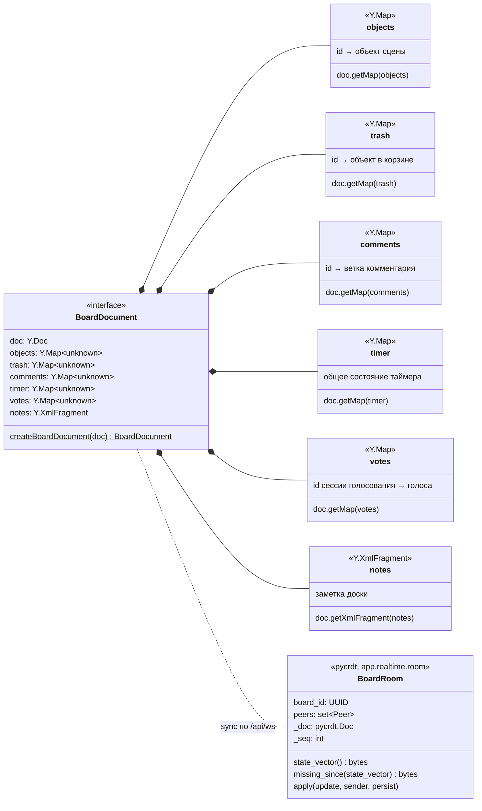

# Документ доски Yjs

Содержимое доски — документ Yjs: в клиенте `yjs` (`apps/web/src/realtime/boardDocument.ts`), на сервере `pycrdt` (`app.realtime.room.BoardRoom._doc`). Сервер документ не интерпретирует: применяет обновления к своей копии и пересылает их; корни документа создаёт клиент. Метаданные списка (название, папка, ссылка, избранное) хранятся в PostgreSQL и в документ не входят; присутствие и курсоры — тоже.

- Объявлены только корни верхнего уровня. Значения пока не типизированы (`unknown`): типы объектов сцены (`type`, `z`, координаты относительно родителя) появятся в T5.*, формат корзины — в T4.3, комментарии — T6.10, таймер и голосование — T8.1, заметки — T6.12.
- Интерфейс пока не пишет в документ (холста нет); документ создаётся заново на каждую открытую доску (`useBoardConnection`) и наполняется из `STEP2` сервера.
- Присутствие (курсоры, вид камеры, слежение, список участников — T4.2) в документ не входит: оно идёт сообщениями `awareness`/`presence` и живёт только в памяти соединений ([ws-protocol.md](ws-protocol.md)).
- Серверная копия собирается из всех строк `board_updates` при первом подключении к доске и выгружается, когда уходит последнее соединение (`Hub.join` / `Hub.leave`), — см. [data-model.md](data-model.md), [sequences/sync.md](sequences/sync.md).

Актуально на: T4.2, 1e65608. Требования: COL-01, COL-02…COL-04, COL-09 (вне документа); ARCHITECTURE.md, раздел 6 (структура документа).
