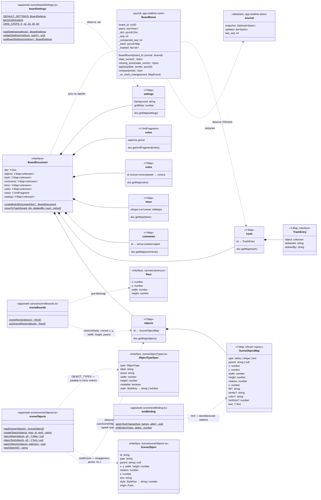

# Документ доски Yjs

Содержимое доски — документ Yjs: в клиенте `yjs` (`apps/web/src/realtime/boardDocument.ts`), на сервере `pycrdt` (`app.realtime.room.BoardRoom._doc`). Сервер документ не интерпретирует: применяет обновления к своей копии и пересылает их; корни документа создаёт клиент. Метаданные списка (название, папка, ссылка, избранное) хранятся в PostgreSQL и в документ не входят; присутствие и курсоры — тоже.

- Корни объявлены в `BoardDocument` как `unknown`; поля объекта сцены разбирает модуль `scene` (T5.2). Объект в `objects` — `Y.Map`, каждое поле — свой ключ, чтобы одновременные правки разных полей не затирали друг друга (COL-01): `type` — `sticky` | `shape` | `text` (`OBJECT_TYPES` в `scene/objectTypes.ts`; другие типы — T6.*, T7.*), `parent` (`null` — верхний уровень; `x`, `y` дочернего — относительно родителя, `readScene` прибавляет позиции предков, цикл и потерянный родитель дают 0), `width`, `height`, `rotation` (градусы вокруг центра, по умолчанию 0), `z` (целое; новый — `topZ` = наибольший `z` + 1), оформление по типу (`sticky` — `fill`; `shape` — `fill`, `stroke`; `text` — `color`, `fontSize`), `text` — `Y.Text` (правки сливаются по символам: `applyTextChange` меняет только изменившуюся середину, `shiftIndex` держит курсор при чужой правке).
- Id объекта — 32 hex-символа из `crypto.getRandomValues` (16 байт; `randomUUID` без HTTPS недоступен). `createObject` ставит объект верхнего уровня одной транзакцией (CVS-09). `patchObjects` пишет рамку и оформление нескольких объектов одной транзакцией (CVS-11, CVS-12, CVS-14), переводя `x`, `y` доски в координаты относительно родителя. Запись-JSON (как в тестах T5.1) читается так же и при первой правке заменяется `Y.Map` (`objectMap`, строка `text` → `Y.Text`). Неверные записи (нет `type` или числовой рамки) `readScene` пропускает.
- Корень `settings` (CVS-06, ответ на Q-002): `background` — `#rrggbb` (`BACKGROUNDS`: Light gray `#fafafa` по умолчанию, White, Cream, Mint, Sky, Dark), `gridStep` — шаг сетки в единицах доски (0 — без сетки и прилипания, по умолчанию 20). Неверные значения читаются как значения по умолчанию. Общий для всех участников, входит в снимки (`test_cvs06_board_settings_root_survives_compaction_and_restart`).
- Миникарта (T5.1, CVS-04) по-прежнему читает `objects` через `sceneRects` (верхний уровень, рамка без поворота). Комментарии — T6.10, таймер и голосование — T8.1, заметки — T6.12.
- Корзина (T4.3, основа COL-08): `moveToTrash(board, ids, deletedBy)` одной транзакцией Yjs для каждого известного id кладёт в `trash[id]` `Y.Map { object: копия объекта (вложенный общий тип — `clone()`), deletedAt: ISO 8601, deletedBy: имя }` и удаляет ключ из `objects`; неизвестные id пропускаются. Восстановления из корзины пока нет (T8.2). Жизненный цикл — [states/board-object.md](states/board-object.md).
- Сервер не разбирает объекты, но подписан на корень `trash` своей копии (`_on_trash_change`): ключи с действием `add`/`update` в принятом обновлении попадают в `JournalEntry.trashed`, и `store.append` пишет запись `board_events` `objects_deleted` с именем из сессии соединения ([data-model.md](data-model.md)). Подписка ставится после загрузки, поэтому состояние из снимка/журнала записей не порождает.
- Интерфейс пишет в `objects`, `settings` и `trash`: создание, правки и удаление (`moveToTrash` с именем своего участника, CVS-21) — [states/board-object.md](states/board-object.md). Выделение, инструмент, черновик рамки/лассо и меню — состояние вкладки, в документ не входят. Документ создаётся заново на каждую открытую доску (`useBoardConnection`) и наполняется из `STEP2` сервера.
- Присутствие (курсоры, вид камеры, слежение, список участников — T4.2) в документ не входит; запомненный вид камеры (CVS-05) хранится в `localStorage` браузера, а не в документе: оно идёт сообщениями `awareness`/`presence` и живёт только в памяти соединений ([ws-protocol.md](ws-protocol.md)).
- Серверная копия собирается из последнего снимка `board_snapshots` и хвоста `board_updates` при первом подключении к доске (`Hub.join` → `store.load_journal` → `BoardRoom(board_id, journal)`) и выгружается, когда уходит последнее соединение (`Hub.leave`, с этим — сжатие журнала). Снимок — полное состояние `Doc.get_update()`; присутствия в нём нет. См. [data-model.md](data-model.md), [sequences/sync.md](sequences/sync.md).

Актуально на: T5.2, b5342f6. Требования: CVS-06 (`settings`), CVS-09…CVS-14, CVS-21 (объекты сцены, их запись и удаление), COL-01, COL-07 и COL-08 (основа: снимки, корзина), CVS-04 (чтение `objects` миникартой), COL-02…COL-04, COL-09, CVS-05 (вне документа); ARCHITECTURE.md, раздел 6 (структура документа, корзина).
