# Документ доски Yjs

Содержимое доски — документ Yjs: в клиенте `yjs` (`apps/web/src/realtime/boardDocument.ts`), на сервере `pycrdt` (`app.realtime.room.BoardRoom._doc`). Сервер документ не интерпретирует: применяет обновления к своей копии и пересылает их; корни документа создаёт клиент. Метаданные списка (название, папка, ссылка, избранное) хранятся в PostgreSQL и в документ не входят; присутствие и курсоры — тоже.

```mermaid
classDiagram
  direction LR
  class BoardDocument {
    <<interface>>
    createBoardDocument(doc) BoardDocument$
    moveToTrash(board, ids, deletedBy, now) string[]$
    doc: Y.Doc
    objects: Y.Map~unknown~
    trash: Y.Map~unknown~
    comments: Y.Map~unknown~
    timer: Y.Map~unknown~
    votes: Y.Map~unknown~
    notes: Y.XmlFragment
    settings: Y.Map~unknown~
  }
  class objects {
    <<Y.Map>>
    doc.getMap(objects)
    id → SceneObjectMap
  }
  class SceneObjectMap {
    <<Y.Map, объект сцены>>
    type: sticky | shape | text | group
    parent: string | null
    x: number
    y: number
    width: number
    height: number
    rotation: number
    z: number
    fill?: string
    stroke?: string
    color?: string
    fontSize?: number
    text: Y.Text
    tags?: Y.Array~string~
    locked?: true
    createdBy?: string
    createdAt?: string
    updatedBy?: string
    updatedAt?: string
  }
  class settings {
    <<Y.Map>>
    doc.getMap(settings)
    background: string
    gridStep: number
  }
  class trash {
    <<Y.Map>>
    doc.getMap(trash)
    id → TrashEntry
  }
  class TrashEntry {
    <<Y.Map, interface>>
    object: unknown
    deletedAt: string
    deletedBy: string
  }
  class comments {
    <<Y.Map>>
    doc.getMap(comments)
    id → ветка комментария
  }
  class timer {
    <<Y.Map>>
    doc.getMap(timer)
    общее состояние таймера
  }
  class votes {
    <<Y.Map>>
    doc.getMap(votes)
    id сессии голосования → голоса
  }
  class notes {
    <<Y.XmlFragment>>
    doc.getXmlFragment(notes)
    заметка доски
  }
  class BoardRoom {
    <<pycrdt, app.realtime.room>>
    board_id: UUID
    peers: set~Peer~
    _doc: pycrdt.Doc
    _seq: int
    _compacted_seq: int
    _trash: pycrdt.Map
    _trashed: list~str~
    BoardRoom(board_id, journal: Journal)
    state_vector() bytes
    missing_since(state_vector) bytes
    apply(update, sender, persist)
    compact(write) bool
    _on_trash_change(event: MapEvent)
  }
  class Journal {
    <<dataclass, app.realtime.store>>
    snapshot: Optional~bytes~
    updates: list~bytes~
    last_seq: int
  }
  BoardDocument *-- objects
  BoardDocument *-- trash
  BoardDocument *-- comments
  BoardDocument *-- timer
  BoardDocument *-- votes
  BoardDocument *-- notes
  BoardDocument *-- settings
  objects *-- SceneObjectMap
  trash *-- TrashEntry
  BoardRoom ..> Journal : загрузка
  BoardRoom ..> trash : observe (TRASH)
  BoardDocument .. BoardRoom : sync по /api/ws
  class sceneBounds {
    <<apps/web canvas/sceneBounds.ts>>
    sceneRects(objects) Rect[]$
    useSceneRects(objects) Rect[]$
  }
  class Rect {
    <<interface, canvas/camera.ts>>
    x: number
    y: number
    width: number
    height: number
  }
  sceneBounds ..> objects : observeDeep, чтение x, y, width, height, parent
  sceneBounds ..> Rect : для Minimap
  class sceneObjects {
    <<apps/web scene/sceneObjects.ts>>
    readScene(objects) SceneObject[]$
    createObject(objects, type, at, text, actor) string$
    objectMap(objects, id) Y.Map | null$
    objectText(objects, id) Y.Text | null$
    patchObjects(objects, patches, actor) void$
    writeFields(objects, changes, actor) void$
    transact(objects, write) void$
    topZ(objects) number$
    creationMeta(actor, now) ObjectMeta$
    touch(map, actor, now) void$
    newObjectId() string$
  }
  class SceneObject {
    <<interface, scene/sceneObjects.ts>>
    id: string
    type: string
    parent: string | null
    x, y, width, height: number
    rotation: number
    z: number
    text: string
    tags: string[]
    style: StyleKey → string | number
    origin: Point
    offset: Point
    locked: boolean
    meta: ObjectMeta
  }
  class ObjectMeta {
    <<interface, scene/sceneObjects.ts>>
    createdBy?: string
    createdAt?: string
    updatedBy?: string
    updatedAt?: string
  }
  class groups {
    <<apps/web scene/groups.ts>>
    ancestors(scene, id) SceneObject[]$
    withDescendants(scene, ids) SceneObject[]$
    topmost(scene, ids) SceneObject[]$
    selectionTarget(scene, leafId, selection) string$
    enterGroup(scene, leafId, selection) string | null$
    canGroup(units) boolean$
    groupObjects(objects, scene, units, actor) string | null$
    ungroupObjects(objects, scene, groups, actor) string[]$
    removalSet(scene, ids) string[]$
  }
  class layers {
    <<apps/web scene/layers.ts>>
    LayerOp: front | forward | backward | back
    reorder(siblings, selected, op) T[]$
    renumber(order) Map$
  }
  class lock {
    <<apps/web scene/lock.ts>>
    setLocked(objects, ids, locked, actor) void$
    unlockAll(objects, actor) void$
    lockedIds(objects) string[]$
  }
  class clipboard {
    <<apps/web scene/clipboard.ts>>
    CLIPBOARD_MIME = application/x-myboard-objects$
    DUPLICATE_OFFSET = 20$
    copyObjects(objects, scene, ids) Clip | null$
    pasteObjects(objects, clip, place, actor) string[]$
    parseClip(text) Clip | null$
    clipText(clip) string$
    loadClip() Clip | null$
    saveClip(clip) void$
  }
  class Clip {
    <<interface, localStorage myboard.clipboard>>
    format: myboard/objects
    objects: ClipObject[]
    bounds: Rect
  }
  class ClipObject {
    <<interface>>
    id: string
    parent: string | null
    fields: поля объекта без parent, locked, автора и дат
  }
  class ObjectTypeSpec {
    <<interface, scene/objectTypes.ts>>
    type: ObjectType
    label: string
    plural: string
    width: number
    height: number
    rotatable: boolean
    style: StyleKey → string | number
  }
  class boardSettings {
    <<apps/web scene/boardSettings.ts>>
    DEFAULT_SETTINGS: BoardSettings$
    BACKGROUNDS$
    GRID_STEPS: 0, 10, 20, 40, 80$
    readSettings(settings) BoardSettings$
    updateSettings(settings, patch) void$
    useBoardSettings(settings) BoardSettings$
  }
  class search {
    <<apps/web scene/search.ts>>
    searchScene(scene, query) SearchHit[]$
  }
  class SearchHit {
    <<interface, scene/search.ts>>
    object: SceneObject
    snippet: string
    tags: string[]
  }
  class textBinding {
    <<apps/web scene/textBinding.ts>>
    applyTextChange(text, before, after) void$
    shiftIndex(index, delta) number$
  }
  sceneObjects ..> objects : observeDeep (useSceneObjects), запись одной транзакцией
  sceneObjects ..> SceneObject : readScene — координаты доски, по z
  sceneObjects ..> ObjectTypeSpec : OBJECT_TYPES — размер и стиль нового
  boardSettings ..> settings : observe, set
  textBinding ..> SceneObjectMap : text — минимальная замена
  SceneObject *-- ObjectMeta
  sceneObjects ..> ObjectMeta : creationMeta, touch — createdBy/At, updatedBy/At
  groups ..> objects : group, parent, x, y, z — одной транзакцией
  groups ..> layers : renumber при разгруппировке
  layers ..> SceneObjectMap : z среди соседей одного parent
  lock ..> SceneObjectMap : locked через writeFields
  clipboard ..> Clip
  Clip *-- ClipObject
  clipboard ..> objects : чтение копии, вставка новыми id
  search ..> SceneObject : text, tags — без записи в документ
  search ..> SearchHit
  SearchHit --> SceneObject
```

- Корни объявлены в `BoardDocument` как `unknown`; поля объекта сцены разбирает модуль `scene` (T5.2). Объект в `objects` — `Y.Map`, каждое поле — свой ключ, чтобы одновременные правки разных полей не затирали друг друга (COL-01): `type` — `sticky` | `shape` | `text` (`OBJECT_TYPES` в `scene/objectTypes.ts`) или `group` (`GROUP_TYPE`, T5.3; другие типы — T6.*, T7.*), `parent` (`null` — верхний уровень; `x`, `y` дочернего — относительно родителя, `readScene` прибавляет позиции предков, цикл и потерянный родитель дают 0), `width`, `height`, `rotation` (градусы вокруг центра, по умолчанию 0), `z` (целое; новый — `topZ` = наибольший `z` + 1, учитываются и записи-JSON, BUG-008), оформление по типу (`sticky` — `fill`; `shape` — `fill`, `stroke`; `text` — `color`, `fontSize`), `text` — `Y.Text` (правки сливаются по символам: `applyTextChange` меняет только изменившуюся середину, `shiftIndex` держит курсор при чужой правке).
- Id объекта — 32 hex-символа из `crypto.getRandomValues` (16 байт; `randomUUID` без HTTPS недоступен). `createObject` ставит объект верхнего уровня одной транзакцией (CVS-09). `patchObjects` пишет рамку и оформление нескольких объектов одной транзакцией (CVS-11, CVS-12, CVS-14), переводя `x`, `y` доски в координаты относительно родителя. Запись-JSON (как в тестах T5.1) читается так же и при первой правке заменяется `Y.Map` (`objectMap`, строка `text` → `Y.Text`). Неверные записи (нет `type` или числовой рамки) `readScene` пропускает.
- Группа (T5.3, CVS-17): `type: "group"`, `parent`, `x`, `y` — начало координат её объектов, `z` — среди соседей, `rotation: 0`, `width`/`height` — только на момент создания: рамку группы `readScene` считает по её объектам (`SceneObject.offset` — сдвиг рамки от записанного положения), пустая группа не рисуется. Объекты группы — `parent: <id группы>`, `x`, `y` относительно группы, `z` — порядок среди объектов группы (`readScene` отдаёт группу перед её объектами, соседей — по `z`, при равенстве по id). `groupObjects` ставит группу на `z` верхнего из объединяемых и нумерует объекты 1…n; `ungroupObjects` переносит объекты к родителю группы на её место в порядке слоёв (`renumber`) и удаляет группу. Группировать можно 2+ незаблокированных объекта одного родителя (`canGroup`).
- Порядок слоёв (CVS-18): `reorder` переставляет соседей одного `parent` (front/forward/backward/back), `renumber` подбирает целые `z` с наименьшим числом изменённых объектов; запись — `writeFields` одной транзакцией.
- Блокировка (CVS-19): `locked: true` у самого объекта; `SceneObject.locked` истинно и у объектов внутри заблокированной группы. `setLocked`, `unlockAll` (все ключи с `locked: true`) пишут через `writeFields`. Заблокированные объекты команды и жесты не меняют и не удаляют (`removalSet` оставляет группу с заблокированным объектом целиком).
- Теги (T5.5, CVS-08): необязательное поле `tags` объекта — `Y.Array<string>` (запись-JSON — массив строк), тег без «#». `readScene` (`readTags`) берёт только строки, обрезает пробелы, отбрасывает пустые и повторы; нет поля или не массив — `[]`. Интерфейс тегов пока не пишет (STK-03 — T6.2, KBN-02 — T6.8). `searchScene` читает `text` и `tags` из `SceneObject` и в документ не пишет; ссылка на объект (SHR-07) — id ключа в `objects`, в документ тоже не входит.
- Автор и даты (CVS-22): `createdBy`, `createdAt`, `updatedBy`, `updatedAt` — имя участника (`BoardScene.userName`: имя `Peer` из присутствия, до него — имя из сессии страницы) и ISO 8601. Создание (`createObject`, `groupObjects`, `pasteObjects`) пишет все четыре (`creationMeta`), любая правка — `updatedBy`/`updatedAt` (`touch` в `writeFields`/`patchObjects`, в транзакции правки текста `TextEditor.onEdit`, в `groupObjects`/`ungroupObjects`). У объектов, записанных до T5.3, полей нет. Пишет их клиент — сервер документ не разбирает.
- Буфер обмена (CVS-20): `copyObjects` берёт выделенные корни (`topmost`) с вложенными; корни — в координатах доски, вложенные — относительно родителя, без `parent`, `locked`, автора и дат. Копия — JSON `Clip` в системном буфере (тип `CLIPBOARD_MIME` + простой текст) и в `localStorage` `myboard.clipboard` — оттуда её вставляет другая доска того же браузера. `pasteObjects` создаёт объекты с новыми id одной транзакцией: корни — поверх остальных (`topZ`), центром в точку вставки с углом на сетке, дубликат (`DUPLICATE_OFFSET`) — со сдвигом 20 в той же группе; `text` — `Y.Text`, автор — вставивший, без блокировки. `parseClip` отвергает чужой формат, берёт не больше 5000 объектов. Вырезание — копия + `moveToTrash`.
- Корень `settings` (CVS-06, ответ на Q-002): `background` — `#rrggbb` (`BACKGROUNDS`: Light gray `#fafafa` по умолчанию, White, Cream, Mint, Sky, Dark), `gridStep` — шаг сетки в единицах доски (0 — без сетки и прилипания, по умолчанию 20). Неверные значения читаются как значения по умолчанию. Общий для всех участников, входит в снимки (`test_cvs06_board_settings_root_survives_compaction_and_restart`).
- Миникарта (T5.1, CVS-04) читает `objects` через `sceneRects` = `readScene` → объекты верхнего уровня (рамка группы — по её объектам, без поворота). Комментарии — T6.10, таймер и голосование — T8.1, заметки — T6.12.
- Корзина (T4.3, основа COL-08): `moveToTrash(board, ids, deletedBy)` одной транзакцией Yjs для каждого известного id кладёт в `trash[id]` `Y.Map { object: копия объекта (вложенный общий тип — `clone()`), deletedAt: ISO 8601, deletedBy: имя }` и удаляет ключ из `objects`; неизвестные id пропускаются. Восстановления из корзины пока нет (T8.2). Жизненный цикл — [states/board-object.md](states/board-object.md).
- Сервер не разбирает объекты, но подписан на корень `trash` своей копии (`_on_trash_change`): ключи с действием `add`/`update` в принятом обновлении попадают в `JournalEntry.trashed`, и `store.append` пишет запись `board_events` `objects_deleted` с именем из сессии соединения ([data-model.md](data-model.md)). Подписка ставится после загрузки, поэтому состояние из снимка/журнала записей не порождает.
- Интерфейс пишет в `objects`, `settings` и `trash`: создание, правки, группы, порядок слоёв, блокировку, вставку и удаление (`moveToTrash` с именем своего участника, CVS-21; вместе с выбранным — вложенные объекты и опустевшие группы, `removalSet`) — [states/board-object.md](states/board-object.md). Выделение, инструмент, черновик рамки/лассо и меню — состояние вкладки, в документ не входят. Документ создаётся заново на каждую открытую доску (`useBoardConnection`) и наполняется из `STEP2` сервера.
- Отмена и повтор (T5.4, CVS-07): `UndoHistory` (`scene/undoHistory.ts`) держит `Y.UndoManager` над корнями `objects`, `trash` и `settings` и записывает только локальные транзакции (origin `null`); обновления других участников он не отменяет. Отмена — обычная транзакция Yjs: структура документа и поля объектов не меняются, новых корней нет. Стек отмены в документ, снимки и резервные копии не входит.
- Присутствие (курсоры, вид камеры, слежение, список участников — T4.2) в документ не входит; запомненный вид камеры (CVS-05) хранится в `localStorage` браузера, а не в документе: оно идёт сообщениями `awareness`/`presence` и живёт только в памяти соединений ([ws-protocol.md](ws-protocol.md)).
- Серверная копия собирается из последнего снимка `board_snapshots` и хвоста `board_updates` при первом подключении к доске (`Hub.join` → `store.load_journal` → `BoardRoom(board_id, journal)`) и выгружается, когда уходит последнее соединение (`Hub.leave`, с этим — сжатие журнала). Снимок — полное состояние `Doc.get_update()`; присутствия в нём нет. См. [data-model.md](data-model.md), [sequences/sync.md](sequences/sync.md).

Актуально на: T5.5, 044e3c2 (поле `tags`, поиск; область отмены — T5.4, e2d1150; `topZ` с записями-JSON — T5.6, 298b639, BUG-008; поля объектов — T5.3, 1c15594). Требования: CVS-06 (`settings`), CVS-07 (область отмены), CVS-09…CVS-14, CVS-21 (объекты сцены, их запись и удаление), CVS-15…CVS-20, CVS-22 (группы, слои, блокировка, буфер обмена, автор и даты), CVS-08 (`tags`, чтение поиском), COL-01, COL-07 и COL-08 (основа: снимки, корзина), CVS-04 (чтение `objects` миникартой), COL-02…COL-04, COL-09, CVS-05 (вне документа); ARCHITECTURE.md, раздел 6 (структура документа, корзина).
