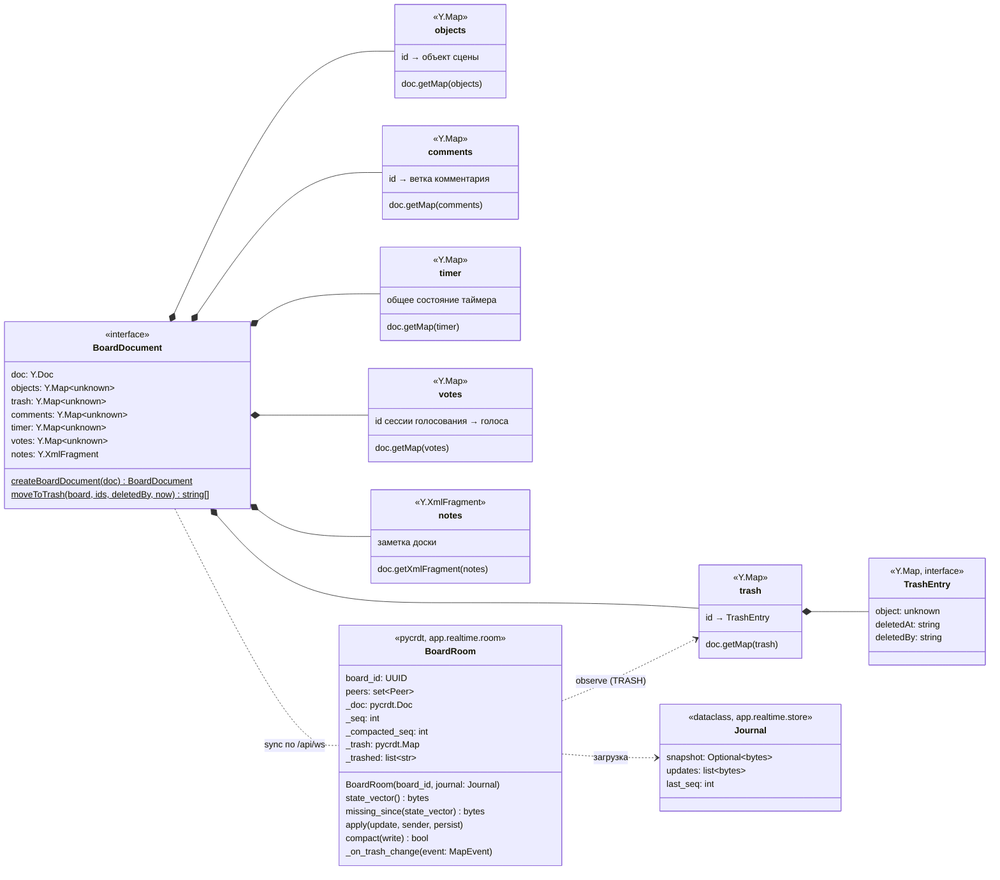

# Документ доски Yjs

Содержимое доски — документ Yjs: в клиенте `yjs` (`apps/web/src/realtime/boardDocument.ts`), на сервере `pycrdt` (`app.realtime.room.BoardRoom._doc`). Сервер документ не интерпретирует: применяет обновления к своей копии и пересылает их; корни документа создаёт клиент. Метаданные списка (название, папка, ссылка, избранное) хранятся в PostgreSQL и в документ не входят; присутствие и курсоры — тоже.

- Объявлены только корни верхнего уровня. Значения пока не типизированы (`unknown`): типы объектов сцены (`type`, `z`, координаты относительно родителя) появятся в T5.*, комментарии — T6.10, таймер и голосование — T8.1, заметки — T6.12.
- Корзина (T4.3, основа COL-08): `moveToTrash(board, ids, deletedBy)` одной транзакцией Yjs для каждого известного id кладёт в `trash[id]` `Y.Map { object: копия объекта (вложенный общий тип — `clone()`), deletedAt: ISO 8601, deletedBy: имя }` и удаляет ключ из `objects`; неизвестные id пропускаются. Восстановления из корзины пока нет (T8.2). Жизненный цикл — [states/board-object.md](states/board-object.md).
- Сервер не разбирает объекты, но подписан на корень `trash` своей копии (`_on_trash_change`): ключи с действием `add`/`update` в принятом обновлении попадают в `JournalEntry.trashed`, и `store.append` пишет запись `board_events` `objects_deleted` с именем из сессии соединения ([data-model.md](data-model.md)). Подписка ставится после загрузки, поэтому состояние из снимка/журнала записей не порождает.
- Интерфейс пока не вызывает `moveToTrash` и не пишет в документ (кнопок удаления и объектов сцены нет — T5.*); документ создаётся заново на каждую открытую доску (`useBoardConnection`) и наполняется из `STEP2` сервера.
- Присутствие (курсоры, вид камеры, слежение, список участников — T4.2) в документ не входит: оно идёт сообщениями `awareness`/`presence` и живёт только в памяти соединений ([ws-protocol.md](ws-protocol.md)).
- Серверная копия собирается из последнего снимка `board_snapshots` и хвоста `board_updates` при первом подключении к доске (`Hub.join` → `store.load_journal` → `BoardRoom(board_id, journal)`) и выгружается, когда уходит последнее соединение (`Hub.leave`, с этим — сжатие журнала). Снимок — полное состояние `Doc.get_update()`; присутствия в нём нет. См. [data-model.md](data-model.md), [sequences/sync.md](sequences/sync.md).

Актуально на: T4.3, 7477309. Требования: COL-01, COL-07 и COL-08 (основа: снимки, корзина), COL-02…COL-04, COL-09 (вне документа); ARCHITECTURE.md, раздел 6 (структура документа, корзина).
