# Компоненты

Фактическое устройство кода приложения. Реализованы каркас сервера `apps/api` (T0.2), каркас интерфейса `apps/web` (T0.3), панель администратора (T1.1) и вход пользователя досок (T1.2): модуль `identity` на сервере, страницы `/admin/login`, `/admin/users`, `/login` и проверка входа в клиенте. T1.4 добавил в клиент обёртку `RequireAccount`: страницы пользователя досок следят за отзывом сессии (ACC-05); сервер в T1.4 не менялся. T2.1 добавил список досок: модуль `library` на сервере (маршруты `/api/boards*`) и одноимённый модуль клиента на страницах `/` и `/boards/:id`. T2.2 добавил папки и избранное: маршруты `/api/folders*`, `/api/boards/{board_id}/folder`, `/api/boards/{board_id}/favorite` и боковой список с перетаскиванием на странице `/`. T3.1 добавил ссылку на доску: модуль `sharing` на сервере (маршруты `/api/boards/{board_id}/share*`, `/api/share/{token}*`, гостевые сессии в `identity.sessions`) и модуль `sharing` клиента — диалог Share на `/boards/:id` и страница входа участника `/b/:token`. T4.1 добавил синхронизацию документа доски: модуль `realtime` на сервере (WebSocket `/api/ws`, `Hub`, `BoardRoom` на `pycrdt`, журнал `board_updates`) и модуль `realtime` клиента (`BoardConnection` на `yjs`, `BoardLive` со строкой состояния связи на `/boards/:id` и `/b/:token`). T4.2 добавил присутствие по тому же каналу: сообщения `awareness`/`presence` в `realtime` сервера (`BoardRoom.announce`, `update_awareness`, `announce_leave`), на клиенте — `BoardPresence`, минимальный холст `canvas` с камерой и модуль `collab` (список присутствующих, чужие курсоры, слежение).

## Сервер `apps/api`

```mermaid
flowchart TB
  entry["app.__main__.main()<br/>python -m app"]
  subgraph core [app.core]
    settings["settings<br/>Settings, load_settings(), SettingsError,<br/>secure_cookies"]
    db["db<br/>Base (NAMING_CONVENTION), create_engine(),<br/>create_session_factory(), get_session / SessionDep"]
    migrations["migrations<br/>alembic_config(), upgrade_to_head()"]
    health["health.router<br/>GET /health → Health"]
  end
  main["app.main<br/>create_app(settings), lifespan,<br/>API_PREFIX = /api, MODULE_ROUTERS,<br/>app.state.admin_login_limiter,<br/>app.state.user_login_limiter, app.state.hub"]
  subgraph identity [app.identity]
    irouter["router<br/>include_router(admin_router, account_router)"]
    iadmin["admin_router (prefix /admin, тег admin)<br/>POST /login, POST /logout, GET /session,<br/>GET /users, POST /users, PATCH /users/{user_id};<br/>require_admin / AdminDep"]
    iaccount["account_router (тег account)<br/>POST /login, POST /logout, GET /session;<br/>require_user / UserDep"]
    ihttp["http<br/>LOGIN_FAILED, TOO_MANY_ATTEMPTS, settings_of,<br/>client_address, ensure_attempt_allowed, login_failed"]
    ischemas["schemas<br/>Credentials, AdminSession, AccountSession,<br/>UserOut, UserCreate, UserUpdate, normalize_email"]
    iservice["service<br/>ensure_first_admin, authenticate_admin,<br/>authenticate_user, active_user, list_users,<br/>create_user, update_user, EmailTakenError"]
    isessions["sessions<br/>ADMIN_COOKIE = myboard_admin,<br/>USER_COOKIE = myboard_session, USER_COOKIE_MAX_AGE,<br/>create_session(…, board_id, display_name),<br/>find_subject, find_board_session, delete_session,<br/>delete_subject_sessions, delete_board_sessions,<br/>set/clear_session_cookie"]
    ipasswords["passwords<br/>hash_password, verify_password<br/>(argon2-cffi, Argon2id)"]
    ilimit["rate_limit<br/>LoginRateLimiter: 10 неудач / 60 с"]
    imodels["models<br/>Admin, User, Session (board_id, display_name),<br/>SubjectType: admin | user | guest"]
  end
  subgraph library [app.library]
    lrouter["router<br/>include_router(board_router, folder_router)"]
    lboards["board_router (prefix /boards, тег library)<br/>GET '', GET /recent, POST '',<br/>GET, PATCH, DELETE /{board_id},<br/>PUT /{board_id}/folder,<br/>PUT, DELETE /{board_id}/favorite; UserDep"]
    lfolders["folder_router (prefix /folders, тег library)<br/>GET '' (?q=), POST '',<br/>PUT /{folder_id}/position,<br/>PUT, DELETE /{folder_id}/favorite; UserDep"]
    lerrors["errors<br/>BOARD_NOT_FOUND, FOLDER_NOT_FOUND → 404,<br/>FOLDER_CYCLE → 409, not_found()"]
    lschemas["schemas<br/>BoardOut, BoardCreate, BoardRename, BoardMove,<br/>FolderOut, FolderCreate, FolderMove,<br/>BoardSort (updated | created | title),<br/>Title, DEFAULT_TITLE = Untitled board"]
    lservice["service<br/>list_boards, recent_boards (RECENT_LIMIT = 8),<br/>get_board, create_board, rename_board,<br/>touch_board, move_board, delete_board; _owned"]
    lfolderSvc["folders<br/>list_folders, get_folder, create_folder,<br/>move_folder; _lock_owned (FOR UPDATE), _is_within;<br/>FolderNotFoundError, FolderCycleError"]
    lfav["favorites<br/>favorite_ids, set_favorite<br/>(INSERT … ON CONFLICT DO NOTHING / DELETE)"]
    lsearch["text_search<br/>contains(): ILIKE, экранирование % _ \\"]
    lmodels["models<br/>Board (share_token, share_token_revoked_at),<br/>Folder, Favorite, FavoriteType,<br/>TITLE_MAX_LENGTH = 200"]
  end
  subgraph sharingMod [app.sharing]
    srouter["router (тег sharing)<br/>GET /boards/{board_id}/share,<br/>POST /boards/{board_id}/share/reset (UserDep);<br/>GET /share/{token}, POST /share/{token}/join;<br/>LINK_UNAVAILABLE = Link is not available"]
    sschemas["schemas<br/>ShareLink {token, url}, SharedBoard {title, participant},<br/>Participant {name}, JoinRequest {name: Name}"]
    sservice["service<br/>new_token (token_urlsafe(32)), board_cookie_name,<br/>current_token, reset_token, board_by_token,<br/>participant, join; TOKEN_MAX_LENGTH = 64"]
  end
  subgraph realtimeApi [app.realtime]
    rrouter["router (тег realtime)<br/>WebSocket /ws?board= | ?token=: board_socket,<br/>_same_origin, _receive, _handle, _watch_access;<br/>ACCESS_CHECK_SECONDS = 5,<br/>POLICY_VIOLATION = 1008, INVALID_PAYLOAD = 1007"]
    raccess["access<br/>AccessRequest {board, token, cookies},<br/>BoardAccess {board_id, guest, name},<br/>authorize → _owner | _participant"]
    rprotocol["protocol<br/>MessageType SYNC/AWARENESS/PRESENCE,<br/>SyncKind STEP1/STEP2/UPDATE, SyncMessage,<br/>AwarenessMessage, PresencePeer, ClientMessage,<br/>encode_sync, encode_awareness, encode_presence,<br/>decode, ProtocolError, MAX_AWARENESS_BYTES = 4096"]
    rhub["hub<br/>Hub: join, leave, persist, close_participants;<br/>ACCESS_REVOKED = 4403, hub_of"]
    rroom["room<br/>BoardRoom (pycrdt.Doc): state_vector,<br/>missing_since, apply, announce,<br/>announce_leave, update_awareness;<br/>Peer {id, name, guest, awareness}: send, close;<br/>EMPTY_UPDATE"]
    rstore["store<br/>load_updates, last_seq, append_update"]
    rmodels["models<br/>BoardUpdate (board_updates)"]
  end
  subgraph modules [Модули: пустые APIRouter, маршрутов пока нет]
    history[history.router]
    media[media.router]
    backup[backup.router]
  end
  alembic["app.migrations<br/>env.py, versions/0001_baseline, 0002_identity,<br/>0003_library_boards, 0004_library_folders,<br/>0005_sharing_link,<br/>0006_realtime_board_updates"]
  pg[(PostgreSQL)]

  entry -->|"1. load_settings()<br/>ошибка → stderr, exit 1"| settings
  entry -->|"2. create_app(settings)"| main
  entry -->|"3. uvicorn.run :8000,<br/>proxy_headers"| main
  main -->|"lifespan: upgrade_to_head()<br/>до приёма трафика"| migrations
  migrations --> alembic
  alembic -->|"target_metadata = Base.metadata"| db
  main -->|"lifespan: engine, app.state.session_factory"| db
  main -->|"lifespan: ensure_first_admin(ADMIN_EMAIL, ADMIN_PASSWORD)"| iservice
  main -->|"include_router(prefix=/api)"| health
  main -->|"include_router(prefix=/api)"| irouter
  main -->|"include_router(prefix=/api)"| lrouter
  main -->|"include_router(prefix=/api)"| srouter
  main -->|"include_router(prefix=/api)"| rrouter
  main -->|"include_router(prefix=/api)"| modules
  main -->|"lifespan: Hub(session_factory)"| rhub
  irouter --> iadmin & iaccount
  iadmin & iaccount --> ihttp & ischemas & iservice & isessions
  iadmin -->|"admin_login_limiter"| ilimit
  iaccount -->|"user_login_limiter"| ilimit
  ihttp --> ilimit
  ihttp -->|"secure_cookies"| settings
  iservice --> ipasswords
  iservice --> isessions
  iservice --> imodels
  isessions --> imodels
  imodels -->|"Base"| db
  health -->|"SessionDep: SELECT 1"| db
  lrouter --> lboards & lfolders
  lboards & lfolders -->|"UserDep = require_user"| iaccount
  lboards & lfolders --> lschemas & lerrors & lfav
  lboards & lfolders -->|"SessionDep"| db
  lboards --> lservice
  lfolders --> lfolderSvc
  lservice -->|"move_board: get_folder,<br/>FolderNotFoundError"| lfolderSvc
  lservice & lfolderSvc --> lsearch
  lservice & lfolderSvc & lfav --> lmodels
  lschemas -->|"TITLE_MAX_LENGTH"| lmodels
  lmodels -->|"Base; owner_id, user_id → users.id"| db
  srouter -->|"UserDep, settings_of, set_session_cookie"| iaccount & ihttp & isessions
  srouter -->|"_owned_board: get_board, BOARD_NOT_FOUND"| lservice & lerrors
  srouter --> sschemas & sservice
  srouter -->|"SessionDep"| db
  sschemas -->|"Name"| ischemas
  sservice -->|"create_session(GUEST), find_board_session,<br/>delete_session, delete_board_sessions"| isessions
  sservice -->|"Board.share_token"| lmodels
  srouter -->|"reset_share_link: close_participants"| rhub
  rrouter -->|"authorize"| raccess
  rrouter -->|"decode, encode_sync, AwarenessMessage"| rprotocol
  rrouter -->|"hub_of: join, leave, persist"| rhub
  rrouter -->|"apply, missing_since, state_vector,<br/>announce, announce_leave, update_awareness"| rroom
  rrouter -->|"session_factory"| db
  raccess -->|"find_subject, find_board_session, active_user"| isessions & iservice
  raccess -->|"get_board"| lservice
  raccess -->|"board_by_token, board_cookie_name"| sservice
  rhub --> rroom
  rhub -->|"load_updates, last_seq, append_update"| rstore
  rroom -->|"encode_sync, encode_awareness,<br/>encode_presence, ProtocolError"| rprotocol
  rstore -->|"touch_board"| lservice
  rstore --> rmodels
  rmodels -->|"Base; board_id → boards.id"| db
  db -->|"SQLAlchemy async, psycopg 3"| pg
  alembic -->|"синхронный движок psycopg"| pg
```

- Все маршруты под префиксом `/api`: `GET /api/health` (`{"status":"ok"}`), `GET /api/openapi.json` (OpenAPI 3.1), `GET /api/docs` (Swagger UI). Неизвестный путь `/api/*` — `404` JSON.
- Маршруты панели (тег `admin`): `POST /api/admin/login` → `204` / `401` / `429`, `POST /api/admin/logout` → `204`, `GET /api/admin/session` → `200 AdminSession`, `GET /api/admin/users` → `200 [UserOut]`, `POST /api/admin/users` → `201` / `409`, `PATCH /api/admin/users/{user_id}` → `200` / `404` / `409`. Маршруты `/users*` требуют сессию администратора (`require_admin`, иначе `401`).
- Маршруты пользователя досок (тег `account`): `POST /api/login` → `204` + cookie `myboard_session` / `401 Invalid email or password` / `429`, `POST /api/logout` → `204`, `GET /api/session` → `200 AccountSession` (без сессии — `authenticated: false`; живую сессию продлевает). `require_user` (`401 Sign in`) защищает маршруты досок. Сценарии — [sequences/login.md](sequences/login.md), таблицы — [data-model.md](data-model.md).
- Ссылка на доску (тег `sharing`, T3.1): `GET /api/boards/{board_id}/share` → `200 ShareLink {token, url}` (токен выдаётся при первом запросе, `url` = `{PUBLIC_BASE_URL}/b/{token}`, SHR-01), `POST /api/boards/{board_id}/share/reset` → `200 ShareLink` с новым токеном (SHR-06) — оба только для владельца (`401` без сессии пользователя, `404 Board not found` для чужой доски). `GET /api/share/{token}` → `200 SharedBoard {title, participant}` (`participant: null` без сессии этой доски), `POST /api/share/{token}/join {name}` → `200 SharedBoard` + cookie `myboard_board_{board_id.hex}` (SHR-02, SHR-03); недействующий токен — `404 Link is not available` (SHR-05). Сценарии — [sequences/link-join.md](sequences/link-join.md), [sequences/link-reset.md](sequences/link-reset.md), состояния — [states/share-link.md](states/share-link.md).
- Маршруты досок (тег `library`, только для пользователя досок, иначе `401`): `GET /api/boards?q=&sort=updated|created|title&modified_since=` → `200 [BoardOut]` (ACC-04, BRD-04…BRD-06), `GET /api/boards/recent` → `200 [BoardOut]` (8 последних изменённых, BRD-04), `POST /api/boards` → `201 BoardOut` (без названия — Untitled board, BRD-01), `GET /api/boards/{board_id}` → `200` / `404`, `PATCH /api/boards/{board_id}` → `200` / `404` / `422` (BRD-02), `DELETE /api/boards/{board_id}` → `204` / `404` (BRD-03). Чужая, удалённая и несуществующая доска — одинаковый `404 Board not found`; название — 1…200 символов после обрезки пробелов, лишние поля тела — `422`. Таблицы — [data-model.md](data-model.md).
- Папки и избранное (тег `library`, T2.2): `GET /api/folders?q=` → `200 [FolderOut]` — все папки пользователя по `position` (дерево строит клиент; `q` — поиск по части названия, BRD-06), `POST /api/folders {title, parent_id?}` → `201 FolderOut` (последней среди соседей, BRD-09) / `404 Folder not found`, `PUT /api/folders/{folder_id}/position {parent_id, position}` → `200` / `404` / `409 A folder cannot be moved into itself or its subfolder` (BRD-10), `PUT /api/boards/{board_id}/folder {folder_id}` → `200 BoardOut` / `404` (BRD-10, `updated_at` не меняется), `PUT|DELETE /api/boards/{board_id}/favorite` и `PUT|DELETE /api/folders/{folder_id}/favorite` → `204` / `404` (BRD-07, повтор ничего не меняет). В `BoardOut` — `folder_id`, `favorite`; `FolderOut` — `id, parent_id, title, position, favorite, created_at`. Чужая и несуществующая папка неразличимы (`404`).
- `create_folder` и `move_folder` блокируют все папки владельца (`SELECT … FOR UPDATE`): создания и переносы одного владельца идут по очереди. `move_folder` отвергает вложение в себя или потомка (`_is_within`) до изменений, вставляет папку на индекс `position` (больше числа соседей — в конец) и перенумеровывает соседей нового родителя с 0.
- Лимиты попыток входа в панель и входа пользователя — два отдельных экземпляра `LoginRateLimiter` в `app.state`.
- `Settings` — семь обязательных переменных (`PUBLIC_BASE_URL`, `SECRET_KEY`, `DATABASE_URL`, `MEDIA_ROOT`, `ADMIN_EMAIL`, `ADMIN_PASSWORD`, `MAX_UPLOAD_BYTES`); пустое значение равно отсутствию. `MAX_UPLOAD_BYTES` > 0, `PUBLIC_BASE_URL` — `http://` или `https://`; свойство `secure_cookies` истинно только для `https://` и задаёт флаг `Secure` cookie сессии.
- Миграции только вперёд: `0001` пустая, `0002` создаёт `admins`, `users`, `sessions`, `0003` — `boards`, `0004` — `folders`, `favorites` и `boards.folder_id`, `0005` — `boards.share_token`, `boards.share_token_revoked_at`, `sessions.board_id`, `sessions.display_name`, `0006` — `board_updates`; `downgrade()` бросает `NotImplementedError`.
- WebSocket `/api/ws` (тег `realtime`, T4.1): владелец — `?board={id}` с cookie `myboard_session`, участник — `?token={token}` с cookie своей доски; нет права или чужой `Origin` — `403` на рукопожатие. Сообщения `sync` (`STEP1`/`STEP2`/`UPDATE`), коды закрытия `1007` и `4403` — [ws-protocol.md](ws-protocol.md); сценарий — [sequences/sync.md](sequences/sync.md). Один процесс держит все соединения: `Hub` хранит `BoardRoom` открытых досок в памяти и выгружает доску, когда уходит последнее соединение.
- `POST /api/boards/{board_id}/share/reset` после записи нового токена вызывает `Hub.close_participants` — открытые каналы участников этой доски закрываются `4403` (SHR-06), остальные сразу получают `presence` без них.
- Присутствие (T4.2): `authorize` возвращает имя соединения (`BoardAccess.name`: имя учётки владельца или `display_name` участника); `Peer` хранит случайный `id` и последнее состояние `awareness` только в памяти. Сообщения и порядок — [ws-protocol.md](ws-protocol.md), сценарий — [sequences/presence.md](sequences/presence.md).

Актуально на: T4.2, 1e65608. Требования: ADM-01…ADM-07, ACC-01…ACC-03 (модуль `identity`), ACC-04, BRD-01…BRD-07, BRD-09…BRD-11 (модуль `library`), SHR-01…SHR-03, SHR-05, SHR-06 (модуль `sharing`), COL-01, COL-02, COL-04, COL-09, SHR-04 (канал и присутствие, модуль `realtime`); каркас — ARCHITECTURE.md, разделы 3, 5, 7, 10, 11.

## Клиент `apps/web`

```mermaid
flowchart TB
  html["index.html<br/>div#root"]
  main["main.tsx<br/>createRoot(#root), StrictMode"]
  routes["routes.tsx<br/>AppRoutes: wouter Switch / Route,<br/>/admin → Redirect /admin/users,<br/>/, /boards/:id, /templates в RequireAccount"]
  subgraph pages [pages]
    placeholder["PagePlaceholder({title})<br/>h1 + This page is not available yet."]
    login["LoginPage<br/>/login: Sign in (ACC-01, ACC-02)"]
    boards["BoardsPage<br/>/: Boards, имя, Sign out (ACC-03);<br/>version: перезагрузка списков и дерева после правок;<br/>reveal(folderId), moved(move): раскрыть путь"]
    board["BoardPage<br/>/boards/:id: название доски или Board unavailable;<br/>кнопка Share → ShareDialog; BoardLive (owner),<br/>ownerHasAccess: getBoard, 401/404 → false"]
    templates["TemplatesPage<br/>/templates"]
    tcopy["TemplateCopyPage<br/>/t/:token"]
    alogin["AdminLoginPage<br/>/admin/login: Admin sign in"]
    ausers["AdminUsersPage<br/>/admin/users: Users, Sign out"]
    shared["SharedBoardPage + NameForm<br/>/b/:token: Your name, Join board (SHR-03) →<br/>You joined as …, BoardLive (participant);<br/>Board unavailable (SHR-05); participantHasAccess, recheck"]
    embed["EmbeddedBoardPage<br/>/b/:token/embed"]
    nf["NotFoundPage<br/>любой другой путь: Page not found"]
  end
  subgraph accountMod [account]
    requireAcc["RequireAccount<br/>useAccountSession({watch: true});<br/>loading → Loading… (страница не монтируется, BUG-002);<br/>signedOut → Redirect /login (ACC-03, ACC-05)"]
    ctx["accountContext.ts<br/>AccountSessionContext, useCurrentAccount()"]
    useAccount["useAccountSession({watch?})<br/>loading | signedOut | signedIn(name, email);<br/>watch: опрос каждые SESSION_CHECK_INTERVAL_MS = 2000,<br/>visibilitychange, focus, onUnauthorized"]
    accountApi["accountApi.ts<br/>signIn, signOut, getSession,<br/>AccountApiError, errorMessage"]
  end
  subgraph libraryMod [library]
    newBoard["NewBoardButton<br/>New board → navigate /boards/{id} (BRD-01)"]
    recent["RecentBoards({version})<br/>Recent, карточки со ссылками (BRD-04)"]
    list["BoardList({version, folders, onChange, onRevealFolder})<br/>All boards: Search boards and folders (SEARCH_DELAY_MS = 300),<br/>Sort by, Modified (ACC-04, BRD-04…BRD-06)"]
    brow["BoardRow<br/>ссылка /boards/{id}, Rename (BRD-02),<br/>Delete → Yes, delete (BRD-03),<br/>Favorite (BRD-07), Drag (BRD-10)"]
    fsearch["FolderSearchResults<br/>Matching folders: путь Work / Projects / Alpha,<br/>нажатие → onReveal (BRD-06)"]
    tree["useLibraryTree(version)<br/>{folders, boards}: listFolders + listBoards(sort=title)"]
    expanded["useExpandedFolders()<br/>expanded, toggle, expand;<br/>localStorage myboard.expandedFolders (BRD-11)"]
    sidebar["FolderSidebar<br/>aside Folders and favorites: Favorites (BRD-07),<br/>Folders, New folder, useRootDrop (BRD-09, BRD-10)"]
    fitem["FolderItem (рекурсивно)<br/>aria-expanded (BRD-11), + → New folder in …,<br/>Contents of …: подпапки и доски, useFolderDrop"]
    nfolder["NewFolderForm({parentId})<br/>Folder name, Create (BRD-09)"]
    favBtn["FavoriteButton({kind, id, favorite})<br/>Favorite, aria-pressed (BRD-07)"]
    dnd["LibraryDnd({folders, onMoved, onError})<br/>@dnd-kit/core DndContext, PointerSensor (4 px),<br/>DragOverlay; cycle → FOLDER_CYCLE (BRD-10)"]
    handle["DragHandle({dragId, item, title})<br/>Drag {title}, useDraggable"]
    drops["dropTargets.ts<br/>useFolderDrop, useRootDrop, IndicatorContext,<br/>collision, targetOf, executeMove"]
    ftree["folderTree.ts<br/>buildTree, siblingsOf, pathTo, isWithin,<br/>zoneAt (¼ before, ¾ after, середина inside),<br/>planMove → Move | cycle | null"]
    fmt["formatDate(iso)<br/>toLocaleString, medium + short"]
    libApi["libraryApi.ts<br/>listBoards(BoardQuery), recentBoards, createBoard,<br/>getBoard, renameBoard, deleteBoard, moveBoard,<br/>listFolders(search), createFolder, moveFolder,<br/>setFavorite(kind, id, favorite), FOLDER_CYCLE,<br/>LibraryApiError, errorMessage"]
  end
  subgraph sharingWeb [sharing]
    sdialog["ShareDialog({boardId, onClose})<br/>Share board: Board link, Copy link (SHR-01),<br/>Reset link → Reset / Cancel в диалоге (SHR-06), Close, Esc"]
    copy["copyText(text, field)<br/>navigator.clipboard, иначе execCommand(copy)"]
    sApi["sharingApi.ts<br/>getShareLink, resetShareLink, openSharedBoard,<br/>joinSharedBoard, SharingApiError, LINK_UNAVAILABLE,<br/>sharingErrorMessage"]
  end
  subgraph adminMod [admin]
    useSession["useAdminSession()<br/>loading | signedOut | signedIn(email)"]
    accounts["UserAccounts<br/>таблица Accounts (ADM-02)"]
    create["CreateUserForm<br/>Create user (ADM-03, ADM-07)"]
    row["UserRow + EditUserForm<br/>Edit, Disable / Enable (ADM-04…ADM-06)"]
    adminApi["adminApi.ts<br/>signIn, signOut, getSession, listUsers,<br/>createUser, updateUser, AdminApiError, errorMessage"]
  end
  subgraph apiMod [api]
    client["client.ts<br/>createApiClient(origin = window.location.origin),<br/>api = openapi-fetch createClient&lt;paths&gt;,<br/>onUnauthorized(listener): 401 любого ответа"]
    schema["schema.d.ts<br/>paths, components, operations<br/>(openapi-typescript)"]
  end
  subgraph realtimeMod [realtime]
    sock["socketUrl.ts<br/>socketUrl(page = window.location):<br/>https: → wss:, иначе ws:; host страницы + /api/ws"]
    live["BoardLive({target, checkAccess, onClosed})<br/>p role=status: Connecting to the board… /<br/>Live: changes are shared… / Offline. Your changes… /<br/>This board is no longer available. (COL-01);<br/>не closed → BoardWorkspace"]
    useConn["useBoardConnection(target, checkAccess)<br/>{board, presence, status}; boardSocketUrl(target):<br/>?board={id} | ?token={token}"]
    conn["BoardConnection({doc, url, presence, onStatus, checkAccess})<br/>connecting | online | offline | closed;<br/>retryDelays 500…8000 мс, destroy();<br/>onopen → presence.attach, onclose → detach"]
    bpres["BoardPresence<br/>setLocal, attach, detach, receive,<br/>subscribe / getSnapshot → {peers: PeerPresence[]};<br/>AWARENESS_INTERVAL_MS = 50"]
    usePres["usePresence(presence)<br/>useSyncExternalStore"]
    bdoc["boardDocument.ts<br/>BoardDocument, createBoardDocument():<br/>objects, trash, comments, timer, votes, notes"]
    msgs["messages.ts<br/>MessageType Sync/Awareness/Presence, SyncKind,<br/>CloseCode, Point, CameraView, AwarenessState,<br/>PresencePeer, ServerMessage,<br/>encodeSync, encodeAwareness, decodeMessage (lib0)"]
  end
  subgraph collabMod [collab]
    workspace["BoardWorkspace({presence})<br/>camera, following, cursorsShown;<br/>Following … / Stop following, рамка цвета участника<br/>(COL-02…COL-04)"]
    ppanel["PresencePanel<br/>aside People on this board: On this board (N),<br/>… (you), · following …, Follow …,<br/>Hide cursors / Show cursors (COL-03, COL-04, COL-09)"]
    rcursors["RemoteCursors({peers, zoom})<br/>стрелка и имя, aria-label …'s cursor;<br/>свой не рисуется (COL-02)"]
    pcolor["peerColor(peer)<br/>hsl по id соединения"]
  end
  subgraph canvasMod [canvas]
    bcanvas["BoardCanvas({camera, onMove, onPointer})<br/>data-testid board-canvas, board-world (CSS transform),<br/>перетаскивание → panBy, колесо → zoomAt,<br/>pointermove → onPointer(screenToBoard), уход мыши → null"]
    camera["camera.ts<br/>HOME, MIN_ZOOM = 0.1, MAX_ZOOM = 8,<br/>screenToBoard, boardToScreen, panBy, zoomAt"]
  end
  yjs["yjs, lib0"]
  oas["openapi.json<br/>pnpm api:fetch ← $PUBLIC_BASE_URL/api/openapi.json"]
  server["apps/api: /api/*"]

  html --> main --> routes
  routes --> login & tcopy & alogin & ausers & shared & embed & nf
  routes -->|"/, /boards/:id, /templates"| requireAcc
  requireAcc -->|"signedIn"| boards & board & templates
  requireAcc -->|"Provider value = session"| ctx
  requireAcc --> useAccount
  templates & tcopy & embed --> placeholder
  board -->|"sharing"| sdialog
  sdialog --> copy
  sdialog -->|"getShareLink, resetShareLink"| sApi
  shared -->|"openSharedBoard, joinSharedBoard"| sApi
  sApi -->|"types ShareLink, SharedBoard"| schema
  sApi --> client
  login -->|"без watch; signedIn → Redirect /"| useAccount
  login -->|"signIn → navigate /"| accountApi
  boards -->|"useCurrentAccount: имя"| ctx
  boards -->|"signOut → navigate /login"| accountApi
  boards --> newBoard & recent & list
  boards -->|"folders, onMoved, onError"| dnd
  boards -->|"tree, actions, onReveal"| sidebar
  boards --> tree & expanded
  boards -->|"pathTo"| ftree
  list -->|"onChange → version + 1"| brow
  list -->|"search, allFolders"| fsearch
  recent & brow --> fmt
  brow --> favBtn & handle
  sidebar --> fitem & nfolder & favBtn
  sidebar -->|"buildTree"| ftree
  sidebar -->|"useRootDrop"| drops
  fitem --> fitem
  fitem --> nfolder & favBtn & handle
  fitem -->|"useFolderDrop"| drops
  dnd -->|"targetOf, executeMove, IndicatorContext"| drops
  dnd -->|"planMove"| ftree
  drops -->|"zoneAt"| ftree
  fsearch -->|"pathTo"| ftree
  newBoard -->|"createBoard"| libApi
  recent -->|"recentBoards"| libApi
  list -->|"listBoards"| libApi
  brow -->|"renameBoard, deleteBoard"| libApi
  board -->|"getBoard"| libApi
  board & shared --> live
  shared -->|"onClosed → recheck: openSharedBoard"| sApi
  live --> useConn
  live -->|"presence"| workspace
  useConn --> conn & bdoc & bpres
  conn -->|"attach, detach, receive"| bpres
  bpres -->|"types"| msgs
  workspace -->|"setLocal, subscribe"| bpres
  workspace --> usePres
  usePres --> bpres
  workspace --> bcanvas & ppanel & rcursors
  workspace -->|"HOME"| camera
  bcanvas --> camera
  ppanel & rcursors & workspace --> pcolor
  useConn -->|"socketUrl"| sock
  conn --> msgs
  conn & bdoc & msgs --> yjs
  conn -->|"WebSocket к происхождению страницы, /api/ws"| server
  tree -->|"listFolders, listBoards"| libApi
  fsearch -->|"listFolders(q)"| libApi
  nfolder -->|"createFolder"| libApi
  favBtn -->|"setFavorite"| libApi
  drops -->|"moveBoard, moveFolder"| libApi
  libApi -->|"types BoardOut, FolderOut, BoardSort"| schema
  libApi --> client
  useAccount -->|"getSession"| accountApi
  useAccount -->|"onUnauthorized, кроме /api/login и /api/admin/*"| client
  accountApi -->|"type AccountSession"| schema
  accountApi --> client
  alogin --> useSession
  alogin -->|"signIn → navigate /admin/users"| adminApi
  ausers --> useSession
  ausers -->|"signOut → navigate /admin/login"| adminApi
  ausers -->|"signedIn"| accounts
  accounts --> create & row
  accounts -->|"listUsers"| adminApi
  create -->|"createUser"| adminApi
  row -->|"updateUser"| adminApi
  useSession -->|"getSession"| adminApi
  adminApi -->|"types UserOut, UserCreate, UserUpdate, AdminSession"| schema
  adminApi --> client
  client -->|"import type paths"| schema
  oas -->|"pnpm api:types"| schema
  client -->|"HTTP к происхождению страницы, пути /api/…"| server
```

- Потребители `api` — модули `account`, `admin`, `library` и `sharing`; `realtime` ходит в API только через WebSocket (`socketUrl` → `boardSocketUrl`), проверку доступа после разрыва ему передают страницы (`checkAccess`). В `schema.d.ts` — `GET /api/health`, маршруты `/api/admin/*`, `/api/login`, `/api/logout`, `/api/session`, `/api/boards*`, `/api/folders*` и `/api/share/*` (T3.1). Внешняя библиотека модуля `library` — `@dnd-kit/core` (перетаскивание указателем: мышь, палец, перо).
- `libraryApi` переводит ответы в текст: `404` Board not found., `422` Enter a board name up to 200 characters., прочие — Something went wrong. Try again., сетевой сбой — Network error. Try again. `getBoard` отвечает на `422` (неверный формат `id`) тем же Board not found. Поиск, сортировку и фильтр выполняет сервер: `BoardList` передаёт `q` (после паузы 300 мс), `sort` и `modified_since` (Any time, Last 24 hours, Last 7 days, Last 30 days). После переименования, удаления, создания папки, переноса и смены избранного `BoardsPage` увеличивает `version`, и `RecentBoards`, `BoardList` и `useLibraryTree` загружаются заново; пустой блок Recent скрыт.
- Боковой список (T2.2): дерево строится на клиенте из плоских `GET /api/folders` и `GET /api/boards` (`buildTree`: папки по `position`, в папке — подпапки и её доски; доски верхнего уровня в дереве не показываются). Раздел Favorites — папки и доски с `favorite = true`; папка по нажатию раскрывается в дереве (`reveal`: раскрыть путь, подсветить и сфокусировать). Новая папка свёрнута; развёрнутые папки хранятся в `localStorage` (BRD-11). При запросе в поиске под ним появляется Matching folders (BRD-06).
- Перетаскивание (BRD-10): ручка `Drag …` у строк All boards, досок и папок дерева. Над строкой папки для папки — верхняя четверть «перед», нижняя «после», середина «внутрь»; для доски — вся строка «внутрь»; свободное место раздела Folders — верхний уровень. `planMove` превращает сброс в `PUT /api/folders/{id}/position` или `PUT /api/boards/{id}/folder`; попытка вложить папку в себя или потомка до запроса даёт `FOLDER_CYCLE` в строке ошибки бокового списка (`role=alert`), ответ `409` сервера — тот же текст. После переноса раскрывается папка назначения.
- `libraryApi` для папок: `404` Folder not found., `409` A folder cannot be moved into itself or its subfolder., `422` Enter a folder name up to 200 characters.
- `sharingApi` (T3.1): владельцу `404` — Board not found.; участнику `404` — This link is not available. (`/b/:token` переходит в Board unavailable), `422` — Enter your name up to 200 characters.; прочие — Something went wrong. Try again., сетевой сбой — Network error. Try again. `copyText` сначала пробует Clipboard API, а по `http://` (не защищённый контекст) — выделяет поле и вызывает `document.execCommand("copy")`; неудача — Copy failed. Select the link and copy it. Двойник API в тестах — `sharing/fakeSharingServer.ts`.
- `accountApi` показывает одно скупое сообщение для `401` и `422` — Invalid email or password. (ACC-02); `429` — Too many sign-in attempts. Try again later.; сетевой сбой — Network error. Try again.
- `adminApi` переводит коды ответа в текст для администратора: `401` Invalid email or password., `404` User not found., `409` Email is already in use., `422` Enter a name, a valid email and a password., `429` Too many sign-in attempts. Try again later.
- Cookie сессий скрипту не видны (`HttpOnly`), поэтому состояние входа страницы узнают из `GET /api/session` и `GET /api/admin/session`. `/login` у вошедшего перенаправляет на `/`; `/`, `/boards/:id`, `/templates` обёрнуты в `RequireAccount`: без сессии и после её отзыва — `Redirect /login` (replace). Отзыв замечается опросом `GET /api/session` раз в 2 с у видимой вкладки, сразу при возврате на вкладку и по любому ответу `401`, кроме `POST /api/login` и `/api/admin/*` (ACC-05, состояния — [states/session.md](states/session.md)); `/admin/login` при действующей сессии перенаправляет на `/admin/users`, `/admin/users` без сессии показывает приглашение со ссылкой Sign in.
- `/boards/:id` за `RequireAccount` показывает название своей доски, строку состояния связи `BoardLive` и холст с присутствием (объектов пока нет, T5.*); до ответа `GET /api/session` страницы под `RequireAccount` не монтируются и своих запросов не шлют (BUG-002); чужая, удалённая и несуществующая — Board unavailable / Board not found. `/templates` — заглушка за `RequireAccount`; `/t/:token`, `/b/:token/embed` — заглушки без проверки входа. `/b/:token` без `RequireAccount`: сессию участника хранит cookie этой доски, страница узнаёт имя из `GET /api/share/{token}`, затем открывает `BoardLive` по токену; закрытый без доступа канал (сброс ссылки) ведёт к повторному `GET /api/share/{token}` и Board unavailable без перезагрузки. Холст с присутствием — как у владельца.
- Присутствие (T4.2): `useBoardConnection` создаёт вместе с документом `BoardPresence`, `BoardConnection` передаёт ему кадры `awareness`/`presence` и шлёт своё состояние; `BoardWorkspace` рисует холст `BoardCanvas` с чужими курсорами, плашку слежения и `PresencePanel`. Камера минимальная (сдвиг перетаскиванием, масштаб колесом, точечный фон) — полная в T5.1; объектов на холсте пока нет. Сценарий — [sequences/presence.md](sequences/presence.md).
- Модуль `realtime` (T4.1): один `Y.Doc` на открытую доску (`useBoardConnection`), `BoardConnection` — провайдер документа поверх `/api/ws` (сценарий — [sequences/sync.md](sequences/sync.md), кадры — [ws-protocol.md](ws-protocol.md)). Внешние библиотеки — `yjs`, `lib0`. Двойник сокета в тестах — `realtime/fakeSocket.ts`.
- Адреса API и WebSocket строятся из адреса страницы (`window.location`), `localhost` в клиенте нет; тестовая среда Vitest (jsdom) открыта по `http://192.168.1.20:8080/`, API в тестах подменяют `admin/fakeAdminServer.ts`, `account/fakeAccountServer.ts` и `library/fakeLibraryServer.ts` (подключается к двойнику входа через `extraRoute`).
- Параметр `?object={id}` на `/b/{token}` отдельным маршрутом не выделен — его прочитает страница доски.
- Сборка: `pnpm build` = `tsc --noEmit && vite build` (плагин `@vitejs/plugin-react`), результат `dist` раздаёт сервис `web` (см. [deployment.md](deployment.md)).

Актуально на: T4.2, 1e65608. Требования: ADM-01…ADM-07 (панель администратора), ACC-01…ACC-03, ACC-05 (вход пользователя досок и отзыв сессии), ACC-04, BRD-01…BRD-07, BRD-09…BRD-11 (список досок, папки, избранное), SHR-01…SHR-03, SHR-05, SHR-06 (ссылка на доску), COL-01, SHR-04 (канал документа доски), COL-02…COL-04, COL-09 (присутствие и курсоры); каркас — ARCHITECTURE.md, разделы 3, 4, 10.
