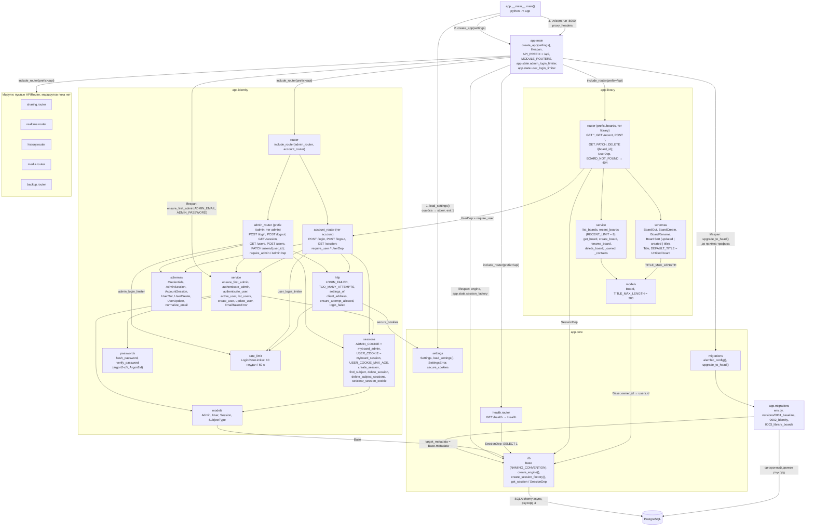

# Компоненты

Фактическое устройство кода приложения. Реализованы каркас сервера `apps/api` (T0.2), каркас интерфейса `apps/web` (T0.3), панель администратора (T1.1) и вход пользователя досок (T1.2): модуль `identity` на сервере, страницы `/admin/login`, `/admin/users`, `/login` и проверка входа в клиенте. T1.4 добавил в клиент обёртку `RequireAccount`: страницы пользователя досок следят за отзывом сессии (ACC-05); сервер в T1.4 не менялся. T2.1 добавил список досок: модуль `library` на сервере (маршруты `/api/boards*`) и одноимённый модуль клиента на страницах `/` и `/boards/:id`.

## Сервер `apps/api`

- Все маршруты под префиксом `/api`: `GET /api/health` (`{"status":"ok"}`), `GET /api/openapi.json` (OpenAPI 3.1), `GET /api/docs` (Swagger UI). Неизвестный путь `/api/*` — `404` JSON.
- Маршруты панели (тег `admin`): `POST /api/admin/login` → `204` / `401` / `429`, `POST /api/admin/logout` → `204`, `GET /api/admin/session` → `200 AdminSession`, `GET /api/admin/users` → `200 [UserOut]`, `POST /api/admin/users` → `201` / `409`, `PATCH /api/admin/users/{user_id}` → `200` / `404` / `409`. Маршруты `/users*` требуют сессию администратора (`require_admin`, иначе `401`).
- Маршруты пользователя досок (тег `account`): `POST /api/login` → `204` + cookie `myboard_session` / `401 Invalid email or password` / `429`, `POST /api/logout` → `204`, `GET /api/session` → `200 AccountSession` (без сессии — `authenticated: false`; живую сессию продлевает). `require_user` (`401 Sign in`) защищает маршруты досок. Сценарии — [sequences/login.md](sequences/login.md), таблицы — [data-model.md](data-model.md).
- Маршруты досок (тег `library`, только для пользователя досок, иначе `401`): `GET /api/boards?q=&sort=updated|created|title&modified_since=` → `200 [BoardOut]` (ACC-04, BRD-04…BRD-06), `GET /api/boards/recent` → `200 [BoardOut]` (8 последних изменённых, BRD-04), `POST /api/boards` → `201 BoardOut` (без названия — Untitled board, BRD-01), `GET /api/boards/{board_id}` → `200` / `404`, `PATCH /api/boards/{board_id}` → `200` / `404` / `422` (BRD-02), `DELETE /api/boards/{board_id}` → `204` / `404` (BRD-03). Чужая, удалённая и несуществующая доска — одинаковый `404 Board not found`; название — 1…200 символов после обрезки пробелов, лишние поля тела — `422`. Таблица — [data-model.md](data-model.md).
- Лимиты попыток входа в панель и входа пользователя — два отдельных экземпляра `LoginRateLimiter` в `app.state`.
- `Settings` — семь обязательных переменных (`PUBLIC_BASE_URL`, `SECRET_KEY`, `DATABASE_URL`, `MEDIA_ROOT`, `ADMIN_EMAIL`, `ADMIN_PASSWORD`, `MAX_UPLOAD_BYTES`); пустое значение равно отсутствию. `MAX_UPLOAD_BYTES` > 0, `PUBLIC_BASE_URL` — `http://` или `https://`; свойство `secure_cookies` истинно только для `https://` и задаёт флаг `Secure` cookie сессии.
- Миграции только вперёд: `0001` пустая, `0002` создаёт `admins`, `users`, `sessions`, `0003` — `boards`; `downgrade()` бросает `NotImplementedError`.
- WebSocket `/api/ws` не реализован (появится в T4.1).

Актуально на: T2.1, facb370. Требования: ADM-01…ADM-07, ACC-01…ACC-03 (модуль `identity`), ACC-04, BRD-01…BRD-06 (модуль `library`); каркас — ARCHITECTURE.md, разделы 3, 5, 7, 11.

## Клиент `apps/web`

```mermaid
flowchart TB
  html["index.html<br/>div#root"]
  main["main.tsx<br/>createRoot(#root), StrictMode"]
  routes["routes.tsx<br/>AppRoutes: wouter Switch / Route,<br/>/admin → Redirect /admin/users,<br/>/, /boards/:id, /templates в RequireAccount"]
  subgraph pages [pages]
    placeholder["PagePlaceholder({title})<br/>h1 + This page is not available yet."]
    login["LoginPage<br/>/login: Sign in (ACC-01, ACC-02)"]
    boards["BoardsPage<br/>/: Boards, имя, Sign out (ACC-03);<br/>version: перезагрузка списков после правок"]
    board["BoardPage<br/>/boards/:id: название доски или Board unavailable;<br/>The canvas is not available yet."]
    templates["TemplatesPage<br/>/templates"]
    tcopy["TemplateCopyPage<br/>/t/:token"]
    alogin["AdminLoginPage<br/>/admin/login: Admin sign in"]
    ausers["AdminUsersPage<br/>/admin/users: Users, Sign out"]
    shared["SharedBoardPage<br/>/b/:token"]
    embed["EmbeddedBoardPage<br/>/b/:token/embed"]
    nf["NotFoundPage<br/>любой другой путь: Page not found"]
  end
  subgraph accountMod [account]
    requireAcc["RequireAccount<br/>useAccountSession({watch: true});<br/>signedOut → Redirect /login (ACC-03, ACC-05)"]
    ctx["accountContext.ts<br/>AccountSessionContext, useCurrentAccount()"]
    useAccount["useAccountSession({watch?})<br/>loading | signedOut | signedIn(name, email);<br/>watch: опрос каждые SESSION_CHECK_INTERVAL_MS = 2000,<br/>visibilitychange, focus, onUnauthorized"]
    accountApi["accountApi.ts<br/>signIn, signOut, getSession,<br/>AccountApiError, errorMessage"]
  end
  subgraph libraryMod [library]
    newBoard["NewBoardButton<br/>New board → navigate /boards/{id} (BRD-01)"]
    recent["RecentBoards({version})<br/>Recent, карточки со ссылками (BRD-04)"]
    list["BoardList({version, onChange})<br/>All boards: Search boards (SEARCH_DELAY_MS = 300),<br/>Sort by, Modified (ACC-04, BRD-04…BRD-06)"]
    brow["BoardRow<br/>ссылка /boards/{id}, Rename (BRD-02),<br/>Delete → Yes, delete (BRD-03)"]
    fmt["formatDate(iso)<br/>toLocaleString, medium + short"]
    libApi["libraryApi.ts<br/>listBoards(BoardQuery), recentBoards, createBoard,<br/>getBoard, renameBoard, deleteBoard,<br/>LibraryApiError, errorMessage"]
  end
  subgraph adminMod [admin]
    useSession["useAdminSession()<br/>loading | signedOut | signedIn(email)"]
    accounts["UserAccounts<br/>таблица Accounts (ADM-02)"]
    create["CreateUserForm<br/>Create user (ADM-03, ADM-07)"]
    row["UserRow + EditUserForm<br/>Edit, Disable / Enable (ADM-04…ADM-06)"]
    adminApi["adminApi.ts<br/>signIn, signOut, getSession, listUsers,<br/>createUser, updateUser, AdminApiError, errorMessage"]
  end
  subgraph apiMod [api]
    client["client.ts<br/>createApiClient(origin = window.location.origin),<br/>api = openapi-fetch createClient&lt;paths&gt;,<br/>onUnauthorized(listener): 401 любого ответа"]
    schema["schema.d.ts<br/>paths, components, operations<br/>(openapi-typescript)"]
  end
  subgraph realtimeMod [realtime]
    sock["socketUrl.ts<br/>socketUrl(page = window.location):<br/>https: → wss:, иначе ws:; host страницы + /api/ws"]
  end
  oas["openapi.json<br/>pnpm api:fetch ← $PUBLIC_BASE_URL/api/openapi.json"]
  server["apps/api: /api/*"]

  html --> main --> routes
  routes --> login & tcopy & alogin & ausers & shared & embed & nf
  routes -->|"/, /boards/:id, /templates"| requireAcc
  requireAcc -->|"signedIn / loading"| boards & board & templates
  requireAcc -->|"Provider value = session"| ctx
  requireAcc --> useAccount
  templates & tcopy & shared & embed --> placeholder
  login -->|"без watch; signedIn → Redirect /"| useAccount
  login -->|"signIn → navigate /"| accountApi
  boards -->|"useCurrentAccount: имя"| ctx
  boards -->|"signOut → navigate /login"| accountApi
  boards --> newBoard & recent & list
  list -->|"onChange → version + 1"| brow
  recent & brow --> fmt
  newBoard -->|"createBoard"| libApi
  recent -->|"recentBoards"| libApi
  list -->|"listBoards"| libApi
  brow -->|"renameBoard, deleteBoard"| libApi
  board -->|"getBoard"| libApi
  libApi -->|"types BoardOut, BoardSort"| schema
  libApi --> client
  useAccount -->|"getSession"| accountApi
  useAccount -->|"onUnauthorized, кроме /api/login и /api/admin/*"| client
  accountApi -->|"type AccountSession"| schema
  accountApi --> client
  alogin --> useSession
  alogin -->|"signIn → navigate /admin/users"| adminApi
  ausers --> useSession
  ausers -->|"signOut → navigate /admin/login"| adminApi
  ausers -->|"signedIn"| accounts
  accounts --> create & row
  accounts -->|"listUsers"| adminApi
  create -->|"createUser"| adminApi
  row -->|"updateUser"| adminApi
  useSession -->|"getSession"| adminApi
  adminApi -->|"types UserOut, UserCreate, UserUpdate, AdminSession"| schema
  adminApi --> client
  client -->|"import type paths"| schema
  oas -->|"pnpm api:types"| schema
  client -->|"HTTP к происхождению страницы, пути /api/…"| server
```

- Потребители `api` — модули `account`, `admin` и `library`; `socketUrl` пока не используется. В `schema.d.ts` — `GET /api/health`, маршруты `/api/admin/*`, `/api/login`, `/api/logout`, `/api/session` и `/api/boards*`.
- `libraryApi` переводит ответы в текст: `404` Board not found., `422` Enter a board name up to 200 characters., прочие — Something went wrong. Try again., сетевой сбой — Network error. Try again. `getBoard` отвечает на `422` (неверный формат `id`) тем же Board not found. Поиск, сортировку и фильтр выполняет сервер: `BoardList` передаёт `q` (после паузы 300 мс), `sort` и `modified_since` (Any time, Last 24 hours, Last 7 days, Last 30 days). После переименования и удаления `BoardsPage` увеличивает `version`, и `RecentBoards` с `BoardList` загружаются заново; пустой блок Recent скрыт.
- `accountApi` показывает одно скупое сообщение для `401` и `422` — Invalid email or password. (ACC-02); `429` — Too many sign-in attempts. Try again later.; сетевой сбой — Network error. Try again.
- `adminApi` переводит коды ответа в текст для администратора: `401` Invalid email or password., `404` User not found., `409` Email is already in use., `422` Enter a name, a valid email and a password., `429` Too many sign-in attempts. Try again later.
- Cookie сессий скрипту не видны (`HttpOnly`), поэтому состояние входа страницы узнают из `GET /api/session` и `GET /api/admin/session`. `/login` у вошедшего перенаправляет на `/`; `/`, `/boards/:id`, `/templates` обёрнуты в `RequireAccount`: без сессии и после её отзыва — `Redirect /login` (replace). Отзыв замечается опросом `GET /api/session` раз в 2 с у видимой вкладки, сразу при возврате на вкладку и по любому ответу `401`, кроме `POST /api/login` и `/api/admin/*` (ACC-05, состояния — [states/session.md](states/session.md)); `/admin/login` при действующей сессии перенаправляет на `/admin/users`, `/admin/users` без сессии показывает приглашение со ссылкой Sign in.
- `/boards/:id` за `RequireAccount` показывает название своей доски (холста пока нет); чужая, удалённая и несуществующая — Board unavailable / Board not found. `/templates` — заглушка за `RequireAccount`; `/t/:token`, `/b/:token`, `/b/:token/embed` — заглушки без проверки входа.
- Адреса API и WebSocket строятся из адреса страницы (`window.location`), `localhost` в клиенте нет; тестовая среда Vitest (jsdom) открыта по `http://192.168.1.20:8080/`, API в тестах подменяют `admin/fakeAdminServer.ts`, `account/fakeAccountServer.ts` и `library/fakeLibraryServer.ts` (подключается к двойнику входа через `extraRoute`).
- Параметр `?object={id}` на `/b/{token}` отдельным маршрутом не выделен — его прочитает страница доски.
- Сборка: `pnpm build` = `tsc --noEmit && vite build` (плагин `@vitejs/plugin-react`), результат `dist` раздаёт сервис `web` (см. [deployment.md](deployment.md)).

Актуально на: T2.1, facb370. Требования: ADM-01…ADM-07 (панель администратора), ACC-01…ACC-03, ACC-05 (вход пользователя досок и отзыв сессии), ACC-04, BRD-01…BRD-06 (список досок); каркас — ARCHITECTURE.md, разделы 3, 4, 10.
