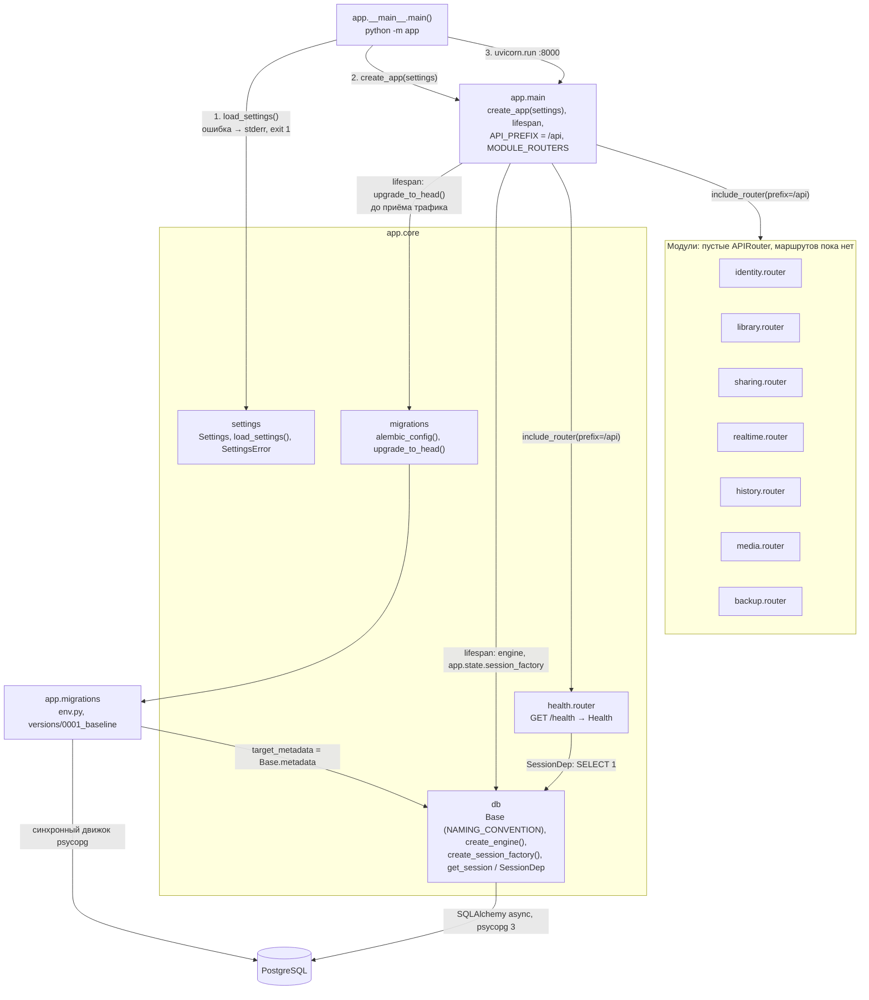

# Компоненты

Фактическое устройство кода приложения. Пока реализован только каркас сервера `apps/api` (T0.2); модули клиента `apps/web` появятся со схемой после приёмки T0.3.

## Сервер `apps/api`

- Все маршруты под префиксом `/api`: `GET /api/health` (`{"status":"ok"}`), `GET /api/openapi.json` (OpenAPI 3.1), `GET /api/docs` (Swagger UI). Неизвестный путь `/api/*` — `404` JSON.
- `Settings` — семь обязательных переменных (`PUBLIC_BASE_URL`, `SECRET_KEY`, `DATABASE_URL`, `MEDIA_ROOT`, `ADMIN_EMAIL`, `ADMIN_PASSWORD`, `MAX_UPLOAD_BYTES`); пустое значение равно отсутствию. `MAX_UPLOAD_BYTES` > 0, `PUBLIC_BASE_URL` — `http://` или `https://`; свойство `secure_cookies` истинно только для `https://`.
- Миграции только вперёд: ревизия `0001` пустая, `downgrade()` бросает `NotImplementedError`.
- WebSocket `/api/ws` не реализован (появится в T4.1).

Актуально на: T0.2, 9bce527. Требования: — (ARCHITECTURE.md, разделы 3, 5, 7, 11: модули сервера, OpenAPI, Alembic, обязательные переменные).
