# Компоненты

Фактическое устройство кода приложения. Реализованы каркас сервера `apps/api` (T0.2), каркас интерфейса `apps/web` (T0.3), панель администратора (T1.1) и вход пользователя досок (T1.2): модуль `identity` на сервере, страницы `/admin/login`, `/admin/users`, `/login` и проверка входа в клиенте. T1.4 добавил в клиент обёртку `RequireAccount`: страницы пользователя досок следят за отзывом сессии (ACC-05); сервер в T1.4 не менялся. T2.1 добавил список досок: модуль `library` на сервере (маршруты `/api/boards*`) и одноимённый модуль клиента на страницах `/` и `/boards/:id`. T2.2 добавил папки и избранное: маршруты `/api/folders*`, `/api/boards/{board_id}/folder`, `/api/boards/{board_id}/favorite` и боковой список с перетаскиванием на странице `/`. T3.1 добавил ссылку на доску: модуль `sharing` на сервере (маршруты `/api/boards/{board_id}/share*`, `/api/share/{token}*`, гостевые сессии в `identity.sessions`) и модуль `sharing` клиента — диалог Share на `/boards/:id` и страница входа участника `/b/:token`. T4.1 добавил синхронизацию документа доски: модуль `realtime` на сервере (WebSocket `/api/ws`, `Hub`, `BoardRoom` на `pycrdt`, журнал `board_updates`) и модуль `realtime` клиента (`BoardConnection` на `yjs`, `BoardLive` со строкой состояния связи на `/boards/:id` и `/b/:token`). T4.2 добавил присутствие по тому же каналу: сообщения `awareness`/`presence` в `realtime` сервера (`BoardRoom.announce`, `update_awareness`, `announce_leave`), на клиенте — `BoardPresence`, минимальный холст `canvas` с камерой и модуль `collab` (список присутствующих, чужие курсоры, слежение). T4.3 добавил снимки и ленту: модуль `history` на сервере (таблицы `board_snapshots`, `board_events`; маршрутов пока нет), сжатие журнала в `Hub` (фоновая задача процесса, выгрузка доски, остановка) и клиентскую функцию корзины `moveToTrash`. T5.1 сделал полную камеру холста в клиенте `canvas`: масштаб кнопками, клавишами, колесом и щипком, сдвиг мышью, пальцем и стрелками, выбор поведения колеса, миникарта по объектам документа и запоминание вида в `localStorage`; на сервере в `SharedBoard` добавлено поле `id` (ключ запомненного вида участника). T5.2 добавил в клиент модуль `scene`: объекты документа на холсте (стикер, фигура, текст), панель инструментов, выделение щелчком, рамкой и лассо, панель выделения с фильтром по типу и массовыми свойствами, перемещение с прилипанием и автопрокруткой, размер и поворот, удаление в корзину, контекстные меню, долгое нажатие пальцем и общий для доски фон и шаг сетки (корень документа `settings`); сервер не менялся. T5.3 добавил в `scene` операции над объектами: выравнивание и распределение (меню Arrange и маркеры промежутка), направляющие к соседям при перемещении, группы, порядок слоёв, блокировку и Unlock all, копирование/вырезание/вставку/дублирование (в том числе между досками браузера) и автора и даты изменения у объекта; имя автора страницы передают в `BoardLive` → `BoardWorkspace` (`userName`); сервер не менялся. T5.6 добавил в клиент модуль `ui`: тему (`theme.css` — палитра, один акцент, шрифт, шкалы текста, отступов, скруглений, теней и размера элементов управления), общую раскладку экранов (`layout.css`) и базовые компоненты (`Button`, `IconButton`, `Input`, `TextField`, `Select`, `SelectField`, `Switch`, `Menu`, `MenuItem`, `Dialog`, `Tooltip`, `Tabs`, `FloatingPanel`); экраны всех модулей переведены на них, поведение и доступные имена прежние; сервер не менялся. T5.4 добавил в `scene` отмену и повтор своих правок (`undoHistory.ts` — локальный `Y.UndoManager`, кнопки Undo/Redo), закреплённые инструменты и полный список (`pinnedTools.ts`, диалог `ToolListDialog`) и горячие клавиши инструментов и отмены (`keymap.ts`); в `ui` — чистые серые темы (R = G = B), одна высота кнопок панели Selection (BUG-009) и закрытие `Dialog` по Escape с первого нажатия; сервер не менялся.

## Сервер `apps/api`

```mermaid
flowchart TB
  entry["app.__main__.main()<br/>python -m app"]
  subgraph core [app.core]
    settings["settings<br/>Settings (snapshot_interval_seconds = 300),<br/>load_settings(), SettingsError, secure_cookies"]
    db["db<br/>Base (NAMING_CONVENTION), create_engine(),<br/>create_session_factory(), get_session / SessionDep"]
    migrations["migrations<br/>alembic_config(), upgrade_to_head()"]
    health["health.router<br/>GET /health → Health"]
  end
  main["app.main<br/>create_app(settings), lifespan,<br/>API_PREFIX = /api, MODULE_ROUTERS,<br/>app.state.admin_login_limiter,<br/>app.state.user_login_limiter, app.state.hub"]
  subgraph identity [app.identity]
    irouter["router<br/>include_router(admin_router, account_router)"]
    iadmin["admin_router (prefix /admin, тег admin)<br/>POST /login, POST /logout, GET /session,<br/>GET /users, POST /users, PATCH /users/{user_id};<br/>require_admin / AdminDep"]
    iaccount["account_router (тег account)<br/>POST /login, POST /logout, GET /session;<br/>require_user / UserDep"]
    ihttp["http<br/>LOGIN_FAILED, TOO_MANY_ATTEMPTS, settings_of,<br/>client_address, ensure_attempt_allowed, login_failed"]
    ischemas["schemas<br/>Credentials, AdminSession, AccountSession,<br/>UserOut, UserCreate, UserUpdate, normalize_email"]
    iservice["service<br/>ensure_first_admin, authenticate_admin,<br/>authenticate_user, active_user, list_users,<br/>create_user, update_user, EmailTakenError"]
    isessions["sessions<br/>ADMIN_COOKIE = myboard_admin,<br/>USER_COOKIE = myboard_session, USER_COOKIE_MAX_AGE,<br/>create_session(…, board_id, display_name),<br/>find_subject, find_board_session, delete_session,<br/>delete_subject_sessions, delete_board_sessions,<br/>set/clear_session_cookie"]
    ipasswords["passwords<br/>hash_password, verify_password<br/>(argon2-cffi, Argon2id)"]
    ilimit["rate_limit<br/>LoginRateLimiter: 10 неудач / 60 с"]
    imodels["models<br/>Admin, User, Session (board_id, display_name),<br/>SubjectType: admin | user | guest"]
  end
  subgraph library [app.library]
    lrouter["router<br/>include_router(board_router, folder_router)"]
    lboards["board_router (prefix /boards, тег library)<br/>GET '', GET /recent, POST '',<br/>GET, PATCH, DELETE /{board_id},<br/>PUT /{board_id}/folder,<br/>PUT, DELETE /{board_id}/favorite; UserDep"]
    lfolders["folder_router (prefix /folders, тег library)<br/>GET '' (?q=), POST '',<br/>PUT /{folder_id}/position,<br/>PUT, DELETE /{folder_id}/favorite; UserDep"]
    lerrors["errors<br/>BOARD_NOT_FOUND, FOLDER_NOT_FOUND → 404,<br/>FOLDER_CYCLE → 409, not_found()"]
    lschemas["schemas<br/>BoardOut, BoardCreate, BoardRename, BoardMove,<br/>FolderOut, FolderCreate, FolderMove,<br/>BoardSort (updated | created | title),<br/>Title, DEFAULT_TITLE = Untitled board"]
    lservice["service<br/>list_boards, recent_boards (RECENT_LIMIT = 8),<br/>get_board, create_board, rename_board,<br/>touch_board, move_board, delete_board; _owned"]
    lfolderSvc["folders<br/>list_folders, get_folder, create_folder,<br/>move_folder; _lock_owned (FOR UPDATE), _is_within;<br/>FolderNotFoundError, FolderCycleError"]
    lfav["favorites<br/>favorite_ids, set_favorite<br/>(INSERT … ON CONFLICT DO NOTHING / DELETE)"]
    lsearch["text_search<br/>contains(): ILIKE, экранирование % _ \\"]
    lmodels["models<br/>Board (share_token, share_token_revoked_at),<br/>Folder, Favorite, FavoriteType,<br/>TITLE_MAX_LENGTH = 200"]
  end
  subgraph sharingMod [app.sharing]
    srouter["router (тег sharing)<br/>GET /boards/{board_id}/share,<br/>POST /boards/{board_id}/share/reset (UserDep);<br/>GET /share/{token}, POST /share/{token}/join;<br/>LINK_UNAVAILABLE = Link is not available"]
    sschemas["schemas<br/>ShareLink {token, url}, SharedBoard {id, title, participant},<br/>Participant {name}, JoinRequest {name: Name}"]
    sservice["service<br/>new_token (token_urlsafe(32)), board_cookie_name,<br/>current_token, reset_token, board_by_token,<br/>participant, join; TOKEN_MAX_LENGTH = 64"]
  end
  subgraph realtimeApi [app.realtime]
    rrouter["router (тег realtime)<br/>WebSocket /ws?board= | ?token=: board_socket,<br/>_same_origin, _receive, _handle, _watch_access;<br/>ACCESS_CHECK_SECONDS = 5,<br/>POLICY_VIOLATION = 1008, INVALID_PAYLOAD = 1007"]
    raccess["access<br/>AccessRequest {board, token, cookies},<br/>BoardAccess {board_id, guest, name},<br/>authorize → _owner | _participant"]
    rprotocol["protocol<br/>MessageType SYNC/AWARENESS/PRESENCE,<br/>SyncKind STEP1/STEP2/UPDATE, SyncMessage,<br/>AwarenessMessage, PresencePeer, ClientMessage,<br/>encode_sync, encode_awareness, encode_presence,<br/>decode, ProtocolError, MAX_AWARENESS_BYTES = 4096"]
    rhub["hub<br/>Hub: join, leave (+ сжатие), persist, compact_all,<br/>run_compaction(interval), close_participants,<br/>_compact, _write_snapshot;<br/>ACCESS_REVOKED = 4403, hub_of"]
    rroom["room<br/>BoardRoom (pycrdt.Doc): state_vector,<br/>missing_since, apply, announce,<br/>announce_leave, update_awareness, compact,<br/>_on_trash_change;<br/>Peer {id, name, guest, awareness}: send, close;<br/>EMPTY_UPDATE, TRASH, Persist, WriteSnapshot"]
    rstore["store<br/>Journal, JournalEntry,<br/>load_journal, append, compact"]
    rmodels["models<br/>BoardUpdate (board_updates)"]
  end
  subgraph historyMod [app.history]
    history["router<br/>пустой APIRouter (маршруты — T8.2)"]
    hsnap["snapshots<br/>latest_state, add_snapshot"]
    hevents["events<br/>EventType.OBJECTS_DELETED,<br/>add_objects_deleted"]
    hmodels["models<br/>BoardSnapshot (board_snapshots),<br/>BoardEvent (board_events)"]
  end
  subgraph modules [Модули: пустые APIRouter, маршрутов пока нет]
    media[media.router]
    backup[backup.router]
  end
  alembic["app.migrations<br/>env.py, versions/0001_baseline, 0002_identity,<br/>0003_library_boards, 0004_library_folders,<br/>0005_sharing_link,<br/>0006_realtime_board_updates,<br/>0007_history_snapshots_events"]
  pg[(PostgreSQL)]

  entry -->|"1. load_settings()<br/>ошибка → stderr, exit 1"| settings
  entry -->|"2. create_app(settings)"| main
  entry -->|"3. uvicorn.run :8000,<br/>proxy_headers"| main
  main -->|"lifespan: upgrade_to_head()<br/>до приёма трафика"| migrations
  migrations --> alembic
  alembic -->|"target_metadata = Base.metadata"| db
  main -->|"lifespan: engine, app.state.session_factory"| db
  main -->|"lifespan: ensure_first_admin(ADMIN_EMAIL, ADMIN_PASSWORD)"| iservice
  main -->|"include_router(prefix=/api)"| health
  main -->|"include_router(prefix=/api)"| irouter
  main -->|"include_router(prefix=/api)"| lrouter
  main -->|"include_router(prefix=/api)"| srouter
  main -->|"include_router(prefix=/api)"| rrouter
  main -->|"include_router(prefix=/api)"| modules
  main -->|"lifespan: Hub(session_factory)"| rhub
  main -->|"lifespan: create_task(run_compaction(snapshot_interval_seconds));<br/>при остановке cancel, compact_all"| rhub
  main -->|"include_router(prefix=/api)"| history
  irouter --> iadmin & iaccount
  iadmin & iaccount --> ihttp & ischemas & iservice & isessions
  iadmin -->|"admin_login_limiter"| ilimit
  iaccount -->|"user_login_limiter"| ilimit
  ihttp --> ilimit
  ihttp -->|"secure_cookies"| settings
  iservice --> ipasswords
  iservice --> isessions
  iservice --> imodels
  isessions --> imodels
  imodels -->|"Base"| db
  health -->|"SessionDep: SELECT 1"| db
  lrouter --> lboards & lfolders
  lboards & lfolders -->|"UserDep = require_user"| iaccount
  lboards & lfolders --> lschemas & lerrors & lfav
  lboards & lfolders -->|"SessionDep"| db
  lboards --> lservice
  lfolders --> lfolderSvc
  lservice -->|"move_board: get_folder,<br/>FolderNotFoundError"| lfolderSvc
  lservice & lfolderSvc --> lsearch
  lservice & lfolderSvc & lfav --> lmodels
  lschemas -->|"TITLE_MAX_LENGTH"| lmodels
  lmodels -->|"Base; owner_id, user_id → users.id"| db
  srouter -->|"UserDep, settings_of, set_session_cookie"| iaccount & ihttp & isessions
  srouter -->|"_owned_board: get_board, BOARD_NOT_FOUND"| lservice & lerrors
  srouter --> sschemas & sservice
  srouter -->|"SessionDep"| db
  sschemas -->|"Name"| ischemas
  sservice -->|"create_session(GUEST), find_board_session,<br/>delete_session, delete_board_sessions"| isessions
  sservice -->|"Board.share_token"| lmodels
  srouter -->|"reset_share_link: close_participants"| rhub
  rrouter -->|"authorize"| raccess
  rrouter -->|"decode, encode_sync, AwarenessMessage"| rprotocol
  rrouter -->|"hub_of: join, leave, persist"| rhub
  rrouter -->|"apply, missing_since, state_vector,<br/>announce, announce_leave, update_awareness"| rroom
  rrouter -->|"session_factory"| db
  raccess -->|"find_subject, find_board_session, active_user"| isessions & iservice
  raccess -->|"get_board"| lservice
  raccess -->|"board_by_token, board_cookie_name"| sservice
  rhub --> rroom
  rhub -->|"load_journal, append, compact"| rstore
  rroom -->|"encode_sync, encode_awareness,<br/>encode_presence, ProtocolError"| rprotocol
  rstore -->|"touch_board"| lservice
  rstore --> rmodels
  rstore -->|"latest_state, add_snapshot"| hsnap
  rstore -->|"add_objects_deleted"| hevents
  hsnap & hevents --> hmodels
  hmodels -->|"Base; board_id → boards.id"| db
  hmodels -.->|"NAME_MAX_LENGTH"| imodels
  rmodels -->|"Base; board_id → boards.id"| db
  db -->|"SQLAlchemy async, psycopg 3"| pg
  alembic -->|"синхронный движок psycopg"| pg
```



- Все маршруты под префиксом `/api`: `GET /api/health` (`{"status":"ok"}`), `GET /api/openapi.json` (OpenAPI 3.1), `GET /api/docs` (Swagger UI). Неизвестный путь `/api/*` — `404` JSON.
- Маршруты панели (тег `admin`): `POST /api/admin/login` → `204` / `401` / `429`, `POST /api/admin/logout` → `204`, `GET /api/admin/session` → `200 AdminSession`, `GET /api/admin/users` → `200 [UserOut]`, `POST /api/admin/users` → `201` / `409`, `PATCH /api/admin/users/{user_id}` → `200` / `404` / `409`. Маршруты `/users*` требуют сессию администратора (`require_admin`, иначе `401`).
- Маршруты пользователя досок (тег `account`): `POST /api/login` → `204` + cookie `myboard_session` / `401 Invalid email or password` / `429`, `POST /api/logout` → `204`, `GET /api/session` → `200 AccountSession` (без сессии — `authenticated: false`; живую сессию продлевает). `require_user` (`401 Sign in`) защищает маршруты досок. Сценарии — [sequences/login.md](sequences/login.md), таблицы — [data-model.md](data-model.md).
- Ссылка на доску (тег `sharing`, T3.1): `GET /api/boards/{board_id}/share` → `200 ShareLink {token, url}` (токен выдаётся при первом запросе, `url` = `{PUBLIC_BASE_URL}/b/{token}`, SHR-01), `POST /api/boards/{board_id}/share/reset` → `200 ShareLink` с новым токеном (SHR-06) — оба только для владельца (`401` без сессии пользователя, `404 Board not found` для чужой доски). `GET /api/share/{token}` → `200 SharedBoard {id, title, participant}` (`participant: null` без сессии этой доски; `id` — uuid доски, ключ запомненного вида камеры участника, CVS-05, T5.1), `POST /api/share/{token}/join {name}` → `200 SharedBoard` + cookie `myboard_board_{board_id.hex}` (SHR-02, SHR-03); недействующий токен — `404 Link is not available` (SHR-05). Сценарии — [sequences/link-join.md](sequences/link-join.md), [sequences/link-reset.md](sequences/link-reset.md), состояния — [states/share-link.md](states/share-link.md).
- Маршруты досок (тег `library`, только для пользователя досок, иначе `401`): `GET /api/boards?q=&sort=updated|created|title&modified_since=` → `200 [BoardOut]` (ACC-04, BRD-04…BRD-06), `GET /api/boards/recent` → `200 [BoardOut]` (8 последних изменённых, BRD-04), `POST /api/boards` → `201 BoardOut` (без названия — Untitled board, BRD-01), `GET /api/boards/{board_id}` → `200` / `404`, `PATCH /api/boards/{board_id}` → `200` / `404` / `422` (BRD-02), `DELETE /api/boards/{board_id}` → `204` / `404` (BRD-03). Чужая, удалённая и несуществующая доска — одинаковый `404 Board not found`; название — 1…200 символов после обрезки пробелов, лишние поля тела — `422`. Таблицы — [data-model.md](data-model.md).
- Папки и избранное (тег `library`, T2.2): `GET /api/folders?q=` → `200 [FolderOut]` — все папки пользователя по `position` (дерево строит клиент; `q` — поиск по части названия, BRD-06), `POST /api/folders {title, parent_id?}` → `201 FolderOut` (последней среди соседей, BRD-09) / `404 Folder not found`, `PUT /api/folders/{folder_id}/position {parent_id, position}` → `200` / `404` / `409 A folder cannot be moved into itself or its subfolder` (BRD-10), `PUT /api/boards/{board_id}/folder {folder_id}` → `200 BoardOut` / `404` (BRD-10, `updated_at` не меняется), `PUT|DELETE /api/boards/{board_id}/favorite` и `PUT|DELETE /api/folders/{folder_id}/favorite` → `204` / `404` (BRD-07, повтор ничего не меняет). В `BoardOut` — `folder_id`, `favorite`; `FolderOut` — `id, parent_id, title, position, favorite, created_at`. Чужая и несуществующая папка неразличимы (`404`).
- `create_folder` и `move_folder` блокируют все папки владельца (`SELECT … FOR UPDATE`): создания и переносы одного владельца идут по очереди. `move_folder` отвергает вложение в себя или потомка (`_is_within`) до изменений, вставляет папку на индекс `position` (больше числа соседей — в конец) и перенумеровывает соседей нового родителя с 0.
- Лимиты попыток входа в панель и входа пользователя — два отдельных экземпляра `LoginRateLimiter` в `app.state`.
- `Settings` — семь обязательных переменных (`PUBLIC_BASE_URL`, `SECRET_KEY`, `DATABASE_URL`, `MEDIA_ROOT`, `ADMIN_EMAIL`, `ADMIN_PASSWORD`, `MAX_UPLOAD_BYTES`) и необязательная `SNAPSHOT_INTERVAL_SECONDS` (> 0, по умолчанию 300, T4.3); пустое значение обязательной равно отсутствию. `MAX_UPLOAD_BYTES` > 0, `PUBLIC_BASE_URL` — `http://` или `https://`; свойство `secure_cookies` истинно только для `https://` и задаёт флаг `Secure` cookie сессии.
- Миграции только вперёд: `0001` пустая, `0002` создаёт `admins`, `users`, `sessions`, `0003` — `boards`, `0004` — `folders`, `favorites` и `boards.folder_id`, `0005` — `boards.share_token`, `boards.share_token_revoked_at`, `sessions.board_id`, `sessions.display_name`, `0006` — `board_updates`, `0007` — `board_snapshots`, `board_events`; `downgrade()` бросает `NotImplementedError`.
- WebSocket `/api/ws` (тег `realtime`, T4.1): владелец — `?board={id}` с cookie `myboard_session`, участник — `?token={token}` с cookie своей доски; нет права или чужой `Origin` — `403` на рукопожатие. Сообщения `sync` (`STEP1`/`STEP2`/`UPDATE`), коды закрытия `1007` и `4403` — [ws-protocol.md](ws-protocol.md); сценарий — [sequences/sync.md](sequences/sync.md). Один процесс держит все соединения: `Hub` хранит `BoardRoom` открытых досок в памяти и выгружает доску, когда уходит последнее соединение.
- `POST /api/boards/{board_id}/share/reset` после записи нового токена вызывает `Hub.close_participants` — открытые каналы участников этой доски закрываются `4403` (SHR-06), остальные сразу получают `presence` без них.
- Снимки и лента (T4.3): модуль `history` хранит таблицы и функции записи, а пишет в них `realtime.store` — он держит открытые документы. `Hub` сжимает журнал открытой доски раз в `SNAPSHOT_INTERVAL_SECONDS`, при уходе последнего соединения (`router` доводит `leave` до конца в `anyio.CancelScope(shield=True)`) и при остановке процесса; сценарий — [sequences/sync.md](sequences/sync.md), таблицы — [data-model.md](data-model.md). Лента пишется только для удаления объектов (`objects_deleted`) — [states/board-object.md](states/board-object.md).
- Присутствие (T4.2): `authorize` возвращает имя соединения (`BoardAccess.name`: имя учётки владельца или `display_name` участника); `Peer` хранит случайный `id` и последнее состояние `awareness` только в памяти. Сообщения и порядок — [ws-protocol.md](ws-protocol.md), сценарий — [sequences/presence.md](sequences/presence.md).

Актуально на: T5.1, 34125f1. Требования: ADM-01…ADM-07, ACC-01…ACC-03 (модуль `identity`), ACC-04, BRD-01…BRD-07, BRD-09…BRD-11 (модуль `library`), SHR-01…SHR-03, SHR-05, SHR-06, CVS-05 (`SharedBoard.id`) (модуль `sharing`), COL-01, COL-02, COL-04, COL-09, SHR-04 (канал и присутствие, модуль `realtime`), COL-07 и COL-08 (основа: снимки и лента, модуль `history`); каркас — ARCHITECTURE.md, разделы 3, 5, 6, 7, 10, 11.

## Клиент `apps/web`

```mermaid
flowchart TB
  html["index.html<br/>div#root, meta color-scheme = light (UI-01)"]
  main["main.tsx<br/>import ui/theme.css, ui/ui.css, ui/layout.css<br/>раньше стилей экранов; createRoot(#root), StrictMode"]
  routes["routes.tsx<br/>AppRoutes: wouter Switch / Route,<br/>/admin → Redirect /admin/users,<br/>/, /boards/:id, /templates в RequireAccount"]
  subgraph pages [pages]
    placeholder["PagePlaceholder({title})<br/>auth-card: h1 + This page is not available yet."]
    login["LoginPage<br/>/login: auth-card, Sign in (ACC-01, ACC-02)"]
    boards["BoardsPage<br/>/: page-header Boards, имя, Sign out (ACC-03);<br/>library-layout: боковой список + library-content;<br/>version: перезагрузка списков и дерева после правок;<br/>reveal(folderId), moved(move): раскрыть путь"]
    board["BoardPage<br/>/boards/:id: board-header ← All boards, название доски<br/>или Board unavailable, Share (primary) → ShareDialog; BoardLive (owner,<br/>userName = имя учётки из useCurrentAccount),<br/>ownerHasAccess: getBoard, 401/404 → false"]
    templates["TemplatesPage<br/>/templates"]
    tcopy["TemplateCopyPage<br/>/t/:token"]
    alogin["AdminLoginPage<br/>/admin/login: auth-card, Admin sign in"]
    ausers["AdminUsersPage<br/>/admin/users: page-header Users, Sign out"]
    shared["SharedBoardPage + NameForm<br/>/b/:token: auth-card Your name, Join board (SHR-03) →<br/>board-header You joined as …, BoardLive (participant,<br/>userName = participant.name);<br/>Board unavailable (SHR-05); participantHasAccess, recheck"]
    embed["EmbeddedBoardPage<br/>/b/:token/embed"]
    nf["NotFoundPage<br/>любой другой путь: auth-card Page not found"]
  end
  subgraph accountMod [account]
    requireAcc["RequireAccount<br/>useAccountSession({watch: true});<br/>loading → Loading… (страница не монтируется, BUG-002);<br/>signedOut → Redirect /login (ACC-03, ACC-05)"]
    ctx["accountContext.ts<br/>AccountSessionContext, useCurrentAccount()"]
    useAccount["useAccountSession({watch?})<br/>loading | signedOut | signedIn(name, email);<br/>watch: опрос каждые SESSION_CHECK_INTERVAL_MS = 2000,<br/>visibilitychange, focus, onUnauthorized"]
    accountApi["accountApi.ts<br/>signIn, signOut, getSession,<br/>AccountApiError, errorMessage"]
  end
  subgraph libraryMod [library]
    newBoard["NewBoardButton<br/>New board → navigate /boards/{id} (BRD-01)"]
    recent["RecentBoards({version})<br/>Recent, карточки со ссылками (BRD-04)"]
    list["BoardList({version, folders, onChange, onRevealFolder})<br/>All boards: Search boards and folders (SEARCH_DELAY_MS = 300),<br/>Sort by, Modified (ACC-04, BRD-04…BRD-06)"]
    brow["BoardRow<br/>ссылка /boards/{id}, Rename (BRD-02),<br/>Delete → Yes, delete (BRD-03),<br/>Favorite (BRD-07), Drag (BRD-10)"]
    fsearch["FolderSearchResults<br/>Matching folders: путь Work / Projects / Alpha,<br/>нажатие → onReveal (BRD-06)"]
    tree["useLibraryTree(version)<br/>{folders, boards}: listFolders + listBoards(sort=title)"]
    expanded["useExpandedFolders()<br/>expanded, toggle, expand;<br/>localStorage myboard.expandedFolders (BRD-11)"]
    sidebar["FolderSidebar<br/>aside Folders and favorites: Favorites (BRD-07),<br/>Folders, New folder, useRootDrop (BRD-09, BRD-10)"]
    fitem["FolderItem (рекурсивно)<br/>aria-expanded (BRD-11), + → New folder in …,<br/>Contents of …: подпапки и доски, useFolderDrop"]
    nfolder["NewFolderForm({parentId})<br/>Folder name, Create (BRD-09)"]
    favBtn["FavoriteButton({kind, id, favorite})<br/>Favorite, aria-pressed (BRD-07)"]
    dnd["LibraryDnd({folders, onMoved, onError})<br/>@dnd-kit/core DndContext, PointerSensor (4 px),<br/>DragOverlay; cycle → FOLDER_CYCLE (BRD-10)"]
    handle["DragHandle({dragId, item, title})<br/>Drag {title}, useDraggable"]
    drops["dropTargets.ts<br/>useFolderDrop, useRootDrop, IndicatorContext,<br/>collision, targetOf, executeMove"]
    ftree["folderTree.ts<br/>buildTree, siblingsOf, pathTo, isWithin,<br/>zoneAt (¼ before, ¾ after, середина inside),<br/>planMove → Move | cycle | null"]
    fmt["formatDate(iso)<br/>toLocaleString, medium + short"]
    libApi["libraryApi.ts<br/>listBoards(BoardQuery), recentBoards, createBoard,<br/>getBoard, renameBoard, deleteBoard, moveBoard,<br/>listFolders(search), createFolder, moveFolder,<br/>setFavorite(kind, id, favorite), FOLDER_CYCLE,<br/>LibraryApiError, errorMessage"]
  end
  subgraph sharingWeb [sharing]
    sdialog["ShareDialog({boardId, onClose})<br/>Dialog Share board: Board link, Copy link (SHR-01),<br/>Reset link → Reset / Cancel в диалоге (SHR-06), Close, Esc"]
    copy["copyText(text, field)<br/>navigator.clipboard, иначе execCommand(copy)"]
    sApi["sharingApi.ts<br/>getShareLink, resetShareLink, openSharedBoard,<br/>joinSharedBoard, SharingApiError, LINK_UNAVAILABLE,<br/>sharingErrorMessage"]
  end
  subgraph adminMod [admin]
    useSession["useAdminSession()<br/>loading | signedOut | signedIn(email)"]
    accounts["UserAccounts<br/>таблица Accounts (ADM-02)"]
    create["CreateUserForm<br/>Create user (ADM-03, ADM-07)"]
    row["UserRow + EditUserForm<br/>Edit, Disable / Enable (ADM-04…ADM-06)"]
    adminApi["adminApi.ts<br/>signIn, signOut, getSession, listUsers,<br/>createUser, updateUser, AdminApiError, errorMessage"]
  end
  subgraph apiMod [api]
    client["client.ts<br/>createApiClient(origin = window.location.origin),<br/>api = openapi-fetch createClient&lt;paths&gt;,<br/>onUnauthorized(listener): 401 любого ответа"]
    schema["schema.d.ts<br/>paths, components, operations<br/>(openapi-typescript)"]
  end
  subgraph realtimeMod [realtime]
    sock["socketUrl.ts<br/>socketUrl(page = window.location):<br/>https: → wss:, иначе ws:; host страницы + /api/ws"]
    live["BoardLive({boardId, target, checkAccess, onClosed, userName})<br/>p.board-status role=status: Connecting to the board… /<br/>Live: changes are shared… / Offline. Your changes… /<br/>This board is no longer available. (COL-01);<br/>не closed → BoardWorkspace key = boardId, board"]
    useConn["useBoardConnection(target, checkAccess)<br/>{board, presence, status}; boardSocketUrl(target):<br/>?board={id} | ?token={token}"]
    conn["BoardConnection({doc, url, presence, onStatus, checkAccess})<br/>connecting | online | offline | closed;<br/>retryDelays 500…8000 мс, destroy();<br/>onopen → presence.attach, onclose → detach"]
    bpres["BoardPresence<br/>setLocal, attach, detach, receive,<br/>subscribe / getSnapshot → {peers: PeerPresence[]};<br/>AWARENESS_INTERVAL_MS = 50"]
    usePres["usePresence(presence)<br/>useSyncExternalStore"]
    bdoc["boardDocument.ts<br/>BoardDocument, createBoardDocument():<br/>objects, trash, comments, timer, votes, notes, settings;<br/>TrashEntry, moveToTrash(board, ids, deletedBy)"]
    msgs["messages.ts<br/>MessageType Sync/Awareness/Presence, SyncKind,<br/>CloseCode, Point, CameraView, AwarenessState,<br/>PresencePeer, ServerMessage,<br/>encodeSync, encodeAwareness, decodeMessage (lib0)"]
  end
  subgraph collabMod [collab]
    workspace["BoardWorkspace({boardId, board, presence, userName})<br/>camera (usePersistentCamera), viewport, wheelMode,<br/>rects (useSceneRects(board.objects)), following, cursorsShown,<br/>selfName (имя своего peer, до присутствия — userName, CVS-22); FloatingPanel board-bar: CameraControls +<br/>BoardSettingsControls; BoardScene с worldOverlay (курсоры)<br/>и stageOverlay (Minimap, Following … / Stop following);<br/>move(): following = null + своя камера; рамка цвета участника<br/>(CVS-01…CVS-05, MOB-02, COL-02…COL-04)"]
    ppanel["PresencePanel<br/>aside People on this board: On this board (N),<br/>… (you), · following …, Follow …,<br/>Hide cursors / Show cursors (COL-03, COL-04, COL-09)"]
    rcursors["RemoteCursors({peers, zoom})<br/>стрелка и имя, aria-label …'s cursor;<br/>свой не рисуется (COL-02)"]
    pcolor["peerColor(peer)<br/>hsl по id соединения"]
  end
  subgraph canvasMod [canvas]
    bcanvas["BoardCanvas({camera, wheelMode, background, dotColor, gridStep,<br/>gestures: CanvasGestures, canvasRef, onMove, onPointer, onResize})<br/>data-testid board-canvas, data-grid-step, board-world: scale(zoom) translate(-x, -y);<br/>фон и точки сетки с шагом gridStep (0 — нет; шаг на экране удваивается до ≥ 8 px, CVS-06);<br/>Session: press, gesture, moved, view; gestures.start(press, longPress) → Gesture | null;<br/>move/end — после сдвига дальше TAP_TOLERANCE (мышь 4, палец 10 px),<br/>иначе click | cancel, без жеста — tap (BUG-004); LONG_PRESS_MS = 500 (MOB-03);<br/>contextmenu, dblclick; autoscroll каждые 16 мс по edgeVelocity (CVS-13);<br/>без жеста: левая/средняя кнопка или один палец → panBy,<br/>два пальца → pinch (MOB-02), колесо (passive: false) → wheelAction;<br/>pointermove → onPointer(screenToBoard), во время щипка — нет;<br/>ResizeObserver → onResize"]
    camera["camera.ts<br/>HOME, MIN_ZOOM = 0.1, MAX_ZOOM = 8, ZOOM_STEP = 1.25,<br/>Size, Rect, clampZoom, zoomBy, centerOn, viewRect,<br/>screenToBoard, boardToScreen, panBy, zoomAt, pinch"]
    controls["CameraControls({zoom, onZoomIn, onZoomOut, wheelMode, onWheelMode})<br/>toolbar View: IconButton Zoom out, Zoom level (N%), Zoom in;<br/>SelectField Mouse wheel: Zooms / Scrolls (Ctrl/⌘ + wheel zooms)<br/>(CVS-02, CVS-03)"]
    minimap["Minimap({camera, viewport, rects, onNavigate})<br/>svg role=img Minimap 160×110: rect.minimap-object,<br/>minimap-view (рамка вида поверх объектов, BUG-003); щелчок / перетаскивание →<br/>onNavigate(toBoard), fit заморожен, пока зажато (CVS-04)"]
    mfit["minimapFit.ts<br/>minimapWorld (объекты + вид + начало координат,<br/>поле MARGIN = 0.1), MinimapFit, fitWorld,<br/>toMinimap, toBoard; visibleFrame:<br/>рамка вида не меньше MIN_VIEW_FRAME 12×9 px (BUG-003)"]
    scene["sceneBounds.ts<br/>sceneRects(objects) = readScene → верхний уровень<br/>(рамка группы — по её объектам); useSceneRects: observeDeep"]
    wheel["wheel.ts<br/>WheelMode zoom | scroll, DEFAULT_WHEEL_MODE = zoom,<br/>wheelAction → zoom(factor) | pan(dx, dy);<br/>loadWheelMode, saveWheelMode:<br/>localStorage myboard.wheelMode (CVS-03)"]
    keys["keyboard.ts<br/>cameraKeyAction: + = → zoomBy, - _ − → zoomBy,<br/>стрелки → panBy ARROW_STEP = 100;<br/>Ctrl/⌘/Alt → null; isTypingTarget"]
    ukeys["useCameraKeys(onMove)<br/>keydown на window, кроме полей ввода (CVS-02)"]
    upcam["usePersistentCamera(boardId)<br/>loadCamera ?? HOME, saveCamera при каждом изменении"]
    cstore["cameraStorage.ts<br/>loadCamera, saveCamera:<br/>localStorage myboard.camera.{boardId} → {x, y, zoom} (CVS-05)"]
  end
  subgraph sceneMod [scene]
    bscene["BoardScene({board, camera, wheelMode, userName, stageStyle,<br/>stageAttributes, onMove, onPointer, onResize, worldOverlay, stageOverlay})<br/>состояние вкладки: tool, selection, draft, guides, menu, editing;<br/>actor = userName (автор правок, CVS-22); create (createObject с actor);<br/>history, canUndo, canRedo = useUndoHistory(board);<br/>gestures = withUndoSteps(useSceneGestures, history);<br/>editing.id ≠ null → history.begin … end — сеанс текста (CVS-07);<br/>pinned = usePinnedTools (CVS-24);<br/>commands = useSceneCommands,<br/>useSceneShortcuts(commands, {onEscape, onTool, history});<br/>pastePoint: указатель или центр вида; drop(type, client);<br/>menu: Object menu, Arrange menu, Board menu (clip = loadClip)<br/>из sceneMenus (CVS-23); Board actions в ToolPanel:<br/>Undo, Redo (disabled без шага, aria-keyshortcuts), Paste, Unlock all;<br/>editText — не для заблокированных (CVS-19)"]
    tpanel["ToolPanel({tool, pinned, onTool, onPinned, onDrop, children})<br/>FloatingPanel tool-panel, toolbar Tools: закреплённые инструменты<br/>в порядке pinned (aria-pressed, aria-keyshortcuts, title с клавишей),<br/>затем All tools (aria-haspopup dialog) → ToolListDialog (CVS-24);<br/>перетаскивание кнопки дальше DRAG_THRESHOLD = 6 px → onDrop<br/>(CVS-09, CVS-10); children — группа Board actions"]
    tlist["ToolListDialog({tool, pinned, onTool, onPinned, onClose})<br/>Dialog All tools, список allTools(pinned): кнопка инструмента<br/>(onTool + onClose), kbd клавиши, Switch Pin …,<br/>IconButton Move … up / Move … down; Done, Escape (CVS-24)"]
    pinnedT["pinnedTools.ts<br/>PINNED_TOOLS_KEY = myboard.pinnedTools, DEFAULT_PINNED (все),<br/>loadPinned, savePinned, togglePin (в конец), movePinned,<br/>allTools (закреплённые, затем остальные);<br/>usePinnedTools → {pinned, update} (CVS-24)"]
    keymap["keymap.ts<br/>UNDO_KEYS, REDO_KEYS (aria-keyshortcuts);<br/>historyKey: Ctrl/⌘+Z → undo, Ctrl/⌘+Shift+Z, Ctrl+Y → redo;<br/>toolKey: KeyboardEvent.code без модификаторов → ToolId<br/>(CVS-07, CVS-25)"]
    undoH["undoHistory.ts<br/>UndoHistory(board): attach — Y.UndoManager([objects, trash, settings],<br/>captureTimeout 0), detach, undo, redo, begin / end (один шаг),<br/>subscribe, snapshot → {canUndo, canRedo};<br/>useUndoHistory(board); withUndoSteps(gestures, history):<br/>жест от start до end / click / cancel — один шаг (CVS-07)"]
    cmds["useSceneCommands(CommandContext) → SceneCommands<br/>units (topmost), editable (не locked); команды или null:<br/>remove (removalSet → moveToTrash), copy, cut, paste, pasteText,<br/>duplicate (CVS-20), align (2+), distribute (3+) (CVS-15),<br/>layer (CVS-18), group, ungroup (CVS-17), lock, unlock,<br/>unlockAll (CVS-19), setStyle; actor во всех правках (CVS-22)"]
    skeys["useSceneShortcuts(commands, {onEscape, onTool, history})<br/>window keydown вне полей ввода и без открытого<br/>[aria-modal=true] (dialogOpen): historyKey → history.undo / redo (CVS-07),<br/>toolKey → onTool: V, L, N, S, T (CVS-25), Ctrl/⌘+C, X, V, D,<br/>Delete/Backspace, Escape; события copy/cut/paste:<br/>CLIPBOARD_MIME + text/plain, текст → объект text (CVS-09);<br/>без события буфера — копия из localStorage;<br/>copyToClipboard(commands, cut): execCommand(copy) (CVS-20, CVS-21)"]
    smenus["sceneMenus.ts<br/>arrangeMenu: Align left…bottom, Distribute horizontally/vertically,<br/>Bring to front, Bring forward, Send backward, Send to back;<br/>objectMenu: Edit text, Copy, Cut, Duplicate, Group, Ungroup,<br/>Lock, Unlock, слои, Delete / Delete N objects;<br/>boardMenu: Paste here, Add … here, Select all, Unlock all"]
    arrange["arrange.ts<br/>AlignOp, Axis, Placed; alignDeltas, distributeDeltas<br/>(крайние на месте), spacingDeltas, gapFor (CVS-15)"]
    guides["guides.ts<br/>Guide {axis, value, from, to}, GUIDE_SNAP_PX = 6;<br/>snapToNeighbors (край/центр к соседу), guidesFor (CVS-16)"]
    groups["groups.ts<br/>ancestors, withDescendants, topmost, selectionTarget,<br/>enterGroup, canGroup, groupObjects, ungroupObjects,<br/>removalSet (CVS-17, CVS-19, CVS-21)"]
    layers["layers.ts<br/>LayerOp front | forward | backward | back,<br/>reorder (среди соседей), renumber (CVS-17, CVS-18)"]
    lock["lock.ts<br/>setLocked, unlockAll, lockedIds (CVS-19)"]
    clip["clipboard.ts<br/>Clip, CLIPBOARD_MIME, DUPLICATE_OFFSET = 20,<br/>copyObjects, pasteObjects (новые id, поверх, автор — вставивший),<br/>parseClip, clipText, loadClip, saveClip:<br/>localStorage myboard.clipboard (CVS-20)"]
    tools["tools.ts<br/>Tool: select | lasso | create {label, hint, key}, TOOLS, ToolId;<br/>key — KeyboardEvent.code: KeyV, KeyL, KeyN, KeyS, KeyT (CVS-25);<br/>toolById, keyLabel (KeyV → V), toolTitle,<br/>placement (центр в точке, угол на сетку)"]
    otypes["objectTypes.ts<br/>ObjectType sticky | shape | text, ObjectTypeSpec,<br/>OBJECT_TYPES (размер, rotatable, стиль), typeSpec,<br/>GROUP_TYPE = group, typeName,<br/>StyleKey fill | stroke | color | fontSize,<br/>STYLE_KEYS (Fill, Border, Text color, Font size), styleKeysOf"]
    sobj["sceneObjects.ts<br/>SceneObject (offset, locked, meta), ObjectMeta, ObjectPatch,<br/>newObjectId, readScene (группа перед своими объектами),<br/>createObject, objectMap, objectText, patchObjects, writeFields,<br/>transact, topZ (и z записей-JSON, BUG-008), creationMeta, touch (CVS-22)"]
    usobj["useSceneObjects(objects)<br/>readScene на любую правку (observeDeep)"]
    ugest["useSceneGestures(controls: SceneControls)<br/>→ CanvasGestures: start (create, lasso, маркеры размера,<br/>поворота и промежутка spacing-x/y, объект — selectionTarget,<br/>Shift / долгое нажатие → рамка), tap, contextMenu,<br/>doubleClick → enterGroup или editText; locked → still (CVS-19);<br/>neighborsOf, порог GUIDE_SNAP_PX / zoom (CVS-16)"]
    gest["gestures.ts<br/>Gesture {move, end, cancel, click?, autoscroll?},<br/>ScenePointer, AreaDraft marquee | lasso;<br/>moveGesture (сосед важнее сетки, onGuides; Shift — ось,<br/>Alt — без прилипания, CVS-12, CVS-16), resizeGesture,<br/>rotateGesture (Shift — 15°, CVS-14), spacingGesture (CVS-15),<br/>areaGesture (CVS-10); правки с actor (CVS-22)"]
    geom["geometry.ts<br/>Frame, Corner, MIN_SIZE = 10, ROTATION_STEP = 15,<br/>boundsOf, rectContains, polygonContains, frameInside,<br/>snap, lockAxis, resizeFrame, groupScale, scaleFrame,<br/>rotateFrame, EDGE_ZONE = 40, EDGE_SPEED = 18,<br/>edgeVelocity (CVS-13), placeMenu (BUG-005)"]
    layer["SceneLayer({objects, selected, editing})<br/>data-object-id, data-type, aria-label (typeName), aria-selected,<br/>data-locked + lock-badge (CVS-19), группа — невидимая;<br/>AreaOverlay: selection-marquee, selection-lasso;<br/>GuidesOverlay: alignment-guide data-axis, data-value (CVS-16)"]
    ostyle["objectStyle.ts<br/>frameStyle (left, top, rotate), objectStyle"]
    soverlay["SelectionOverlay({selected})<br/>selection-frame (data-locked), Resize nw|ne|sw|se,<br/>Rotate — если rotatable у всех (CVS-14);<br/>от 2 объектов — spacing-x, spacing-y (CVS-15);<br/>у заблокированного маркеров нет"]
    sbar["SelectionBar({selected, onFilter, onStyle, onEditText, onDelete,<br/>onLock, onUnlock, onGroup, onUngroup, onArrange, onMore})<br/>FloatingPanel, toolbar Selection (на телефоне — одна строка, BUG-007): N selected, Keep only → Only … (n),<br/>общие свойства, Mixed; Arrange, Group, Ungroup, Lock, Unlock,<br/>Edit text, Delete, More — если доступно (CVS-11, CVS-15…CVS-19, CVS-21);<br/>ObjectInfo — Object info: object-created, object-modified (CVS-22)"]
    cmenu["ContextMenu({label, at, items, onClose})<br/>Menu / MenuItem role=menu, позиция placeMenu до отрисовки;<br/>Escape, нажатие вне меню (CVS-23)"]
    teditor["TextEditor({object, text: Y.Text, onDone})<br/>textarea Object text поверх объекта;<br/>Escape, уход фокуса → onDone (COL-01)"]
    tbind["textBinding.ts<br/>applyTextChange (общие префикс и суффикс),<br/>shiftIndex (курсор при чужой правке)"]
    bsettings["boardSettings.ts<br/>BoardSettings {background, gridStep}, DEFAULT_SETTINGS,<br/>BACKGROUNDS, GRID_STEPS, readSettings, updateSettings,<br/>useBoardSettings, isDark (CVS-06)"]
    bsctl["BoardSettingsControls({settings})<br/>group Board settings: SelectField Background, Grid (Off, 10…80 px)"]
  end
  subgraph uiMod [ui]
    uindex["index.ts<br/>публичный вход модуля (UI-03)"]
    utheme["theme.css<br/>:root color-scheme light; --gray-* — чистые серые #f7f7f7 … #1c1c1c<br/>(R = G = B), тени и затемнение rgb(28 28 28 / …); один акцент --color-accent,<br/>--color-*, --focus-ring, --font-family, --font-size-*,<br/>--space-*, --radius-*, --shadow-*, --layer-*;<br/>--control-size 44px при max-width 640px или pointer coarse<br/>(UI-01, UI-02, UI-04)"]
    ucss["ui.css<br/>.ui-button--primary|secondary|danger|ghost, .ui-icon-button,<br/>.ui-input, .ui-select, .ui-switch, .ui-menu, .ui-menu-item,<br/>.ui-dialog, .ui-tooltip, .ui-tab, .ui-panel;<br/>:hover, :active, :focus-visible, :disabled, aria-pressed (UI-03)"]
    ulayout["layout.css<br/>.auth-page, .auth-card (вход, 404, заглушки),<br/>.page, .page-header, .page-user, .page-section (UI-02)"]
    ubutton["Button({variant = secondary}), IconButton<br/>ui-button ui-button--{variant}, ui-icon-button"]
    ucls["classNames.ts<br/>classNames(...), ButtonVariant,<br/>buttonClass(variant) — ссылка в виде кнопки"]
    ufield["TextField.tsx<br/>Input, TextField({label}), Select, SelectField({label})"]
    uswitch["Switch<br/>input role=switch + ui-switch-track"]
    umenu["Menu({label}) role=menu, MenuItem role=menuitem"]
    udialog["Dialog({title, onClose}) role=dialog, aria-modal,<br/>Escape → onClose: один обработчик keydown на всё время<br/>диалога, onClose — через ref (закрытие с первого нажатия)"]
    utip["Tooltip({text, children(describedBy)}) role=tooltip,<br/>наведение и фокус, Escape, aria-describedby"]
    utabs["Tabs({label, items: TabItem[]})<br/>tablist / tab / tabpanel; стрелки, Home, End"]
    upanel["FloatingPanel<br/>div.ui-panel — белая плавающая панель"]
  end
  yjs["yjs, lib0"]
  oas["openapi.json<br/>pnpm api:fetch ← $PUBLIC_BASE_URL/api/openapi.json"]
  server["apps/api: /api/*"]

  html --> main --> routes
  main -->|"import CSS"| utheme & ucss & ulayout
  uindex --> ubutton & ucls & ufield & uswitch & umenu & udialog & utip & utabs & upanel
  ubutton & ufield & umenu & upanel & uswitch & udialog --> ucls
  pages & libraryMod & sharingWeb & adminMod & collabMod & canvasMod & sceneMod -->|"Button, IconButton, TextField, Input,<br/>Select(Field), Menu, Dialog, FloatingPanel"| uindex
  routes --> login & tcopy & alogin & ausers & shared & embed & nf
  routes -->|"/, /boards/:id, /templates"| requireAcc
  requireAcc -->|"signedIn"| boards & board & templates
  requireAcc -->|"Provider value = session"| ctx
  requireAcc --> useAccount
  templates & tcopy & embed --> placeholder
  board -->|"sharing"| sdialog
  sdialog --> copy
  sdialog -->|"getShareLink, resetShareLink"| sApi
  shared -->|"openSharedBoard, joinSharedBoard"| sApi
  sApi -->|"types ShareLink, SharedBoard"| schema
  sApi --> client
  login -->|"без watch; signedIn → Redirect /"| useAccount
  login -->|"signIn → navigate /"| accountApi
  boards -->|"useCurrentAccount: имя"| ctx
  boards -->|"signOut → navigate /login"| accountApi
  boards --> newBoard & recent & list
  boards -->|"folders, onMoved, onError"| dnd
  boards -->|"tree, actions, onReveal"| sidebar
  boards --> tree & expanded
  boards -->|"pathTo"| ftree
  list -->|"onChange → version + 1"| brow
  list -->|"search, allFolders"| fsearch
  recent & brow --> fmt
  brow --> favBtn & handle
  sidebar --> fitem & nfolder & favBtn
  sidebar -->|"buildTree"| ftree
  sidebar -->|"useRootDrop"| drops
  fitem --> fitem
  fitem --> nfolder & favBtn & handle
  fitem -->|"useFolderDrop"| drops
  dnd -->|"targetOf, executeMove, IndicatorContext"| drops
  dnd -->|"planMove"| ftree
  drops -->|"zoneAt"| ftree
  fsearch -->|"pathTo"| ftree
  newBoard -->|"createBoard"| libApi
  recent -->|"recentBoards"| libApi
  list -->|"listBoards"| libApi
  brow -->|"renameBoard, deleteBoard"| libApi
  board -->|"getBoard"| libApi
  board & shared --> live
  shared -->|"onClosed → recheck: openSharedBoard"| sApi
  live --> useConn
  live -->|"boardId, board, presence"| workspace
  useConn --> conn & bdoc & bpres
  conn -->|"attach, detach, receive"| bpres
  bpres -->|"types"| msgs
  workspace -->|"setLocal, subscribe"| bpres
  workspace --> usePres
  usePres --> bpres
  workspace --> ppanel & rcursors & controls & minimap
  workspace -->|"board, camera, onMove, overlays"| bscene
  workspace -->|"board.settings"| bsctl
  bscene -->|"gestures, background, gridStep, canvasRef"| bcanvas
  bscene --> tpanel & layer & soverlay & sbar & cmenu & teditor
  bscene -->|"useSceneObjects, useBoardSettings"| usobj & bsettings
  bscene -->|"createObject, objectMap, objectText, readScene, touch"| sobj
  bscene -->|"useSceneCommands"| cmds
  bscene -->|"useSceneShortcuts, copyToClipboard"| skeys
  bscene -->|"arrangeMenu, objectMenu, boardMenu"| smenus
  bscene -->|"loadClip"| clip
  bscene -->|"topmost"| groups
  skeys -->|"commands"| cmds
  skeys -->|"CLIPBOARD_MIME, parseClip, clipText, loadClip"| clip
  skeys -->|"isTypingTarget"| keys
  skeys -->|"historyKey, toolKey"| keymap
  skeys -->|"UndoHistory: undo, redo"| undoH
  bscene -->|"useUndoHistory, withUndoSteps,<br/>history.begin / end"| undoH
  bscene -->|"usePinnedTools"| pinnedT
  bscene -->|"UNDO_KEYS, REDO_KEYS"| keymap
  tpanel -->|"listOpen"| tlist
  tlist -->|"allTools, togglePin, movePinned"| pinnedT
  tlist -->|"toolById, keyLabel, toolTitle"| tools
  pinnedT & keymap -->|"TOOLS"| tools
  undoH -->|"Y.UndoManager"| yjs
  undoH -->|"type BoardDocument"| bdoc
  undoH -->|"type CanvasGestures"| bcanvas
  smenus -->|"OBJECT_TYPES"| otypes
  cmds -->|"moveToTrash"| bdoc
  cmds -->|"alignDeltas, distributeDeltas"| arrange
  cmds -->|"copyObjects, pasteObjects, saveClip"| clip
  cmds -->|"canGroup, groupObjects, ungroupObjects,<br/>removalSet, topmost"| groups
  cmds -->|"reorder, renumber"| layers
  cmds -->|"setLocked, unlockAll"| lock
  cmds -->|"createObject, patchObjects, readScene, writeFields"| sobj
  cmds -->|"placement"| tools
  groups -->|"renumber"| layers
  groups & clip -->|"creationMeta, newObjectId, objectMap,<br/>touch, transact, topZ"| sobj
  groups & clip -->|"boundsOf"| geom
  lock -->|"writeFields"| sobj
  clip -->|"Y.Map, Y.Text"| yjs
  bscene -->|"placement"| tools
  bscene -->|"useSceneGestures"| ugest
  bscene -->|"screenToBoard"| camera
  bscene -->|"isTypingTarget"| keys
  ugest -->|"areaGesture, moveGesture,<br/>resizeGesture, rotateGesture"| gest
  ugest -->|"toolById"| tools
  ugest -->|"ancestors, withDescendants, topmost,<br/>selectionTarget, enterGroup"| groups
  ugest -->|"GUIDE_SNAP_PX"| guides
  gest -->|"snapToNeighbors, guidesFor"| guides
  gest -->|"spacingDeltas, gapFor"| arrange
  gest --> geom
  gest -->|"patchObjects"| sobj
  usobj --> sobj
  sobj -->|"OBJECT_TYPES"| otypes
  sobj -->|"Y.Map, Y.Text"| yjs
  tools --> otypes
  tools -->|"snap"| geom
  tpanel -->|"toolById, keyLabel, toolTitle"| tools
  layer & sbar & soverlay -->|"typeSpec, typeName, styleKeysOf, STYLE_KEYS"| otypes
  layer & soverlay & teditor --> ostyle
  soverlay -->|"boundsOf"| geom
  cmenu -->|"placeMenu"| geom
  teditor --> tbind
  bsctl --> bsettings
  bsettings -->|"Y.Map settings: observe, set"| yjs
  bcanvas -->|"edgeVelocity"| geom
  workspace -->|"zoomBy(ZOOM_STEP), centerOn"| camera
  workspace -->|"usePersistentCamera(boardId)"| upcam
  workspace -->|"useCameraKeys(move)"| ukeys
  workspace -->|"useSceneRects(objects)"| scene
  workspace -->|"loadWheelMode, saveWheelMode"| wheel
  bcanvas -->|"panBy, pinch, zoomAt, screenToBoard"| camera
  minimap -->|"visibleFrame"| mfit
  bcanvas -->|"wheelAction"| wheel
  controls -->|"MIN_ZOOM, MAX_ZOOM"| camera
  minimap -->|"viewRect"| camera
  minimap -->|"minimapWorld, fitWorld, toMinimap, toBoard"| mfit
  ukeys -->|"cameraKeyAction, isTypingTarget"| keys
  keys -->|"zoomBy, panBy"| camera
  upcam -->|"loadCamera, saveCamera"| cstore
  upcam -->|"HOME"| camera
  cstore -->|"MIN_ZOOM, MAX_ZOOM"| camera
  scene -->|"Y.Map objects, observeDeep"| yjs
  scene -->|"readScene"| sobj
  ppanel & rcursors & workspace --> pcolor
  useConn -->|"socketUrl"| sock
  conn --> msgs
  conn & bdoc & msgs --> yjs
  conn -->|"WebSocket к происхождению страницы, /api/ws"| server
  tree -->|"listFolders, listBoards"| libApi
  fsearch -->|"listFolders(q)"| libApi
  nfolder -->|"createFolder"| libApi
  favBtn -->|"setFavorite"| libApi
  drops -->|"moveBoard, moveFolder"| libApi
  libApi -->|"types BoardOut, FolderOut, BoardSort"| schema
  libApi --> client
  useAccount -->|"getSession"| accountApi
  useAccount -->|"onUnauthorized, кроме /api/login и /api/admin/*"| client
  accountApi -->|"type AccountSession"| schema
  accountApi --> client
  alogin --> useSession
  alogin -->|"signIn → navigate /admin/users"| adminApi
  ausers --> useSession
  ausers -->|"signOut → navigate /admin/login"| adminApi
  ausers -->|"signedIn"| accounts
  accounts --> create & row
  accounts -->|"listUsers"| adminApi
  create -->|"createUser"| adminApi
  row -->|"updateUser"| adminApi
  useSession -->|"getSession"| adminApi
  adminApi -->|"types UserOut, UserCreate, UserUpdate, AdminSession"| schema
  adminApi --> client
  client -->|"import type paths"| schema
  oas -->|"pnpm api:types"| schema
  client -->|"HTTP к происхождению страницы, пути /api/…"| server
```

- Потребители `api` — модули `account`, `admin`, `library` и `sharing`; `realtime` ходит в API только через WebSocket (`socketUrl` → `boardSocketUrl`), проверку доступа после разрыва ему передают страницы (`checkAccess`). В `schema.d.ts` — `GET /api/health`, маршруты `/api/admin/*`, `/api/login`, `/api/logout`, `/api/session`, `/api/boards*`, `/api/folders*` и `/api/share/*` (T3.1). Внешняя библиотека модуля `library` — `@dnd-kit/core` (перетаскивание указателем: мышь, палец, перо).
- `libraryApi` переводит ответы в текст: `404` Board not found., `422` Enter a board name up to 200 characters., прочие — Something went wrong. Try again., сетевой сбой — Network error. Try again. `getBoard` отвечает на `422` (неверный формат `id`) тем же Board not found. Поиск, сортировку и фильтр выполняет сервер: `BoardList` передаёт `q` (после паузы 300 мс), `sort` и `modified_since` (Any time, Last 24 hours, Last 7 days, Last 30 days). После переименования, удаления, создания папки, переноса и смены избранного `BoardsPage` увеличивает `version`, и `RecentBoards`, `BoardList` и `useLibraryTree` загружаются заново; пустой блок Recent скрыт.
- Боковой список (T2.2): дерево строится на клиенте из плоских `GET /api/folders` и `GET /api/boards` (`buildTree`: папки по `position`, в папке — подпапки и её доски; доски верхнего уровня в дереве не показываются). Раздел Favorites — папки и доски с `favorite = true`; папка по нажатию раскрывается в дереве (`reveal`: раскрыть путь, подсветить и сфокусировать). Новая папка свёрнута; развёрнутые папки хранятся в `localStorage` (BRD-11). При запросе в поиске под ним появляется Matching folders (BRD-06).
- Перетаскивание (BRD-10): ручка `Drag …` у строк All boards, досок и папок дерева. Над строкой папки для папки — верхняя четверть «перед», нижняя «после», середина «внутрь»; для доски — вся строка «внутрь»; свободное место раздела Folders — верхний уровень. `planMove` превращает сброс в `PUT /api/folders/{id}/position` или `PUT /api/boards/{id}/folder`; попытка вложить папку в себя или потомка до запроса даёт `FOLDER_CYCLE` в строке ошибки бокового списка (`role=alert`), ответ `409` сервера — тот же текст. После переноса раскрывается папка назначения.
- `libraryApi` для папок: `404` Folder not found., `409` A folder cannot be moved into itself or its subfolder., `422` Enter a folder name up to 200 characters.
- `sharingApi` (T3.1): владельцу `404` — Board not found.; участнику `404` — This link is not available. (`/b/:token` переходит в Board unavailable), `422` — Enter your name up to 200 characters.; прочие — Something went wrong. Try again., сетевой сбой — Network error. Try again. `copyText` сначала пробует Clipboard API, а по `http://` (не защищённый контекст) — выделяет поле и вызывает `document.execCommand("copy")`; неудача — Copy failed. Select the link and copy it. Двойник API в тестах — `sharing/fakeSharingServer.ts`.
- `accountApi` показывает одно скупое сообщение для `401` и `422` — Invalid email or password. (ACC-02); `429` — Too many sign-in attempts. Try again later.; сетевой сбой — Network error. Try again.
- `adminApi` переводит коды ответа в текст для администратора: `401` Invalid email or password., `404` User not found., `409` Email is already in use., `422` Enter a name, a valid email and a password., `429` Too many sign-in attempts. Try again later.
- Cookie сессий скрипту не видны (`HttpOnly`), поэтому состояние входа страницы узнают из `GET /api/session` и `GET /api/admin/session`. `/login` у вошедшего перенаправляет на `/`; `/`, `/boards/:id`, `/templates` обёрнуты в `RequireAccount`: без сессии и после её отзыва — `Redirect /login` (replace). Отзыв замечается опросом `GET /api/session` раз в 2 с у видимой вкладки, сразу при возврате на вкладку и по любому ответу `401`, кроме `POST /api/login` и `/api/admin/*` (ACC-05, состояния — [states/session.md](states/session.md)); `/admin/login` при действующей сессии перенаправляет на `/admin/users`, `/admin/users` без сессии показывает приглашение со ссылкой Sign in.
- `/boards/:id` за `RequireAccount` показывает название своей доски, строку состояния связи `BoardLive` и сцену с объектами и присутствием; до ответа `GET /api/session` страницы под `RequireAccount` не монтируются и своих запросов не шлют (BUG-002); чужая, удалённая и несуществующая — Board unavailable / Board not found. `/templates` — заглушка за `RequireAccount`; `/t/:token`, `/b/:token/embed` — заглушки без проверки входа. `/b/:token` без `RequireAccount`: сессию участника хранит cookie этой доски, страница узнаёт имя из `GET /api/share/{token}`, затем открывает `BoardLive` по токену; закрытый без доступа канал (сброс ссылки) ведёт к повторному `GET /api/share/{token}` и Board unavailable без перезагрузки. Холст с присутствием — как у владельца.
- Присутствие (T4.2): `useBoardConnection` создаёт вместе с документом `BoardPresence`, `BoardConnection` передаёт ему кадры `awareness`/`presence` и шлёт своё состояние; `BoardWorkspace` рисует сцену `BoardScene` (внутри — холст `BoardCanvas`) с чужими курсорами, плашку слежения и `PresencePanel`. Сценарий — [sequences/presence.md](sequences/presence.md).
- Камера (T5.1): вид — центр `{x, y}` в координатах доски и `zoom` (10 %…800 %), сдвиг не ограничен (CVS-01). Все свои движения вида идут через `BoardWorkspace.move` — он снимает слежение (COL-04) и меняет камеру: кнопки и клавиши `+`/`=`, `-` — `zoomBy` ×1,25 вокруг центра, стрелки — `panBy` на 100 px экрана (клавиши слушаются на всей странице, кроме полей ввода, без Ctrl/⌘/Alt; CVS-02); колесо по `WheelMode`: `zoom` — масштаб вокруг указателя, `scroll` — сдвиг (Shift — по горизонтали), масштаб с Ctrl/⌘ (CVS-03); перетаскивание левой или средней кнопкой и один палец — сдвиг, два пальца — `pinch`, точка между пальцами идёт за ними (MOB-02, `touch-action: none` на холсте и миникарте); миникарта — `centerOn` в выбранную точку (CVS-04). Камера уходит в `awareness` как раньше (`setLocal({camera})`).
- Запоминание (CVS-05): `localStorage` `myboard.camera.{boardId}` — вид каждой доски, `myboard.wheelMode` — режим колеса для всех досок этого браузера. `boardId` владельцу даёт `BoardPage` (`board.id`), участнику — `SharedBoardPage` (`SharedBoard.id`); `BoardLive` пересоздаёт `BoardWorkspace` (`key = boardId`) при смене доски. Недоступное хранилище или испорченная запись — начальный вид `HOME` (0; 0; 100 %).
- Миникарта (CVS-04) читает объекты верхнего уровня из `objects` документа (`useSceneRects`, пересчёт на любую правку) и показывает их, рамку вида и начало координат; поле вписывания замораживается, пока указатель зажат.
- Модуль `realtime` (T4.1): `moveToTrash` (T4.3) — перенос объектов в корзину документа, его вызывает `BoardScene` (CVS-21). Один `Y.Doc` на открытую доску (`useBoardConnection`), `BoardConnection` — провайдер документа поверх `/api/ws` (сценарий — [sequences/sync.md](sequences/sync.md), кадры — [ws-protocol.md](ws-protocol.md)). Внешние библиотеки — `yjs`, `lib0`. Двойник сокета в тестах — `realtime/fakeSocket.ts`.
- Адреса API и WebSocket строятся из адреса страницы (`window.location`), `localhost` в клиенте нет; тестовая среда Vitest (jsdom) открыта по `http://192.168.1.20:8080/`, API в тестах подменяют `admin/fakeAdminServer.ts`, `account/fakeAccountServer.ts` и `library/fakeLibraryServer.ts` (подключается к двойнику входа через `extraRoute`).
- Параметр `?object={id}` на `/b/{token}` отдельным маршрутом не выделен — его прочитает страница доски.
- Сцена (T5.2): `BoardScene` держит своё для вкладки (инструмент, выделение, черновик области, меню, редактируемый текст) и пишет в документ только объекты, `settings` и корзину. Холст не знает об инструментах: жесты ему отдаёт `useSceneGestures` через `CanvasGestures`; нажатие, не ставшее жестом (`start` → `null`), двигает вид, как в T5.1. Инструмент создания: щелчок ставит объект центром в точку (угол — на сетку), выделяет его, открывает `TextEditor` и возвращает Select; та же кнопка, перетащенная на холст, ставит объект в точке отпускания. Выделение: щелчок, Shift+щелчок, Shift+перетаскивание пустого места — рамка, Lasso — область; попадает объект, все углы которого внутри (CVS-10). Перемещение пишет только изменившийся сдвиг; общая рамка прилипает углом к сетке `gridStep` (CVS-12). У края холста (`EDGE_ZONE` 40 px) жест с `autoscroll` сдвигает вид, объект идёт за указателем (CVS-13). MOB-03: короткое движение пальцем по невыделенному объекту двигает вид, касание выделяет, долгое нажатие (500 мс, сдвиг ≤ 10 px) выделяет и тянет объект или начинает рамку; выделенный объект палец тянет сразу.
- Операции над объектами (T5.3): `BoardScene` собирает команды `useSceneCommands` над выделенным (`units` — без вложенных в выделенную группу, `editable` — без заблокированных) и раздаёт их панели «Selection», меню (`sceneMenus`) и клавишам (`useSceneShortcuts`); недоступная команда — `null`, её кнопка и пункт не показываются. Выравнивание — 2+ незаблокированных, распределение — 3+, крайние на месте; маркеры `spacing-x`/`spacing-y` ставят объекты с равным шагом, который следует за указателем (CVS-15). При перемещении край или центр общей рамки прилипает к краю или центру соседа ближе 6 экранных px, сосед важнее сетки, Alt отключает оба; `GuidesOverlay` рисует линии только во время жеста (CVS-16). Щелчок по объекту группы выделяет группу, двойной «входит» на уровень ниже (CVS-17). Заблокированное выделяется и копируется, но жест его не двигает (`still`), маркеров нет, команды его не меняют (CVS-19).
- Буфер обмена (CVS-20): Ctrl/⌘+C/X/V и пункты `Copy`/`Cut` пишут копию в событие `copy`/`cut` (тип `application/x-myboard-objects` + текст) и в `localStorage` `myboard.clipboard`; `Paste here` и кнопка `Paste` берут её из `localStorage` (без HTTPS браузер не даёт читать буфер по кнопке). Вставка на другой доске того же браузера — новые id, поверх, центром под указателем. `Duplicate`/Ctrl/⌘+D — копия со сдвигом 20 в той же группе.
- Автор (CVS-22): имя для правок — `selfName` (имя своего `Peer` от сервера: имя учётки или введённое участником), до первого `presence` — `userName` страницы. Поля пишет клиент; `ObjectInfo` показывает Created/Modified с `<time datetime>`.
- Оформление (T5.6, UI-01…UI-04): один светлый стиль на всех экранах. Цвета, шрифт, размеры текста, отступы, скругления и тени — переменные `ui/theme.css`; модульные CSS-файлы экранов своих цветов, теней и шрифтов не задают (проверяет `ui/theme.test.ts`). Тёмной темы нет: `color-scheme: light`, `prefers-color-scheme: dark` вид не меняет. Цвета содержимого доски (фон доски, заливки объектов, цвета участников) — данные документа и присутствия, а не переменные темы.
- Раскладка экранов (T5.6): `/login`, `/admin/login`, `/b/:token` до входа и с отказом, 404 и заглушки — карточка `.auth-card` по центру; `/`, `/admin/users` — шапка-панель `.page-header` и панели содержимого; `/boards/:id` и `/b/:token` после входа — `.board-header` (← All boards, название, Share), `.board-status`, панель вида `.board-bar`, панель инструментов `.tool-panel`, холст и `.presence` вокруг холста; поверх холста — панель Selection, меню, миникарта и баннер слежения. `Switch`, `Tabs`, `Tooltip` на экранах пока не используются.
- Отмена и повтор (T5.4, CVS-07): `UndoHistory` — локальный `Y.UndoManager` над корнями `objects`, `trash` и `settings`; в стек попадают только транзакции этого клиента (origin `null`), правки других участников приходят с origin соединения и не откатываются. Шаг — одно действие: транзакция команды, весь жест (`withUndoSteps`: `begin` при `start`, `end` при `end`/`click`/`cancel`) или сеанс правки текста (`begin`/`end` по `editing.id`); вне жеста `captureTimeout = 0` — каждая транзакция отдельно. Удаление отменяется возвратом из `trash`. Стек живёт в памяти вкладки (пересоздаётся с документом доски), правки отмены уходят обычным `sync`.
- Закреплённые инструменты (T5.4, CVS-24): `localStorage` `myboard.pinnedTools` — массив `ToolId` в порядке панели, общий для всех досок браузера; по умолчанию закреплены все; испорченная запись — набор по умолчанию, неизвестные id отбрасываются. Диалог All tools выбирает любой инструмент, в том числе откреплённый.
- Горячие клавиши (T5.4, CVS-25): `useSceneShortcuts` — инструменты (V, L, N, S, T по `KeyboardEvent.code`, без модификаторов — в любой раскладке), отмена/повтор, буфер и дубликат (T5.3, по `event.key`), Delete/Backspace, Escape; `useCameraKeys` — «+»/«−» и стрелки (T5.1). Клавиши сцены не срабатывают в полях ввода и при открытом модальном диалоге (`[aria-modal="true"]`). Клавиша показана в `title` и `aria-keyshortcuts` кнопок.
- Телефон (UI-04, BUG-006, BUG-007, BUG-009): при `max-width: 640px` или `pointer: coarse` высота элементов управления и ссылок — 44 px, на компьютере — 36 px у всех кнопок, в том числе панели Selection (`--control-size-sm` удалена); маркеры размера и поворота видимо 14 px, область нажатия при `pointer: coarse` — 44×44 (псевдоэлемент). Панель вида, панель инструментов и Selection — по одной строке с прокруткой вбок. Холст: `calc(100vh - 190px)` на компьютере, `calc(100svh - 250px)` при ширине ≤ 640 px.
- Сборка: `pnpm build` = `tsc --noEmit && vite build` (плагин `@vitejs/plugin-react`), результат `dist` раздаёт сервис `web` (см. [deployment.md](deployment.md)).

Актуально на: T5.4, e2d1150. Требования: ADM-01…ADM-07 (панель администратора), ACC-01…ACC-03, ACC-05 (вход пользователя досок и отзыв сессии), ACC-04, BRD-01…BRD-07, BRD-09…BRD-11 (список досок, папки, избранное), SHR-01…SHR-03, SHR-05, SHR-06 (ссылка на доску), COL-01, SHR-04 (канал документа доски), COL-02…COL-04, COL-09 (присутствие и курсоры), COL-08 (основа: `moveToTrash`), CVS-01…CVS-05, MOB-02 (камера и миникарта), CVS-06, CVS-09…CVS-14, CVS-21, CVS-23, MOB-03 (сцена, создание и выделение), CVS-15…CVS-20, CVS-22 (операции над объектами), CVS-07, CVS-24, CVS-25 (отмена, закреплённые инструменты, горячие клавиши), UI-01…UI-04 (тема и базовые компоненты `ui`); каркас — ARCHITECTURE.md, разделы 3, 4, 6, 10.
