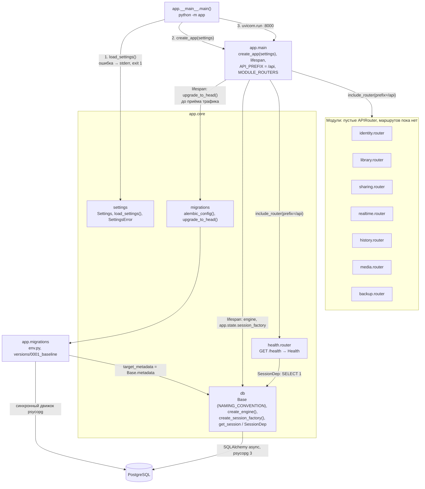
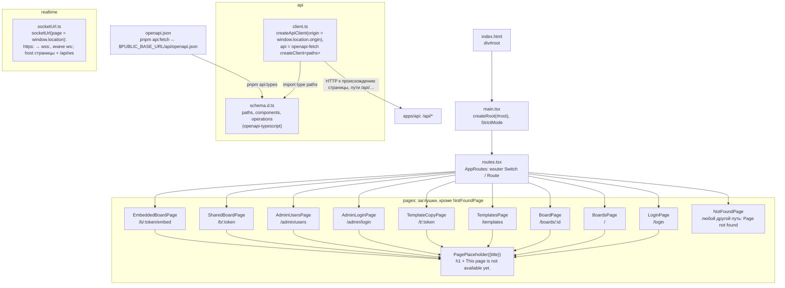

# Компоненты

Фактическое устройство кода приложения. Реализованы каркас сервера `apps/api` (T0.2) и каркас интерфейса `apps/web` (T0.3): таблица маршрутов со страницами-заглушками, типизированный HTTP-клиент и адрес WebSocket.

## Сервер `apps/api`

- Все маршруты под префиксом `/api`: `GET /api/health` (`{"status":"ok"}`), `GET /api/openapi.json` (OpenAPI 3.1), `GET /api/docs` (Swagger UI). Неизвестный путь `/api/*` — `404` JSON.
- `Settings` — семь обязательных переменных (`PUBLIC_BASE_URL`, `SECRET_KEY`, `DATABASE_URL`, `MEDIA_ROOT`, `ADMIN_EMAIL`, `ADMIN_PASSWORD`, `MAX_UPLOAD_BYTES`); пустое значение равно отсутствию. `MAX_UPLOAD_BYTES` > 0, `PUBLIC_BASE_URL` — `http://` или `https://`; свойство `secure_cookies` истинно только для `https://`.
- Миграции только вперёд: ревизия `0001` пустая, `downgrade()` бросает `NotImplementedError`.
- WebSocket `/api/ws` не реализован (появится в T4.1).

Актуально на: T0.2, 9bce527 (сервер не менялся в T0.3, сверено на 03e00fa). Требования: — (ARCHITECTURE.md, разделы 3, 5, 7, 11: модули сервера, OpenAPI, Alembic, обязательные переменные).

## Клиент `apps/web`

- Страницы пока не используют `api` и `socketUrl`: модули готовы для задач T1.1 и далее. В `schema.d.ts` сейчас один путь — `GET /api/health`.
- Адреса API и WebSocket строятся из адреса страницы (`window.location`), `localhost` в клиенте нет; тестовая среда Vitest (jsdom) открыта по `http://192.168.1.20:8080/`.
- Параметр `?object={id}` на `/b/{token}` отдельным маршрутом не выделен — его прочитает страница доски.
- Сборка: `pnpm build` = `tsc --noEmit && vite build` (плагин `@vitejs/plugin-react`), результат `dist` раздаёт сервис `web` (см. [deployment.md](deployment.md)).

Актуально на: T0.3, 03e00fa. Требования: — (ARCHITECTURE.md, разделы 3, 4, 10: SPA, таблица маршрутов, типы из OpenAPI, адреса из адреса страницы).
