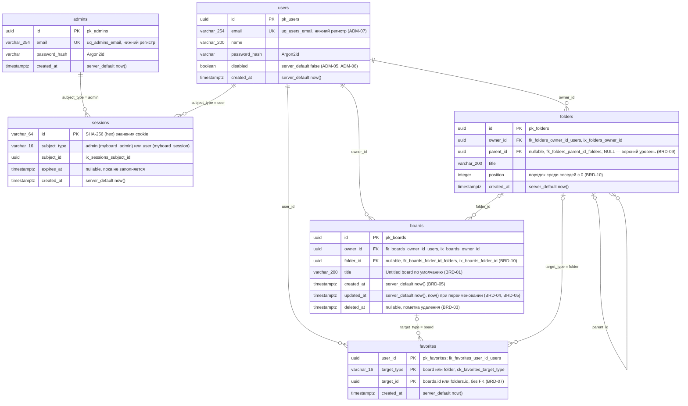

# Модель данных PostgreSQL

Фактические таблицы в `main`. Миграции Alembic только вперёд: `0001` (пустая), `0002_identity` (T1.1), `0003_library_boards` (T2.1), `0004_library_folders` (T2.2); вход пользователя досок (T1.2) новых таблиц не добавил. Модели SQLAlchemy — `app.identity.models` и `app.library.models`, базовый класс `app.core.db.Base` с соглашением об именах ограничений (`pk_%(table)s`, `uq_%(table)s_%(column)s`, `ix_%(column_label)s`, `fk_%(table)s_%(column)s_%(referred_table)s`).

- Связь `sessions → admins/users` полиморфная (`subject_type` + `subject_id`), внешнего ключа в базе нет.
- `sessions.id` — не само значение cookie, а его SHA-256: cookie содержит `secrets.token_urlsafe(32)`, утечка таблицы не даёт готовых cookie.
- Почта нормализуется до записи (`strip().lower()`), поэтому `uq_users_email` отклоняет повтор без учёта регистра; нарушение ограничения превращается в `EmailTakenError` → `409`.
- Первый администратор вставляется при старте, только если `admins` пуста (`ensure_first_admin`, из `ADMIN_EMAIL`/`ADMIN_PASSWORD`).
- Строку `sessions` с `subject_type = user` создаёт `POST /api/login`, удаляет `POST /api/logout`. Сессия пользователя в базе бессрочна (ACC-03): срок `Max-Age` 400 дней есть только у cookie и продлевается `GET /api/session`.
- Отключение пользователя (`disabled = true`) удаляет его строки из `sessions` в той же транзакции; кроме того, сессия отключённого пользователя не принимается (`active_user`).
- `boards.owner_id` ссылается на `users.id` без каскада; строки `users` не удаляются, поэтому доски отключённого пользователя остаются (ADM-05).
- Каждый запрос модуля `library` отбирает только живые доски владельца (`_owned`: `owner_id = :user AND deleted_at IS NULL`); чужая, удалённая и несуществующая доска неразличимы (`404`).
- Удаление доски (BRD-03) только ставит `deleted_at = now()`: строка остаётся, в списках и по `id` не видна. Переименование (BRD-02) ставит `updated_at = now()`; создание заполняет обе даты из базы.
- Папки (BRD-09) образуют дерево через `parent_id` без ограничения глубины; строки `folders` не удаляются (удаления папок нет). Новая папка получает `position` = последний у соседей + 1. Перенос (BRD-10) блокирует все папки владельца (`FOR UPDATE`), проверяет, что новый родитель не лежит внутри переносимой папки (иначе `409`, строки не меняются), и перенумеровывает соседей нового родителя с 0; порядок чтения — `position`, `created_at`, `id`.
- Перенос доски в папку меняет только `boards.folder_id` (`updated_at` прежний): это раскладка списка, а не правка доски. Папка должна принадлежать владельцу доски.
- Избранное (BRD-07) — строка `favorites` на пару «пользователь — цель»; повторное добавление игнорируется (`ON CONFLICT DO NOTHING`), снятие — `DELETE`. Внешнего ключа на цель нет (полиморфная связь): владение проверяет маршрут до записи, а строка избранного удалённой доски остаётся, но не видна, потому что флаг `favorite` проставляется только живым доскам из выборки `_owned`.
- Поиск (BRD-06) — `title ILIKE '%…%'` с экранированием `%`, `_`, `\` (по `boards` и по `folders` владельца, `text_search.contains`); фильтр (BRD-05) — `updated_at >= modified_since`; порядок (BRD-05) — `updated_at DESC`, `created_at DESC` или `lower(title) ASC`, при равенстве `id ASC`. «Недавние» (BRD-04) — первые 8 по `updated_at DESC`.
- Столбцов обложки и токенов ссылок в `boards`, столбцов `sessions.board_id` и `sessions.display_name` (сессия участника по ссылке), таблиц `board_updates`, `board_snapshots` пока нет — появятся в задачах T3.1, T4.* и далее.

Актуально на: T2.2, 6819f64. Требования: ADM-01, ADM-02, ADM-03, ADM-04, ADM-05, ADM-06, ADM-07, ACC-01, ACC-03, ACC-04, BRD-01, BRD-02, BRD-03, BRD-04, BRD-05, BRD-06, BRD-07, BRD-09, BRD-10.
