# Модель данных PostgreSQL

Фактические таблицы в `main`. Миграции Alembic только вперёд: `0001` (пустая), `0002_identity` (T1.1), `0003_library_boards` (T2.1), `0004_library_folders` (T2.2), `0005_sharing_link` (T3.1), `0006_realtime_board_updates` (T4.1), `0007_history_snapshots_events` (T4.3); вход пользователя досок (T1.2) новых таблиц не добавил. Модели SQLAlchemy — `app.identity.models`, `app.library.models`, `app.realtime.models` и `app.history.models`, базовый класс `app.core.db.Base` с соглашением об именах ограничений (`pk_%(table)s`, `uq_%(table)s_%(column)s`, `ix_%(column_label)s`, `fk_%(table)s_%(column)s_%(referred_table)s`).

```mermaid
erDiagram
  admins {
    uuid id PK "pk_admins"
    varchar_254 email UK "uq_admins_email, нижний регистр"
    varchar password_hash "Argon2id"
    timestamptz created_at "server_default now()"
  }
  users {
    uuid id PK "pk_users"
    varchar_254 email UK "uq_users_email, нижний регистр (ADM-07)"
    varchar_200 name
    varchar password_hash "Argon2id"
    boolean disabled "server_default false (ADM-05, ADM-06)"
    timestamptz created_at "server_default now()"
  }
  sessions {
    varchar_64 id PK "SHA-256 (hex) значения cookie"
    varchar_16 subject_type "admin (myboard_admin), user (myboard_session) или guest (myboard_board_{board_id.hex})"
    uuid subject_id "ix_sessions_subject_id; у guest — случайный uuid4"
    timestamptz expires_at "nullable, пока не заполняется"
    uuid board_id FK "nullable, fk_sessions_board_id_boards, ix_sessions_board_id; только у guest (SHR-02)"
    varchar_200 display_name "nullable; имя участника по ссылке (SHR-03)"
    timestamptz created_at "server_default now()"
  }
  folders {
    uuid id PK "pk_folders"
    uuid owner_id FK "fk_folders_owner_id_users, ix_folders_owner_id"
    uuid parent_id FK "nullable, fk_folders_parent_id_folders; NULL — верхний уровень (BRD-09)"
    varchar_200 title
    integer position "порядок среди соседей с 0 (BRD-10)"
    timestamptz created_at "server_default now()"
  }
  boards {
    uuid id PK "pk_boards"
    uuid owner_id FK "fk_boards_owner_id_users, ix_boards_owner_id"
    uuid folder_id FK "nullable, fk_boards_folder_id_folders, ix_boards_folder_id (BRD-10)"
    varchar_200 title "Untitled board по умолчанию (BRD-01)"
    timestamptz created_at "server_default now() (BRD-05)"
    timestamptz updated_at "server_default now(), now() при переименовании и принятой правке документа (BRD-04, BRD-05)"
    timestamptz deleted_at "nullable, пометка удаления (BRD-03)"
    varchar_64 share_token UK "nullable, uq_boards_share_token; NULL — ссылка ещё не выдана (SHR-01, SHR-06)"
    timestamptz share_token_revoked_at "nullable, момент последнего сброса ссылки (SHR-06)"
  }
  favorites {
    uuid user_id PK "pk_favorites; fk_favorites_user_id_users"
    varchar_16 target_type PK "board или folder, ck_favorites_target_type"
    uuid target_id PK "boards.id или folders.id, без FK (BRD-07)"
    timestamptz created_at "server_default now()"
  }
  board_updates {
    uuid board_id PK "pk_board_updates; fk_board_updates_board_id_boards"
    bigint seq PK "порядок применения на сервере с 1, без autoincrement"
    bytea update "обновление Yjs как пришло от клиента (COL-01)"
    timestamptz created_at "server_default now()"
  }
  board_snapshots {
    uuid id PK "pk_board_snapshots"
    uuid board_id FK "fk_board_snapshots_board_id_boards"
    bytea state "полное состояние документа Yjs (Doc.get_update), основа COL-07"
    timestamptz created_at "server_default now(); ix_board_snapshots_board_id_created_at (board_id, created_at)"
  }
  board_events {
    uuid id PK "pk_board_events"
    uuid board_id FK "fk_board_events_board_id_boards"
    varchar_200 actor_name "имя из сессии соединения, основа COL-08"
    varchar_64 event_type "EventType: objects_deleted"
    jsonb payload "objects_deleted: {object_ids: [...]}"
    timestamptz created_at "server_default now(); ix_board_events_board_id_created_at (board_id, created_at)"
  }
  admins ||--o{ sessions : "subject_type = admin"
  users ||--o{ sessions : "subject_type = user"
  boards |o--o{ sessions : "board_id, subject_type = guest"
  users ||--o{ boards : "owner_id"
  users ||--o{ folders : "owner_id"
  folders |o--o{ folders : "parent_id"
  folders |o--o{ boards : "folder_id"
  users ||--o{ favorites : "user_id"
  boards |o--o{ favorites : "target_type = board"
  folders |o--o{ favorites : "target_type = folder"
  boards ||--o{ board_updates : "board_id"
  boards ||--o{ board_snapshots : "board_id"
  boards ||--o{ board_events : "board_id"
```

- Связь `sessions → admins/users` полиморфная (`subject_type` + `subject_id`), внешнего ключа в базе нет.
- `sessions.id` — не само значение cookie, а его SHA-256: cookie содержит `secrets.token_urlsafe(32)`, утечка таблицы не даёт готовых cookie.
- Почта нормализуется до записи (`strip().lower()`), поэтому `uq_users_email` отклоняет повтор без учёта регистра; нарушение ограничения превращается в `EmailTakenError` → `409`.
- Первый администратор вставляется при старте, только если `admins` пуста (`ensure_first_admin`, из `ADMIN_EMAIL`/`ADMIN_PASSWORD`).
- Строку `sessions` с `subject_type = user` создаёт `POST /api/login`, удаляет `POST /api/logout`. Сессия пользователя в базе бессрочна (ACC-03): срок `Max-Age` 400 дней есть только у cookie и продлевается `GET /api/session`.
- Отключение пользователя (`disabled = true`) удаляет его строки из `sessions` в той же транзакции; кроме того, сессия отключённого пользователя не принимается (`active_user`).
- `boards.owner_id` ссылается на `users.id` без каскада; строки `users` не удаляются, поэтому доски отключённого пользователя остаются (ADM-05).
- Каждый запрос модуля `library` отбирает только живые доски владельца (`_owned`: `owner_id = :user AND deleted_at IS NULL`); чужая, удалённая и несуществующая доска неразличимы (`404`).
- Удаление доски (BRD-03) только ставит `deleted_at = now()`: строка остаётся, в списках и по `id` не видна. Переименование (BRD-02) ставит `updated_at = now()`; создание заполняет обе даты из базы.
- Папки (BRD-09) образуют дерево через `parent_id` без ограничения глубины; строки `folders` не удаляются (удаления папок нет). Новая папка получает `position` = последний у соседей + 1. Перенос (BRD-10) блокирует все папки владельца (`FOR UPDATE`), проверяет, что новый родитель не лежит внутри переносимой папки (иначе `409`, строки не меняются), и перенумеровывает соседей нового родителя с 0; порядок чтения — `position`, `created_at`, `id`.
- Перенос доски в папку меняет только `boards.folder_id` (`updated_at` прежний): это раскладка списка, а не правка доски. Папка должна принадлежать владельцу доски.
- Избранное (BRD-07) — строка `favorites` на пару «пользователь — цель»; повторное добавление игнорируется (`ON CONFLICT DO NOTHING`), снятие — `DELETE`. Внешнего ключа на цель нет (полиморфная связь): владение проверяет маршрут до записи, а строка избранного удалённой доски остаётся, но не видна, потому что флаг `favorite` проставляется только живым доскам из выборки `_owned`.
- Поиск (BRD-06) — `title ILIKE '%…%'` с экранированием `%`, `_`, `\` (по `boards` и по `folders` владельца, `text_search.contains`); фильтр (BRD-05) — `updated_at >= modified_since`; порядок (BRD-05) — `updated_at DESC`, `created_at DESC` или `lower(title) ASC`, при равенстве `id ASC`. «Недавние» (BRD-04) — первые 8 по `updated_at DESC`.
- Ссылка на доску (T3.1, модуль `sharing`): `boards.share_token` — `secrets.token_urlsafe(32)` (43 символа), не связан с `id`. Выдаётся при первом `GET /api/boards/{id}/share` запросом `UPDATE boards SET share_token = … WHERE id = … AND share_token IS NULL` — одновременные первые запросы получают один токен. Сброс (`reset_token`) перезаписывает `share_token` новым значением, ставит `share_token_revoked_at = now()` и в той же транзакции удаляет гостевые сессии доски (`delete_board_sessions`). Прежний токен в базе не остаётся, поэтому отозванный и несуществующий токен неразличимы.
- Доска по ссылке (`board_by_token`): `share_token = :token AND deleted_at IS NULL`; пустой токен или длиннее 64 символов в базу не идёт. Удалённая доска по ссылке не открывается.
- Сессия участника по ссылке — строка `sessions` с `subject_type = guest`, случайным `subject_id`, `board_id` и `display_name`; строк в `users` не создаётся (SHR-02). Принимается только на своей доске (`find_board_session`: `id = sha256(cookie) AND subject_type = guest AND board_id = :board`). Повторный `join` того же браузера удаляет прежнюю строку и создаёт новую. Гостевая сессия не проходит `require_user` — маршруты `library` ей недоступны.
- Внешний ключ `sessions.board_id → boards.id` без каскада: строки `boards` не удаляются (только `deleted_at`).
- Журнал документа доски (T4.1, модуль `realtime`): строка `board_updates` на каждое принятое обновление Yjs (`STEP2` или `UPDATE` клиента, кроме пустого `00 00`). `seq` назначает `BoardRoom` под своей блокировкой: при открытии доски — последний `seq` оставшегося журнала (после сжатия журнала нет — 0), далее +1 на обновление; номера после сжатия могут начаться заново, порядок определяет снимок + хвост журнала. Запись строки, записи ленты (если есть) и `UPDATE boards SET updated_at = now()` (`library.service.touch_board`) — одна транзакция (`store.append(JournalEntry)`), рассылка другим соединениям — только после неё. Повреждённое обновление в журнал не попадает.
- Документ доски на сервере собирается из последнего снимка и строк журнала после него (`store.load_journal`: `history.snapshots.latest_state` — последний по `created_at DESC, id DESC`, затем `board_updates` по `seq`), оба чтения — в одной транзакции `REPEATABLE READ`, чтобы параллельное сжатие их не разорвало.
- Сжатие журнала (T4.3, `store.compact`): одна транзакция — `INSERT board_snapshots (board_id, state)` + `DELETE board_updates WHERE board_id = … AND seq <= upto_seq`. Запускается `Hub`: раз в `SNAPSHOT_INTERVAL_SECONDS` (по умолчанию 300) для открытых досок, при уходе последнего соединения и при остановке процесса (`compact_all`); доска без правок с прошлого снимка (`_seq == _compacted_seq`) снимок не получает. Ошибка базы при сжатии журнал не трогает — сжатие повторится. Снимки не удаляются, пока доска существует (точки истории версий для T8.2).
- Лента действий (T4.3, `history.events`): строка `board_events` на каждое принятое обновление, добавившее ключи в корень `trash` документа (`event_type = objects_deleted`, `payload = {"object_ids": [...]}`); `actor_name` — имя соединения из сессии (`Peer.name`), а не поле `deletedBy` документа. Повторная загрузка доски из снимка/журнала записей не порождает. Других типов событий пока нет (T8.2).
- Присутствие (`awareness`) ни в `board_updates`, ни в `board_snapshots` не попадает.
- Внешние ключи `board_updates`, `board_snapshots`, `board_events` → `boards.id` без каскада.
- Столбцов обложки и ссылки-шаблона в `boards`, таблицы медиафайлов пока нет — появятся в задачах T7.*, T9.1 и далее.

Актуально на: T4.3, 7477309. Требования: COL-01, COL-07 и COL-08 (основа: снимки и лента), ADM-01, ADM-02, ADM-03, ADM-04, ADM-05, ADM-06, ADM-07, ACC-01, ACC-03, ACC-04, BRD-01, BRD-02, BRD-03, BRD-04, BRD-05, BRD-06, BRD-07, BRD-09, BRD-10, SHR-01, SHR-02, SHR-03, SHR-05, SHR-06.
