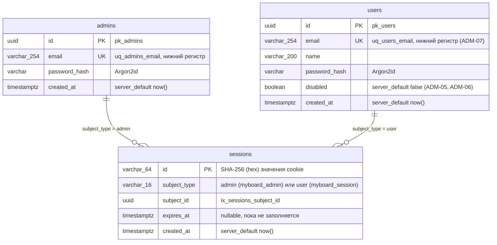

# Модель данных PostgreSQL

Фактические таблицы в `main`. Миграции Alembic только вперёд: `0001` (пустая), `0002_identity` (T1.1); вход пользователя досок (T1.2) новых таблиц не добавил. Модели SQLAlchemy — `app.identity.models`, базовый класс `app.core.db.Base` с соглашением об именах ограничений (`pk_%(table)s`, `uq_%(table)s_%(column)s`, `ix_%(column_label)s`).

- Связь `sessions → admins/users` полиморфная (`subject_type` + `subject_id`), внешнего ключа в базе нет.
- `sessions.id` — не само значение cookie, а его SHA-256: cookie содержит `secrets.token_urlsafe(32)`, утечка таблицы не даёт готовых cookie.
- Почта нормализуется до записи (`strip().lower()`), поэтому `uq_users_email` отклоняет повтор без учёта регистра; нарушение ограничения превращается в `EmailTakenError` → `409`.
- Первый администратор вставляется при старте, только если `admins` пуста (`ensure_first_admin`, из `ADMIN_EMAIL`/`ADMIN_PASSWORD`).
- Строку `sessions` с `subject_type = user` создаёт `POST /api/login`, удаляет `POST /api/logout`. Сессия пользователя в базе бессрочна (ACC-03): срок `Max-Age` 400 дней есть только у cookie и продлевается `GET /api/session`.
- Отключение пользователя (`disabled = true`) удаляет его строки из `sessions` в той же транзакции; кроме того, сессия отключённого пользователя не принимается (`active_user`).
- Столбцов `sessions.board_id` и `sessions.display_name` (сессия участника по ссылке) и таблиц досок пока нет — появятся в задачах T2.1, T3.1 и далее.

Актуально на: T1.2, f65eab9. Требования: ADM-01, ADM-02, ADM-03, ADM-04, ADM-05, ADM-06, ADM-07, ACC-01, ACC-03.
