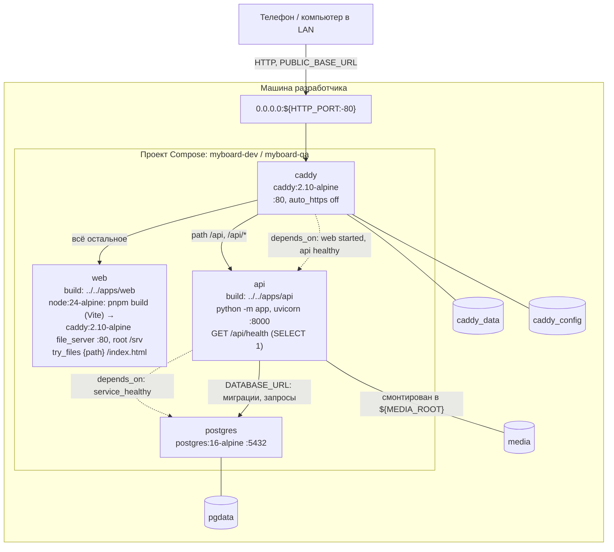
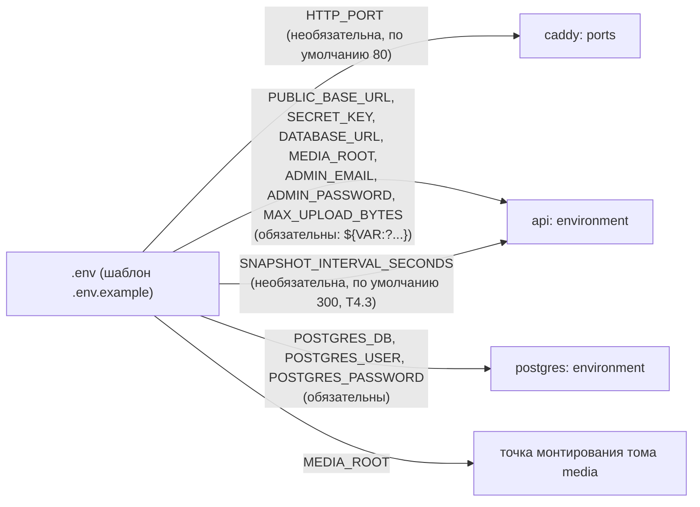
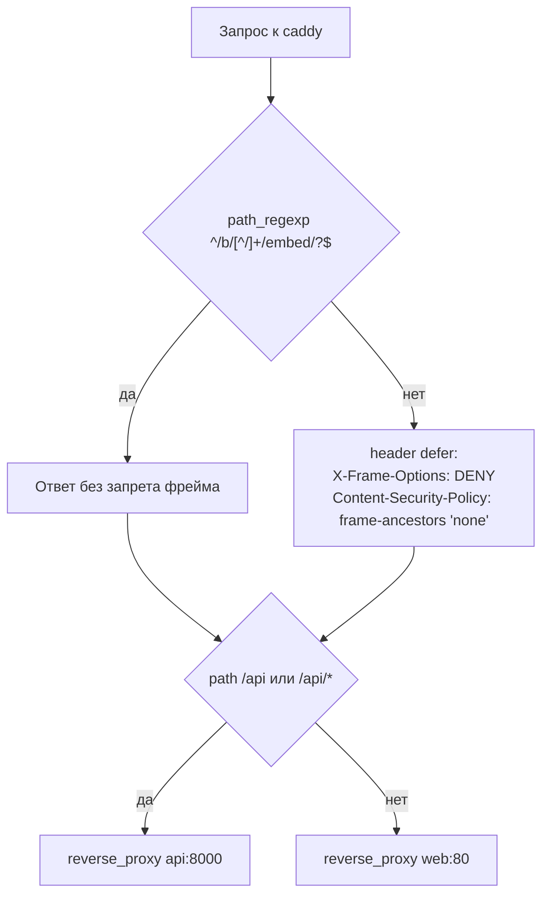

# Развёртывание

Фактическое устройство стека Docker Compose (`deploy/compose/compose.yaml`, `deploy/compose/Caddyfile`). Реализован только профиль локальной сети; публичный профиль с HTTPS (`SITE_DOMAIN`, порт 443) — задача T11.2.

## Сервисы, тома и порты (профиль LAN)

- `web` — образ из `apps/web`: стадия сборки `node:24-alpine` (`pnpm install --frozen-lockfile`, `pnpm build` = `tsc --noEmit && vite build`), стадия раздачи `caddy:2.10-alpine` со своим `apps/web/Caddyfile` отдаёт `dist` из `/srv`; любой путь без файла получает `index.html` (маршруты SPA).
- `api` — образ из `apps/api` (Python 3.12, зависимости из `uv.lock`). При старте проверяет обязательные переменные (без любой — выход с кодом 1) и применяет миграции Alembic в `postgres` до приёма трафика; `GET /api/health` выполняет `SELECT 1`. WebSocket `/api/ws` пока не реализован — маршрут Caddy для него уже есть.
- Порт на машине задаёт `HTTP_PORT`: 80 — стек QA (`-p myboard-qa`), 8080 — стек DEV (`-p myboard-dev`).
- Проверки готовности: `api` — `GET http://127.0.0.1:8000/api/health`, `postgres` — `pg_isready`.

## Переменные окружения

Без любой обязательной переменной `docker compose` отказывается запускать стек и называет переменную. `SITE_DOMAIN` в шаблоне закомментирована (T11.2).

## Заголовки против показа во фрейме

Заголовки ставятся на все ответы (статика и API), кроме `/b/{token}/embed` и `/b/{token}/embed/`.

Актуально на: T0.3, 03e00fa; переменная `SNAPSHOT_INTERVAL_SECONDS` — T4.3, 7477309. Требования: EMB-04 (часть: фрейм только для `/b/{token}/embed`); ARCHITECTURE.md, разделы 11–12 (сервисы, тома, обязательные переменные, профиль LAN).
