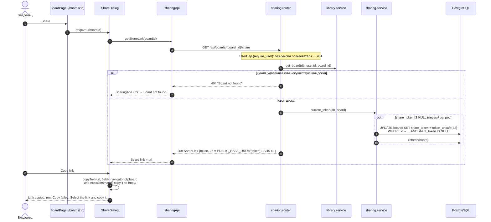

# Вход по ссылке

Владелец получает ссылку в диалоге Share (T3.1), участник без учётной записи открывает её и вводит имя. Маршруты — `app.sharing.router`, логика — `app.sharing.service`, сессии — `app.identity.sessions`. Клиент — `ShareDialog`, `SharedBoardPage`, `sharingApi.ts`.

## Ссылка владельца

## Вход участника

- Учётная запись не создаётся: строка `users` не появляется, в `GET /api/admin/users` участника нет. Гостевая cookie не открывает `/api/boards*`, `/api/folders*` (`401`) и другие доски.
- Отказ по ссылке один для всех недействующих токенов и не говорит, существует ли доска.
- Холста на `/b/:token` пока нет (T4.1, T5.*): после входа страница показывает название доски и имя участника.

Актуально на: T3.1, d4a2685. Требования: SHR-01, SHR-02, SHR-03, SHR-05.
