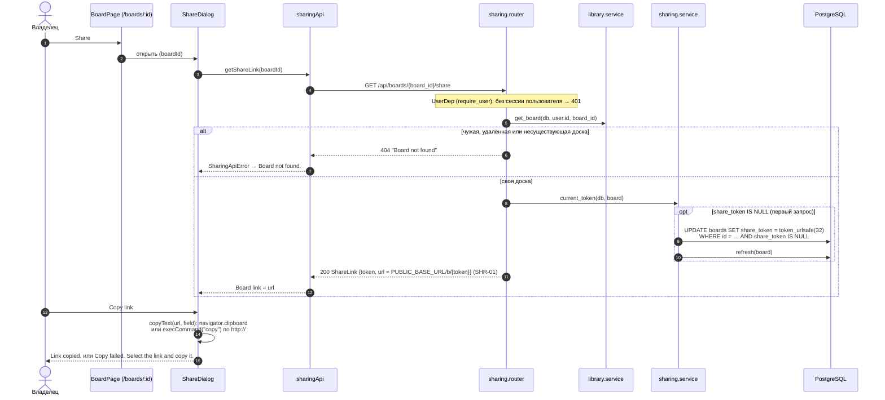
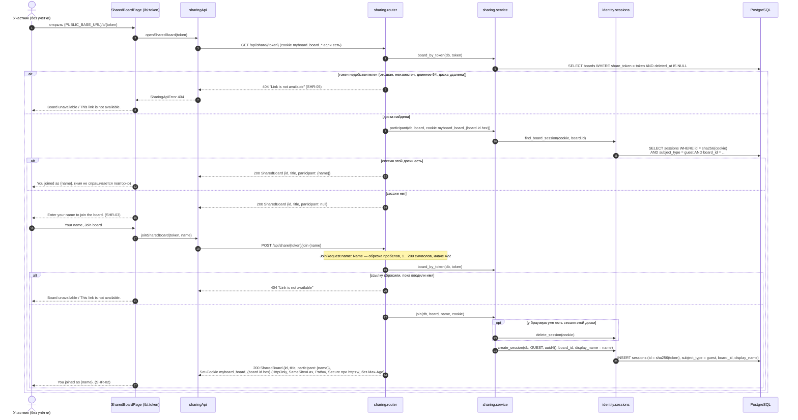
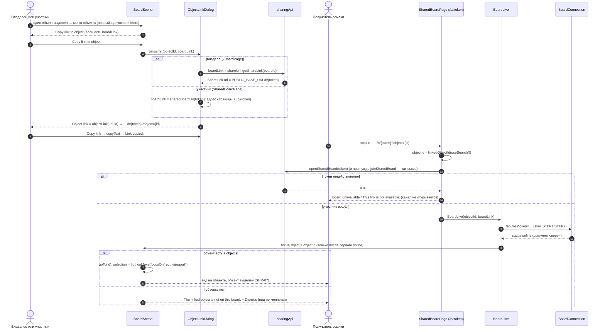

# Вход по ссылке

Владелец получает ссылку в диалоге Share (T3.1), участник без учётной записи открывает её и вводит имя. Маршруты — `app.sharing.router`, логика — `app.sharing.service`, сессии — `app.identity.sessions`. Клиент — `ShareDialog`, `SharedBoardPage`, `sharingApi.ts`; ссылка на объект (T5.5) — `ObjectLinkDialog`, `objectLink.ts`, `BoardLive`, `BoardScene`.

## Ссылка владельца

## Вход участника

## Ссылка на объект и переход по ней

- Учётная запись не создаётся: строка `users` не появляется, в `GET /api/admin/users` участника нет. Гостевая cookie не открывает `/api/boards*`, `/api/folders*` (`401`) и другие доски.
- Отказ по ссылке один для всех недействующих токенов и не говорит, существует ли доска.
- Ссылка на объект (SHR-07) — та же ссылка на доску с `?object={id}`: доступ даёт только токен, после сброса ссылки старая ссылка на объект получает тот же отказ. Переход выполняется один раз на id (`BoardScene`, `linkedRef`); вид запоминается как обычно (CVS-05). Сервер параметр `object` не читает.
- После входа страница показывает имя участника и открывает `BoardLive` по токену (канал — [sync.md](sync.md), присутствие — [presence.md](presence.md)). `SharedBoard.id` (uuid доски, T5.1) — ключ запомненного вида камеры участника в `localStorage` (CVS-05); доступа он не даёт: канал и файлы участник открывает только по токену и cookie доски.

Актуально на: T5.5, 044e3c2 (ссылка на объект; вход — T5.1, 34125f1). Требования: SHR-01, SHR-02, SHR-03, SHR-05, SHR-07; CVS-05 (поле `id`).
