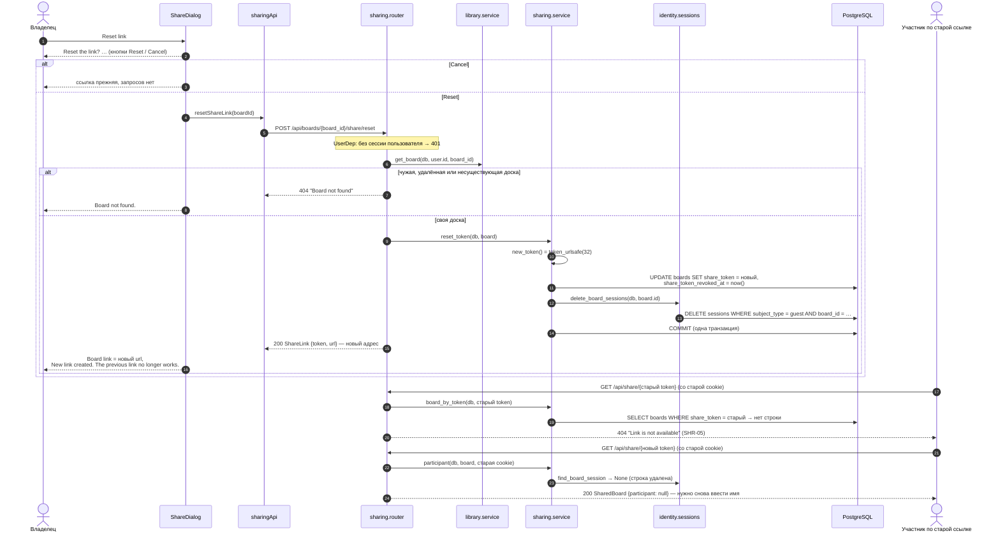

# Сброс ссылки

Владелец сбрасывает ссылку в диалоге Share (SHR-06). Подтверждение — внутри диалога, без `window.confirm`. Маршрут — `app.sharing.router.reset_share_link`, логика — `app.sharing.service.reset_token`.

- Сессия владельца (`subject_type = user`) и гостевые сессии других досок не затрагиваются.
- Открытая вкладка участника о сбросе не узнаёт сама: отказ — при следующем запросе (перезагрузка); мгновенное отключение появится с WebSocket (T4.1).

Актуально на: T3.1, d4a2685. Требования: SHR-05, SHR-06.
