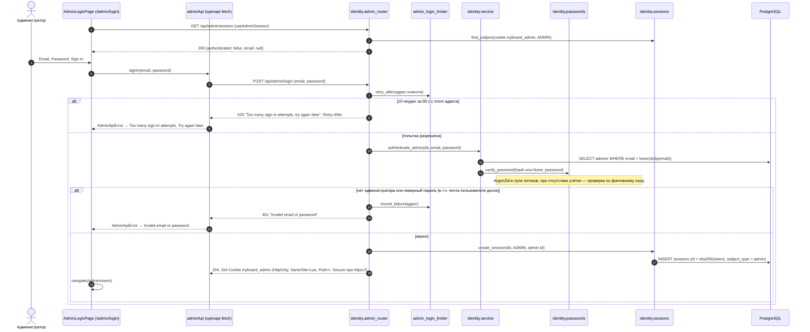
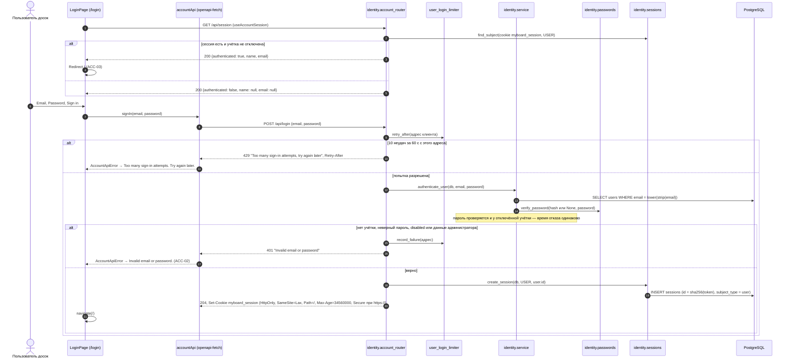
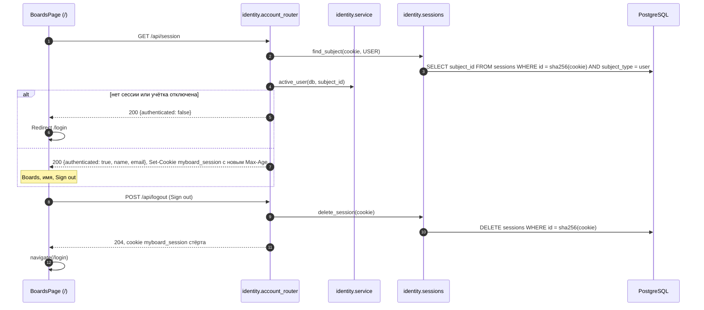

# Вход

Реализованы вход администратора в панель (T1.1) и вход пользователя досок на `/login` (T1.2). Маршруты панели — `identity.admin_router`, маршруты пользователя — `identity.account_router`; общие части (лимит, скупой отказ) — `identity.http`.

## Вход администратора

## Доступ к панели и выход

- `/admin` перенаправляет на `/admin/users`; `/admin/login` при действующей сессии перенаправляет туда же.
- Отказ одинаков для неизвестной почты, неверного пароля и учётки пользователя досок; формат почты при входе не проверяется.
- Адрес клиента для лимита — `request.client.host`, который Uvicorn берёт из `X-Forwarded-For` от Caddy (`proxy_headers=True`). Счётчики в памяти процесса.

## Вход пользователя досок

## Список досок и выход пользователя

- Отказ одинаков для неизвестной почты, неверного пароля, отключённой учётки и данных администратора; пустые или отсутствующие поля — `422`, интерфейс показывает тот же текст.
- Лимит входа пользователя досок считается отдельно от лимита входа в панель.
- Выход в одном браузере отзывает только его сессию; скопированная ранее cookie после выхода не действует.

Актуально на: T1.2, f65eab9. Требования: ADM-01, ACC-01, ACC-02, ACC-03.
