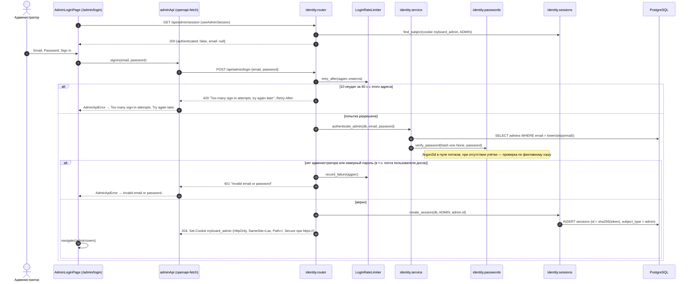
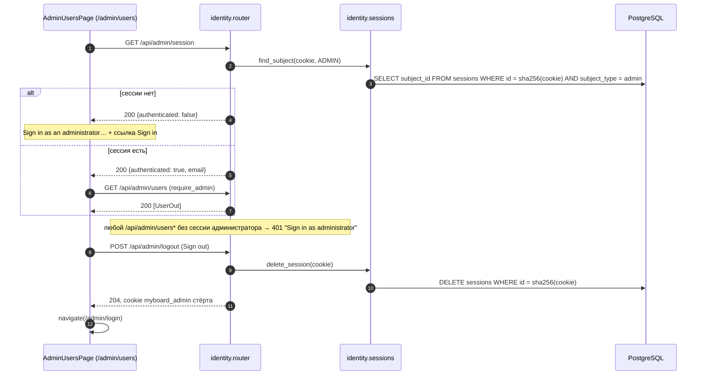

# Вход

Реализован вход администратора в панель (T1.1). Вход пользователя досок (`/login`, ACC-*) появится в T1.2.

## Вход администратора

## Доступ к панели и выход

- `/admin` перенаправляет на `/admin/users`; `/admin/login` при действующей сессии перенаправляет туда же.
- Отказ одинаков для неизвестной почты, неверного пароля и учётки пользователя досок; формат почты при входе не проверяется.
- Адрес клиента для лимита — `request.client.host`, который Uvicorn берёт из `X-Forwarded-For` от Caddy (`proxy_headers=True`). Счётчики в памяти процесса.

Актуально на: T1.1, 97556a8. Требования: ADM-01.
