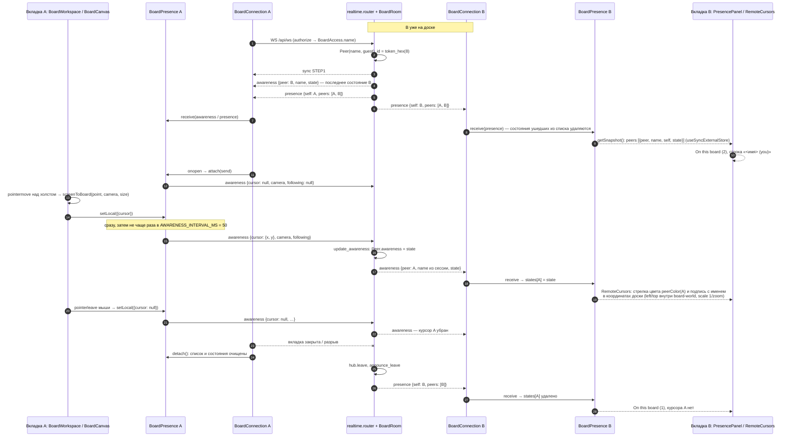
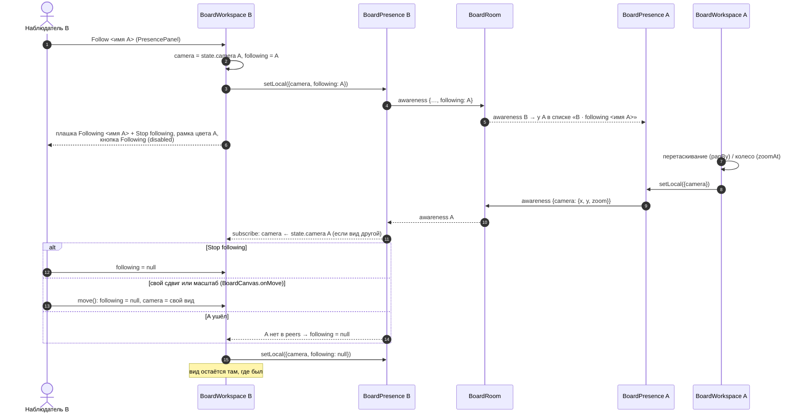

# Присутствие и курсоры

Кто сейчас на доске (COL-09), чужие курсоры с именами (COL-02) и их скрытие (COL-03), «смотреть глазами участника» (COL-04). Клиент — `BoardLive` → `BoardWorkspace` (`apps/web/src/collab`), холст `BoardCanvas` (`apps/web/src/canvas`), состояние — `BoardPresence` (`apps/web/src/realtime/boardPresence.ts`) поверх канала `BoardConnection`; сервер — `BoardRoom.announce`, `update_awareness`, `announce_leave` (`app.realtime.room`). Кадры — [ws-protocol.md](../ws-protocol.md).

## Вход, курсор, выход

## Слежение за участником (COL-04)

- Скрытие курсоров (COL-03) — кнопка `Hide cursors` / `Show cursors` в `PresencePanel`: локальный флаг `cursorsShown` вкладки, `RemoteCursors` не рисуется; в канал ничего не уходит.
- Свой курсор не рисуется (`self`); две вкладки одного человека — два соединения и две строки списка.
- Камера минимальная (`canvas/camera.ts`: `HOME`, `screenToBoard`, `boardToScreen`, `panBy`, `zoomAt`, масштаб `MIN_ZOOM = 0.1`…`MAX_ZOOM = 8`); курсор касанием передаётся, пока палец движется, и при отрыве не убирается (`null` — только для мыши).
- Присутствие не попадает в документ и `board_updates`; при сбросе ссылки (`Hub.close_participants`) и отзыве доступа (`_watch_access`) соединение закрывается `4403` и сразу пропадает из `presence` у остальных.

Актуально на: T4.2, 1e65608. Требования: COL-02, COL-03, COL-04, COL-09.
