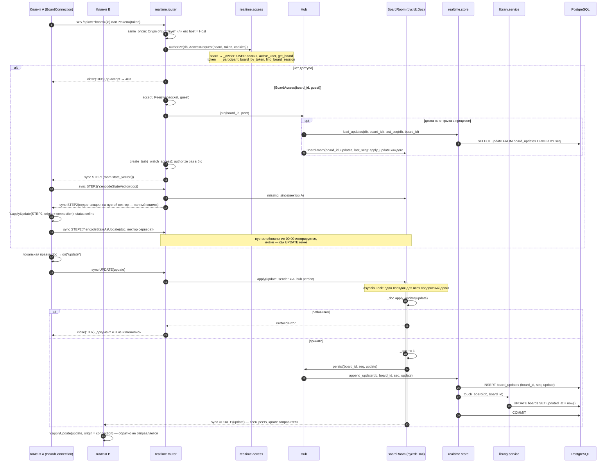
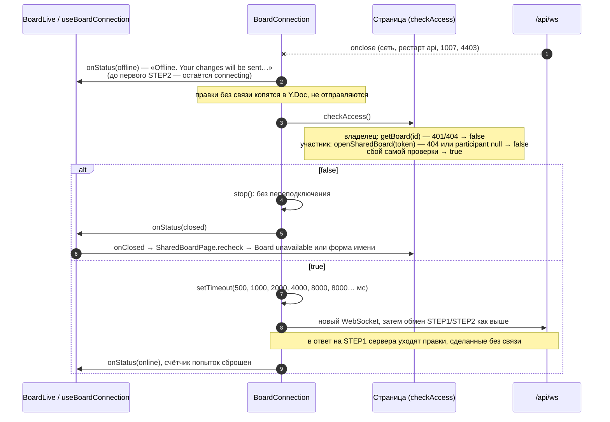

# Синхронизация документа

Совместная правка доски (COL-01) по WebSocket `/api/ws`. Клиент — `BoardConnection` (`apps/web/src/realtime/boardConnection.ts`) внутри `useBoardConnection` / `BoardLive` на `/boards/:id` и `/b/:token`; сервер — `app.realtime.router.board_socket`, `Hub`, `BoardRoom`, `store`. Формат кадров — [ws-protocol.md](../ws-protocol.md).

## Подключение и правка

## Разрыв и переподключение

- Документ сервера выгружается из памяти, когда уходит последнее соединение доски; следующий клиент получает состояние, собранное из `board_updates` (переживает и перезапуск `api`).
- Снимков (`board_snapshots`) и сжатия журнала пока нет (T4.3): серверная копия каждый раз собирается из всего журнала.
- Ошибка отправки одному соединению (`Peer.send`) не прерывает рассылку остальным; разрыв замечает цикл приёма этого соединения.

Актуально на: T4.1, 28e1b09. Требования: COL-01, SHR-04 (канал), BRD-04 (`updated_at` при правке).
