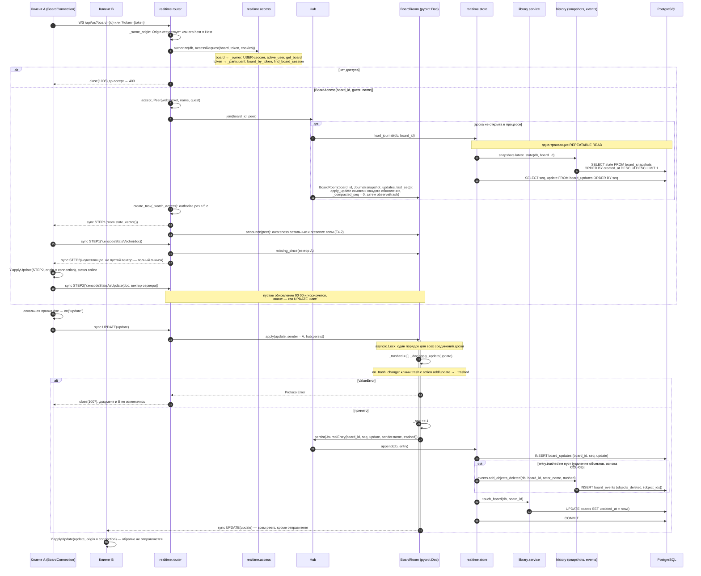
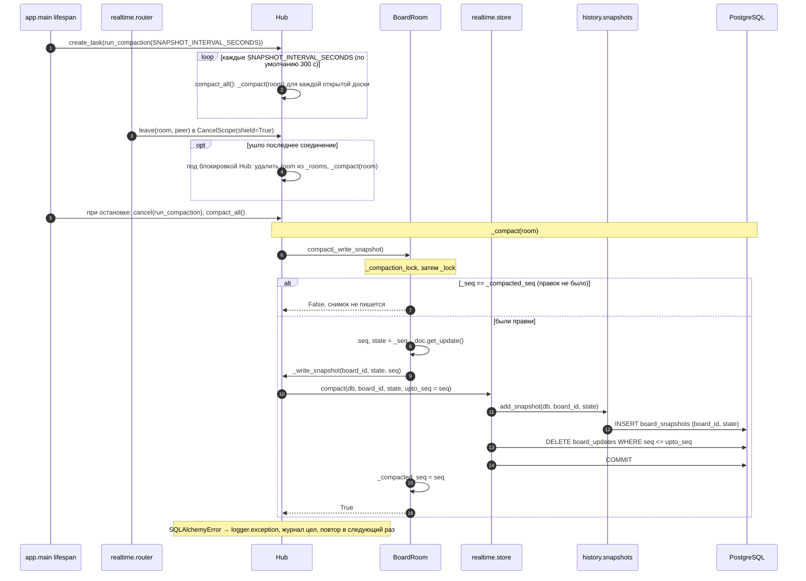
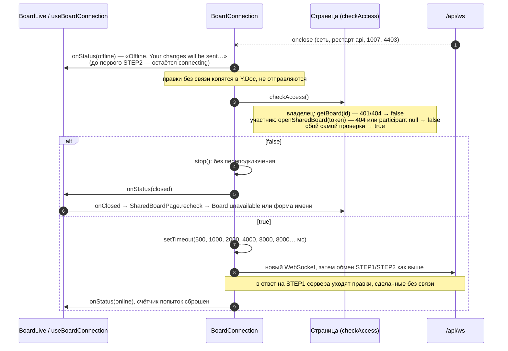

# Синхронизация документа

Совместная правка доски (COL-01) по WebSocket `/api/ws`. Клиент — `BoardConnection` (`apps/web/src/realtime/boardConnection.ts`) внутри `useBoardConnection` / `BoardLive` на `/boards/:id` и `/b/:token`; сервер — `app.realtime.router.board_socket`, `Hub`, `BoardRoom`, `store`, `app.history` (снимки и лента, T4.3). Формат кадров — [ws-protocol.md](../ws-protocol.md).

## Подключение и правка

## Сжатие журнала (снимок)

## Разрыв и переподключение

- Документ сервера выгружается из памяти, когда уходит последнее соединение доски (и журнал сжимается); следующий клиент получает состояние, собранное из последнего снимка и хвоста `board_updates`, — в `STEP2` на пустой вектор это полное состояние (переживает и перезапуск `api`: при остановке процесса открытые доски сжимаются).
- Блокировка `Hub` держится на время загрузки (`join`) и выгрузки со сжатием (`leave`): новое подключение к доске читает уже сжатый журнал.
- Снимки не удаляются; их просмотр и восстановление — T8.2.
- Вместе с `sync` по тому же каналу идут `awareness` и `presence` (T4.2): они не применяются к документу и не пишутся в журнал — сценарий [presence.md](presence.md).
- Ошибка отправки одному соединению (`Peer.send`) не прерывает рассылку остальным; разрыв замечает цикл приёма этого соединения.

Актуально на: T4.3, 7477309. Требования: COL-01, SHR-04 (канал), BRD-04 (`updated_at` при правке), COL-07 и COL-08 (основа: снимки, лента удалений).
