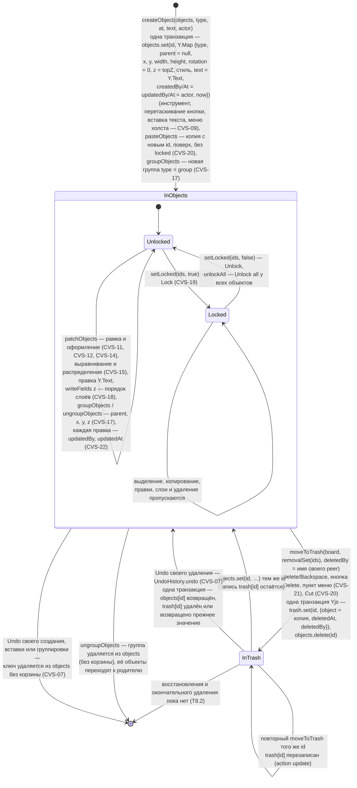
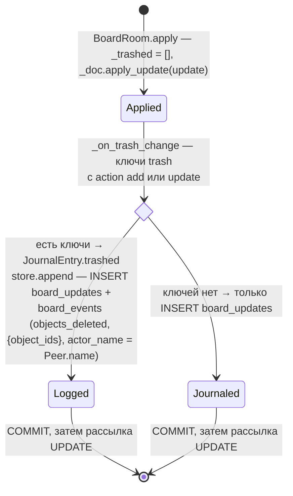

# Объект доски

Жизненный цикл объекта сцены в документе Yjs ([board-document.md](../board-document.md)): ключ корня `objects` → ключ корня `trash`. Клиент — `createObject`, `patchObjects`, `writeFields`, `objectMap` в `apps/web/src/scene/sceneObjects.ts`, `groupObjects`/`ungroupObjects` (`scene/groups.ts`), `setLocked`/`unlockAll` (`scene/lock.ts`), `pasteObjects` (`scene/clipboard.ts`) и `moveToTrash` в `apps/web/src/realtime/boardDocument.ts` (вызывает `SceneCommands.remove` из `scene/useSceneCommands.ts`); сервер — подписка `BoardRoom._on_trash_change` (`app.realtime.room`) и запись ленты `app.history.events`.

Что делает сервер, когда принятое обновление переносит объект в корзину:

- Перенос атомарен: у других участников объект не исчезает из `objects`, не появившись в `trash` (одна транзакция Yjs → одно обновление `sync`).
- В `trash[id].object` лежит копия: вложенный общий тип Yjs (например, `Y.Text`) копируется `clone()`, обычный JSON — как есть. Неизвестные id `moveToTrash` пропускает и не возвращает.
- `deletedBy` в документе — имя, которое указал клиент; лента берёт имя из сессии соединения, а не из документа.
- Подписка на `trash` ставится после загрузки снимка и журнала: повторное открытие доски записей ленты не порождает.
- Блокировка (T5.3, CVS-19) — поле `locked: true` самого объекта; объект внутри заблокированной группы считается заблокированным (`SceneObject.locked`) и разблокируется только вместе с группой. `removalSet` не удаляет заблокированные и группу, содержащую заблокированный объект; вместе с выбранным уносит вложенные объекты групп и группы, у которых не остаётся объектов.
- Вставка и дублирование (CVS-20) не переносят `locked`, автора и даты: копия — новый объект вставившего. Разгруппировка удаляет ключ группы из `objects` напрямую, в корзину и ленту это не попадает.
- Интерфейс (T5.2) создаёт объекты `createObject` (CVS-09), правит `patchObjects` и `Y.Text` и удаляет выделенное `moveToTrash` с именем своего участника из присутствия (CVS-21): клавиши Delete/Backspace вне полей ввода, кнопка `Delete` панели «Selection», пункт `Delete` / `Delete N objects` меню объекта. Удаление, сделанное другим участником, убирает объект из своего выделения. Просмотр корзины и восстановление — T8.2.

- Отмена и повтор (T5.4, CVS-07) — `Y.UndoManager` над `objects`, `trash`, `settings` только для своих транзакций: Undo возвращает объект в прежнее состояние любого перехода выше (правка, блокировка, слои, группы, создание, удаление), Redo повторяет. Отмена удаления на сервере не считается удалением (`_on_trash_change` реагирует только на `add`/`update`), поэтому запись `objects_deleted` в ленте остаётся. Правку поля, которое позже изменил другой участник, отмена не перезаписывает.

Актуально на: T5.4, e2d1150 (сервер — T4.3, 7477309). Требования: CVS-07 (отмена и повтор), CVS-09 (создание), CVS-11, CVS-12, CVS-14 (правки), CVS-15, CVS-17, CVS-18 (выравнивание, группы, слои), CVS-19 (блокировка), CVS-20 (вставка, вырезание), CVS-22 (автор и даты), CVS-21 (удаление в корзину), COL-08 (основа: корзина и лента удалений); ARCHITECTURE.md, разделы 6, 7.
