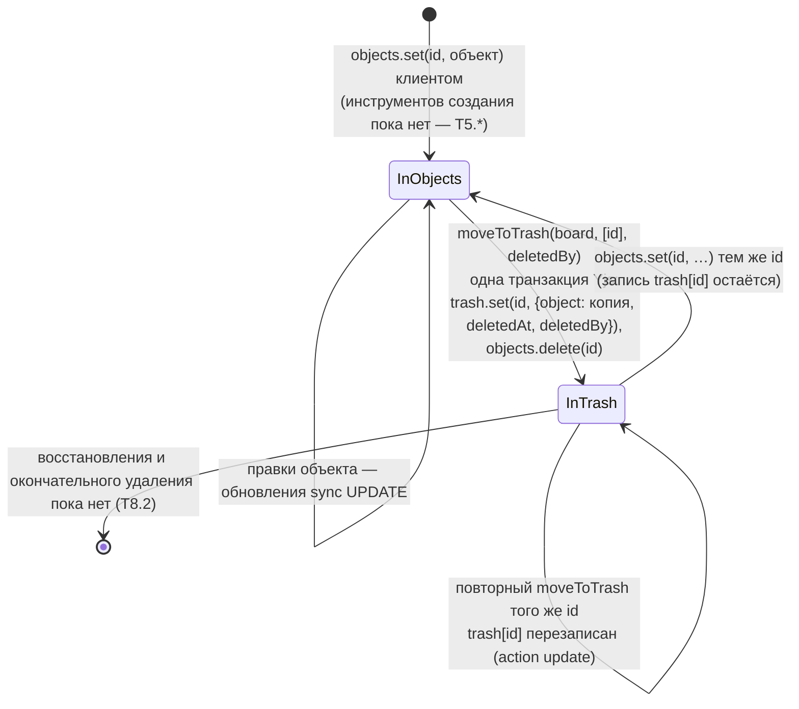
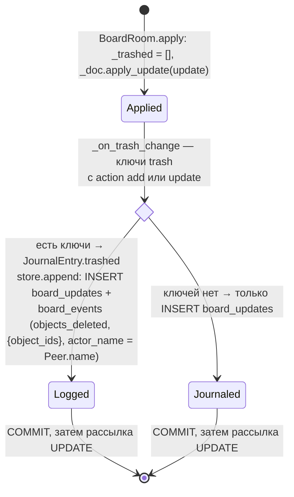

# Объект доски

Жизненный цикл объекта сцены в документе Yjs ([board-document.md](../board-document.md)): ключ корня `objects` → ключ корня `trash`. Клиент — `moveToTrash` в `apps/web/src/realtime/boardDocument.ts`; сервер — подписка `BoardRoom._on_trash_change` (`app.realtime.room`) и запись ленты `app.history.events`.

Что делает сервер, когда принятое обновление переносит объект в корзину:

- Перенос атомарен: у других участников объект не исчезает из `objects`, не появившись в `trash` (одна транзакция Yjs → одно обновление `sync`).
- В `trash[id].object` лежит копия: вложенный общий тип Yjs (например, `Y.Text`) копируется `clone()`, обычный JSON — как есть. Неизвестные id `moveToTrash` пропускает и не возвращает.
- `deletedBy` в документе — имя, которое указал клиент; лента берёт имя из сессии соединения, а не из документа.
- Подписка на `trash` ставится после загрузки снимка и журнала: повторное открытие доски записей ленты не порождает.
- Интерфейс пока не вызывает `moveToTrash` (кнопок удаления нет — T5.2/T5.3); просмотр корзины и восстановление — T8.2.

Актуально на: T4.3, 7477309. Требования: COL-08 (основа: корзина и лента удалений); ARCHITECTURE.md, разделы 6, 7.
