# Объект доски

Жизненный цикл объекта сцены в документе Yjs ([board-document.md](../board-document.md)): ключ корня `objects` → ключ корня `trash`. Клиент — `createObject`, `patchObjects`, `objectMap` в `apps/web/src/scene/sceneObjects.ts` и `moveToTrash` в `apps/web/src/realtime/boardDocument.ts` (вызывает `BoardScene.remove`); сервер — подписка `BoardRoom._on_trash_change` (`app.realtime.room`) и запись ленты `app.history.events`.

```mermaid
stateDiagram-v2
  [*] --> InObjects: createObject(objects, type, at, text)<br/>одна транзакция — objects.set(id, Y.Map {type, parent = null,<br/>x, y, width, height, rotation = 0, z = topZ, стиль, text = Y.Text})<br/>(инструмент, перетаскивание кнопки, вставка, меню холста — CVS-09)
  InObjects --> InObjects: patchObjects — рамка и оформление одной транзакцией<br/>(CVS-11, CVS-12, CVS-14); правка Y.Text (TextEditor);<br/>objectMap — запись JSON → Y.Map при первой правке
  InObjects --> InTrash: moveToTrash(board, ids, deletedBy = имя своего peer)<br/>Delete/Backspace, кнопка Delete, пункт меню (CVS-21)<br/>одна транзакция Yjs —<br/>trash.set(id, {object = копия, deletedAt, deletedBy}),<br/>objects.delete(id)
  InTrash --> InObjects: objects.set(id, …) тем же id<br/>(запись trash[id] остаётся)
  InTrash --> InTrash: повторный moveToTrash того же id<br/>trash[id] перезаписан (action update)
  InTrash --> [*]: восстановления и окончательного удаления пока нет (T8.2)
```

Что делает сервер, когда принятое обновление переносит объект в корзину:

- Перенос атомарен: у других участников объект не исчезает из `objects`, не появившись в `trash` (одна транзакция Yjs → одно обновление `sync`).
- В `trash[id].object` лежит копия: вложенный общий тип Yjs (например, `Y.Text`) копируется `clone()`, обычный JSON — как есть. Неизвестные id `moveToTrash` пропускает и не возвращает.
- `deletedBy` в документе — имя, которое указал клиент; лента берёт имя из сессии соединения, а не из документа.
- Подписка на `trash` ставится после загрузки снимка и журнала: повторное открытие доски записей ленты не порождает.
- Интерфейс (T5.2) создаёт объекты `createObject` (CVS-09), правит `patchObjects` и `Y.Text` и удаляет выделенное `moveToTrash` с именем своего участника из присутствия (CVS-21): клавиши Delete/Backspace вне полей ввода, кнопка `Delete` панели «Selection», пункт `Delete` / `Delete N objects` меню объекта. Удаление, сделанное другим участником, убирает объект из своего выделения. Просмотр корзины и восстановление — T8.2.

Актуально на: T5.2, b5342f6 (сервер — T4.3, 7477309). Требования: CVS-09 (создание), CVS-11, CVS-12, CVS-14 (правки), CVS-21 (удаление в корзину), COL-08 (основа: корзина и лента удалений); ARCHITECTURE.md, разделы 6, 7.
