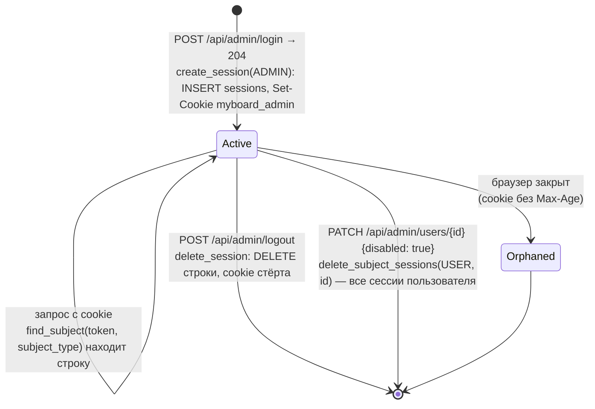

# Сессия

Строка таблицы `sessions` и cookie браузера. Реализованы сессии администратора (T1.1); сессии пользователя досок (`subject_type = user`) создаются входом из T1.2, но уже отзываются при отключении учётки. Сессии участника по ссылке — T3.1.

- Значение cookie — `secrets.token_urlsafe(32)`; в базе `id = sha256(token)`. Cookie: `HttpOnly`, `SameSite=Lax`, `Path=/`, `Secure` только при `PUBLIC_BASE_URL` на `https://`.
- Проверка учитывает `subject_type`: сессия пользователя досок не открывает панель администратора.
- `expires_at` сейчас всегда `NULL`, срок сессии не проверяется. Строка сессии, cookie которой браузер выбросил (`Orphaned`), остаётся в базе — очистки нет.

Актуально на: T1.1, 97556a8. Требования: ADM-01, ADM-05.
