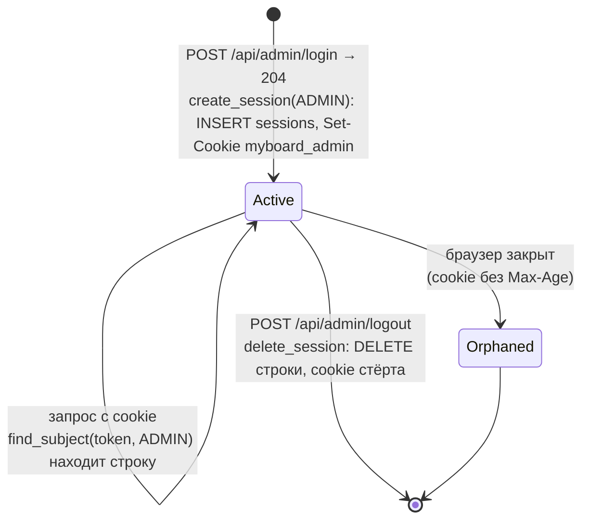
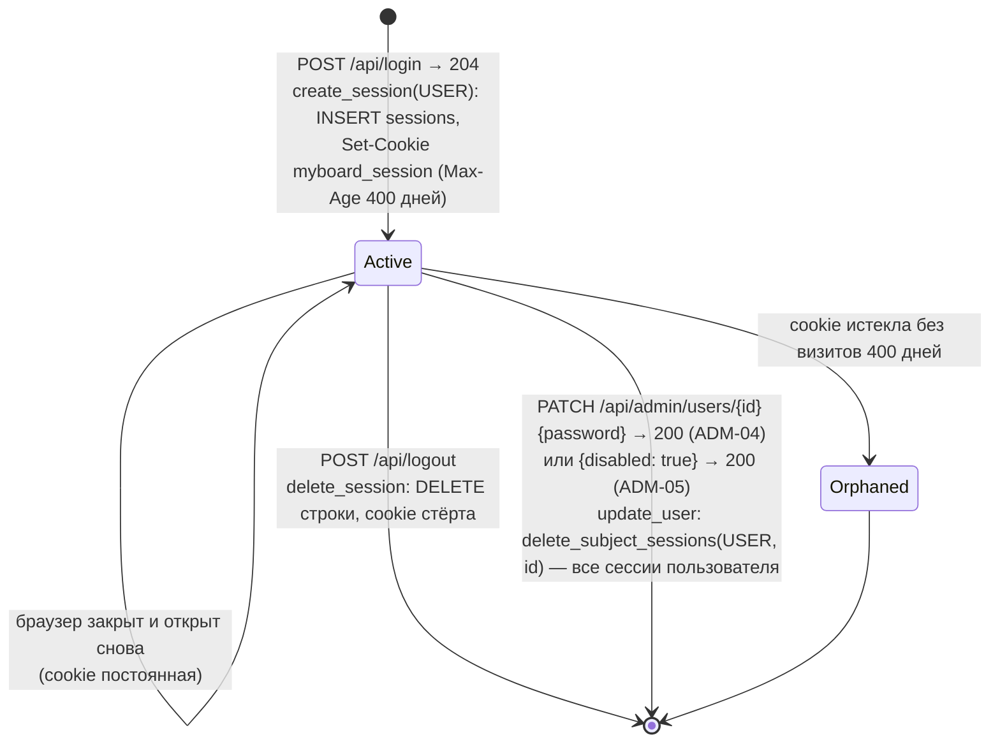

# Сессия

Строка таблицы `sessions` и cookie браузера. Реализованы сессии администратора (T1.1, cookie `myboard_admin`) и пользователя досок (T1.2, cookie `myboard_session`). Сессии участника по ссылке — T3.1.

## Сессия администратора

## Сессия пользователя досок

- Значение cookie — `secrets.token_urlsafe(32)`; в базе `id = sha256(token)`. Cookie: `HttpOnly`, `SameSite=Lax`, `Path=/`, `Secure` только при `PUBLIC_BASE_URL` на `https://`.
- Проверка учитывает `subject_type`: сессия пользователя досок не открывает панель администратора, cookie администратора не является сессией пользователя.
- Сессия пользователя принимается, только если учётка существует и не отключена (`active_user`).
- Любое поле `password` в `PATCH /api/admin/users/{id}` (даже прежнее значение) отзывает все сессии пользователя (ADM-04); смена только имени или почты их не трогает — выданная ранее сессия продолжает действовать и в `GET /api/session` видит новые данные.
- Отзыв идёт в той же транзакции, что и правка учётки, и до изменения полей: при отказе `409` (почта занята) не меняются ни пароль, ни сессии. Сессии других пользователей и администратора не затрагиваются.
- Отозванная сессия: `GET /api/session` → `200 {authenticated: false}`, маршруты с `require_user` → `401`. Открытая вкладка узнаёт об этом только при следующем обращении к API (опроса сессии нет, ACC-05 — T1.4).
- `expires_at` сейчас всегда `NULL`, срок сессии в базе не проверяется. Строка сессии, cookie которой браузер выбросил (`Orphaned`), остаётся в базе — очистки нет.

Актуально на: T1.3, b53b509. Требования: ADM-01, ADM-04, ADM-05, ACC-01, ACC-03.
