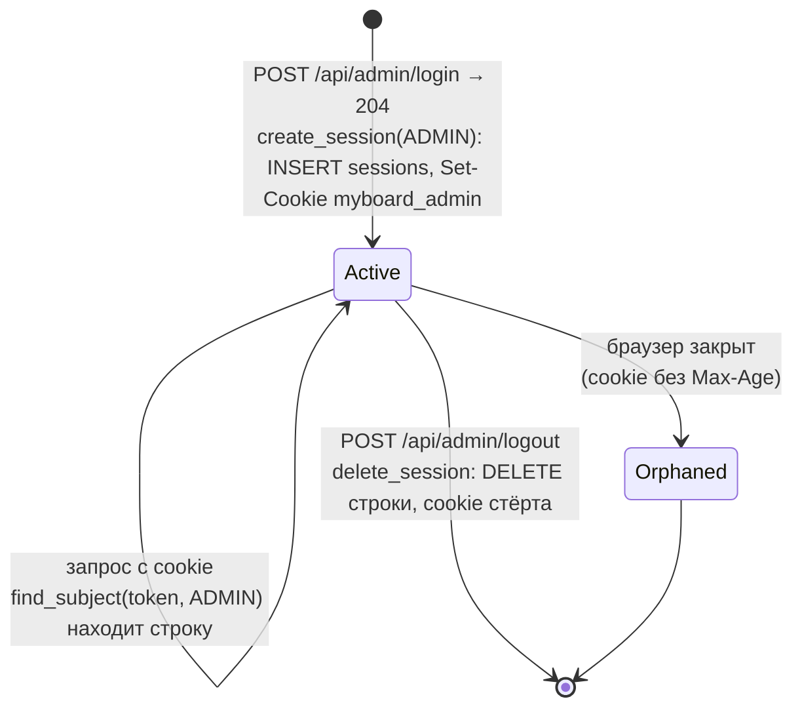
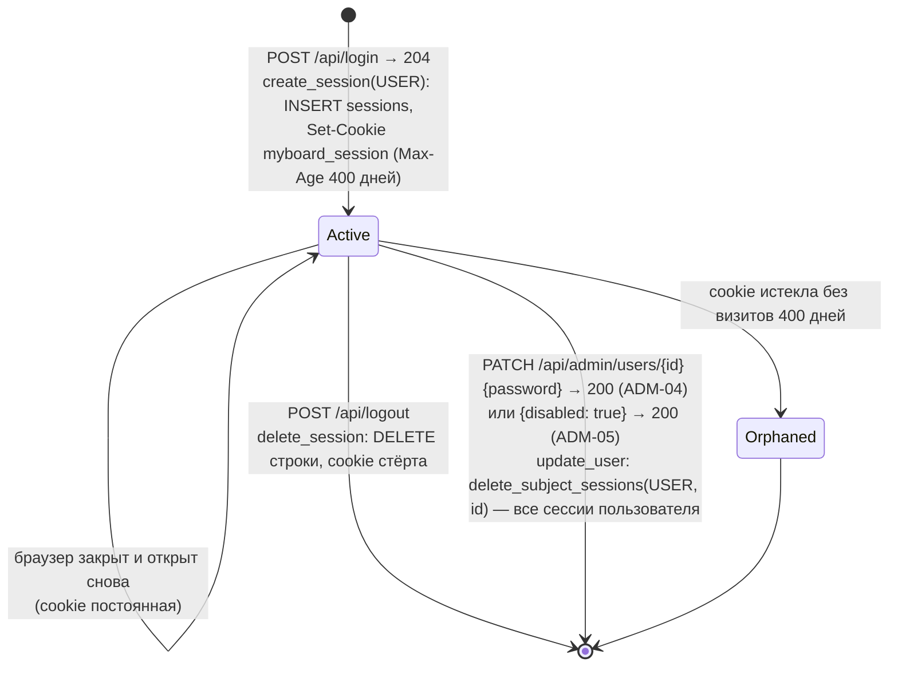
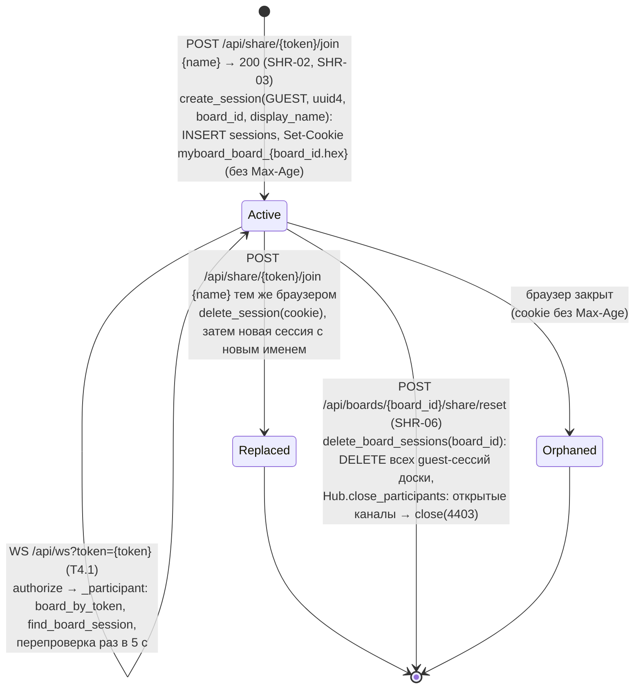
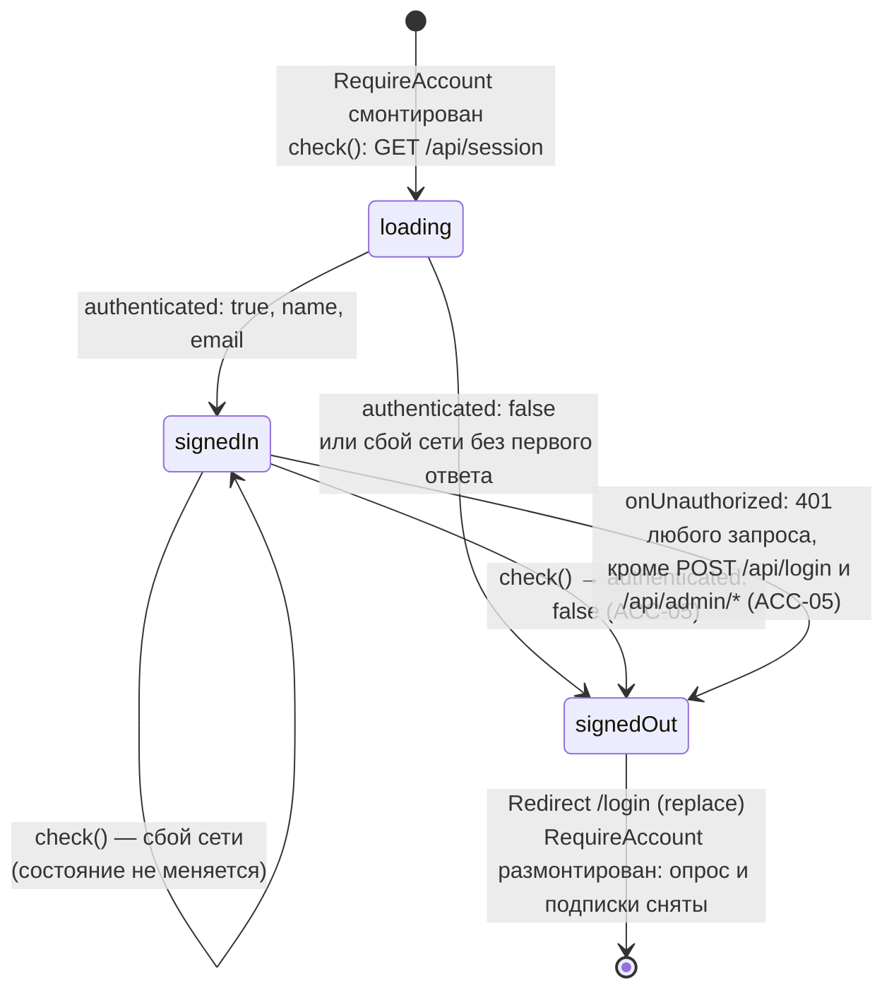

# Сессия

Строка таблицы `sessions` и cookie браузера. Реализованы сессии администратора (T1.1, cookie `myboard_admin`) и пользователя досок (T1.2, cookie `myboard_session`). Сессия участника по ссылке (T3.1) — строка `sessions` с `subject_type = guest` и cookie `myboard_board_{board_id.hex}` своей доски. Реакция открытой вкладки на отзыв сессии — T1.4.

## Сессия администратора

## Сессия пользователя досок

- Значение cookie — `secrets.token_urlsafe(32)`; в базе `id = sha256(token)`. Cookie: `HttpOnly`, `SameSite=Lax`, `Path=/`, `Secure` только при `PUBLIC_BASE_URL` на `https://`.
- Проверка учитывает `subject_type`: сессия пользователя досок не открывает панель администратора, cookie администратора не является сессией пользователя.
- Сессия пользователя принимается, только если учётка существует и не отключена (`active_user`).
- Любое поле `password` в `PATCH /api/admin/users/{id}` (даже прежнее значение) отзывает все сессии пользователя (ADM-04); смена только имени или почты их не трогает — выданная ранее сессия продолжает действовать и в `GET /api/session` видит новые данные.
- Отзыв идёт в той же транзакции, что и правка учётки, и до изменения полей: при отказе `409` (почта занята) не меняются ни пароль, ни сессии. Сессии других пользователей и администратора не затрагиваются.
- Отозванная сессия: `GET /api/session` → `200 {authenticated: false}`, маршруты с `require_user` → `401`. Открытая вкладка узнаёт об этом сама — опросом (см. «Вкладка пользователя досок», ACC-05).
- Канал документа `/api/ws?board={id}` (T4.1) принимает только `Active` сессию пользователя досок — владельца живой доски (`realtime.access._owner`). Открытый канал перепроверяет доступ раз в 5 с: выход, смена пароля, отключение учётки, удаление доски закрывают его кодом `4403` не позже чем через 5 с; сброс ссылки канал владельца не трогает.
- `expires_at` сейчас всегда `NULL`, срок сессии в базе не проверяется. Строка сессии, cookie которой браузер выбросил (`Orphaned`), остаётся в базе — очистки нет.

Актуально на: T1.3, b53b509; канал WebSocket — T4.1, 28e1b09. Требования: ADM-01, ADM-04, ADM-05, ACC-01, ACC-03, COL-01.

## Сессия участника по ссылке

Модуль `sharing` (`service.join`, `service.participant`, `service.reset_token`) поверх `identity.sessions` (`create_session`, `find_board_session`, `delete_session`, `delete_board_sessions`).

- Cookie: `HttpOnly`, `SameSite=Lax`, `Path=/`, `Secure` только при `https://`; без `Max-Age` — до закрытия браузера. У каждой доски своя cookie: участник может быть на нескольких досках под разными именами, сброс ссылки одной доски не задевает другие.
- Сессия принимается только на своей доске (`board_id` в условии `find_board_session`) и только по действующему токену: маршрут сначала ищет доску по токену (`board_by_token`), отозванный токен — `404 Link is not available` при любой cookie.
- После сброса прежняя cookie на новой ссылке даёт `participant: null` — участник снова вводит имя. Сессии владельца и гостей других досок сброс не трогает.
- Гостевая сессия не является сессией пользователя досок (`find_subject(…, USER)` её не находит): `/api/boards*`, `/api/folders*` → `401`, `/` и `/boards/:id` уводят на `/login`. Учётная запись не создаётся.
- Строка `Orphaned` остаётся в базе до сброса ссылки доски — отдельной очистки нет. Открытая вкладка участника узнаёт о сбросе сразу: канал `/api/ws` закрывается кодом `4403`, страница перепроверяет ссылку и показывает Board unavailable (T4.1).

Актуально на: T4.1, 28e1b09. Требования: SHR-02, SHR-03, SHR-04, SHR-05, SHR-06.

## Вкладка пользователя досок

Состояние `AccountSessionState` хука `useAccountSession({ watch: true })` в `RequireAccount` — обёртке страниц `/`, `/boards/:id`, `/templates` (T1.4). Cookie скрипту не видна (`HttpOnly`), поэтому вкладка сверяет сессию через `GET /api/session`.

`check()` вызывается:

- при монтировании;
- каждые `SESSION_CHECK_INTERVAL_MS` = 2000 мс по `setInterval`, пока `document.visibilityState === "visible"`; у скрытой вкладки таймер снят;
- сразу при `visibilitychange` в видимое состояние и при `focus` окна.

- Одновременно идёт не более одной проверки (`checking`). `signedOut` окончательный: запоздавший ответ `authenticated: true` не возвращает вкладку в `signedIn`.
- Сигнал `401` даёт `api/client.ts`: middleware `onResponse` рассылает запрос подписчикам `onUnauthorized`; `401` входа (`/api/login`) и панели (`/api/admin/*`) вкладку пользователя не выбивают.
- `LoginPage` вызывает `useAccountSession()` без `watch`: одна проверка при открытии, без опроса. `/t/:token`, `/b/:token`, `/b/:token/embed`, страницы панели — без `RequireAccount`.

Актуально на: T1.4, 6f59eaf. Требования: ACC-03, ACC-05, ADM-04, ADM-05.
