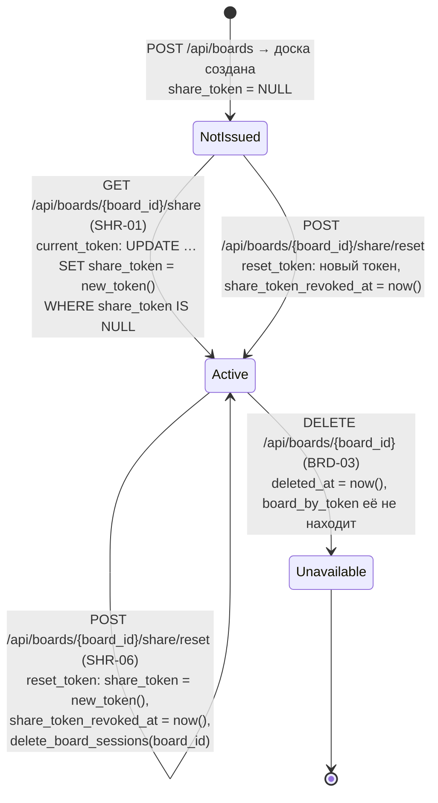
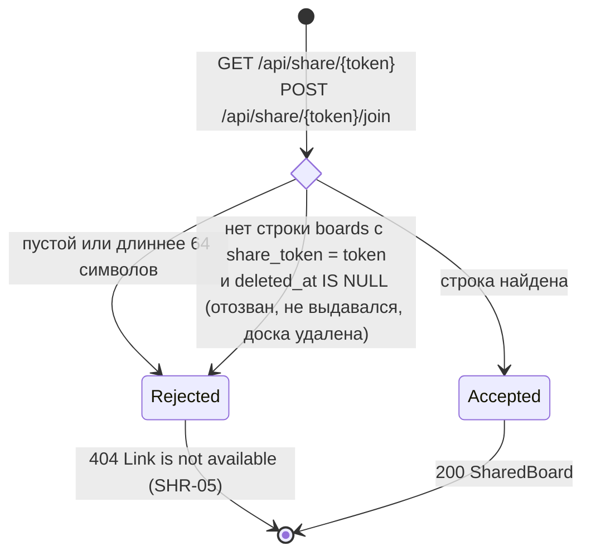

# Ссылка доски

Столбцы `boards.share_token` и `boards.share_token_revoked_at` (модуль `sharing`, `app.sharing.service`). У доски одна действующая ссылка `{PUBLIC_BASE_URL}/b/{share_token}`.

Прежний токен после сброса в базе не хранится — он перезаписан. Поэтому для `board_by_token` отозванный, никогда не выданный и токен удалённой доски одинаковы:

- Токен — `secrets.token_urlsafe(32)` (32 случайных байта, 43 символа), уникальный (`uq_boards_share_token`), не содержит id доски.
- Маршруты владельца (`/api/boards/{board_id}/share*`) требуют сессию пользователя досок (`401`) и отвечают `404 Board not found` на чужую, удалённую и несуществующую доску.
- `share_token_revoked_at` только фиксирует момент последнего сброса; в проверке токена не участвует.
- Сброс отзывает и гостевые сессии доски — см. [session.md](session.md), «Сессия участника по ссылке», — и сразу закрывает открытые каналы участников `/api/ws` кодом `4403` (`Hub.close_participants`, T4.1). Канал по `?token=` проходит ту же проверку `board_by_token`: отозванный токен — отказ рукопожатия `403`.

Актуально на: T4.1, 28e1b09. Требования: SHR-01, SHR-05, SHR-06.
