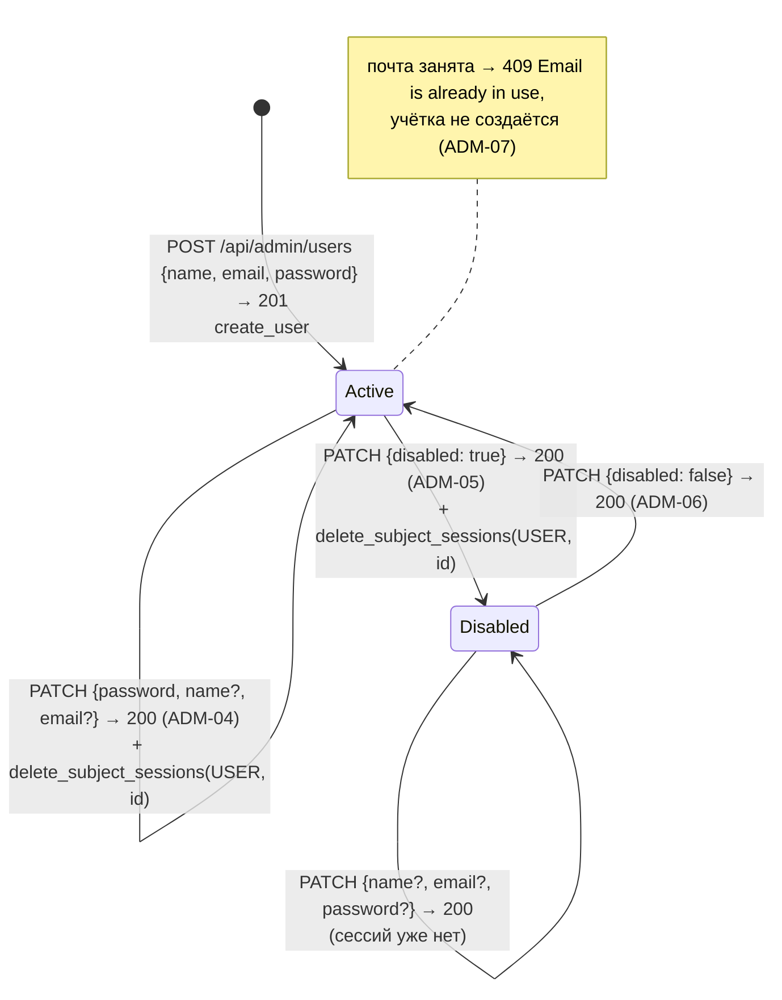

# Учётная запись пользователя досок

Строка таблицы `users`; меняет её только администратор через `/api/admin/users` (кнопки Create user, Edit, Disable, Enable на `/admin/users`).

- Удаления учётки нет. Отключение трогает только `users.disabled` и сессии пользователя. Отзыв сессий (пароль или `disabled: true`) идёт в одной транзакции с правкой: при `409` строка и сессии не меняются.
- Смена почты на занятую другой учёткой → `409`, строка не меняется; своя почта в другом регистре допускается. Неизвестный `id` → `404`, лишние поля → `422`.
- Новый пароль хэшируется Argon2id и заменяет `password_hash`. Пустое поле New password в форме Edit пароль не передаёт.
- Вход пользователя досок (`POST /api/login`, T1.2) разрешён только в состоянии `Active`: отключённая учётка получает тот же `401 Invalid email or password`, что неверный пароль (ADM-05, ACC-02); после включения прежний пароль снова работает (ADM-06). После смены пароля или почты вход проходит только с новыми данными (ADM-04). Смена пароля отзывает все выданные ранее сессии пользователя, смена только имени или почты — нет (подробнее — [session.md](session.md)).
- Сохранность досок отключённого пользователя — после появления таблицы `boards` (T2.1).

Актуально на: T1.3, b53b509. Требования: ADM-03, ADM-04, ADM-05, ADM-06, ADM-07, ACC-02.
