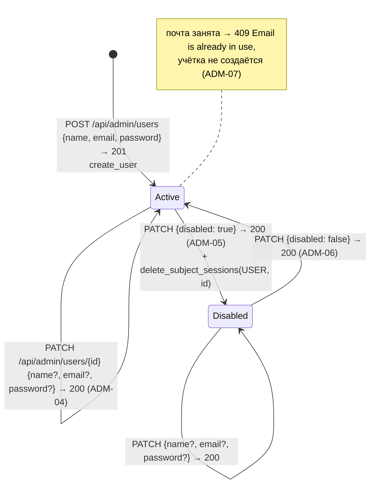

# Учётная запись пользователя досок

Строка таблицы `users`; меняет её только администратор через `/api/admin/users` (кнопки Create user, Edit, Disable, Enable на `/admin/users`).

- Удаления учётки нет. Отключение трогает только `users.disabled` и сессии пользователя.
- Смена почты на занятую другой учёткой → `409`, строка не меняется; своя почта в другом регистре допускается. Неизвестный `id` → `404`, лишние поля → `422`.
- Новый пароль хэшируется Argon2id и заменяет `password_hash`. Пустое поле New password в форме Edit пароль не передаёт.
- Отказ во входе отключённой учётке (ADM-05) и вход после включения (ADM-06) реализуются входом пользователя досок в T1.2; сохранность досок — после появления таблицы `boards` (T2.1).

Актуально на: T1.1, 97556a8. Требования: ADM-03, ADM-04, ADM-05, ADM-06, ADM-07.
