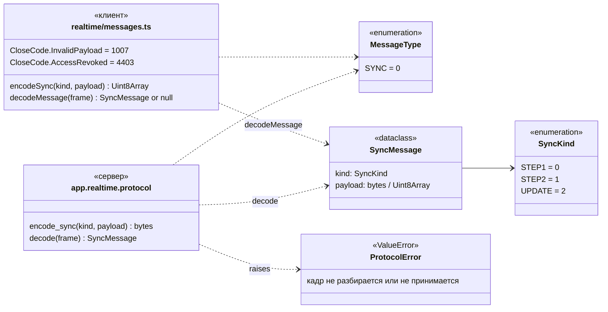
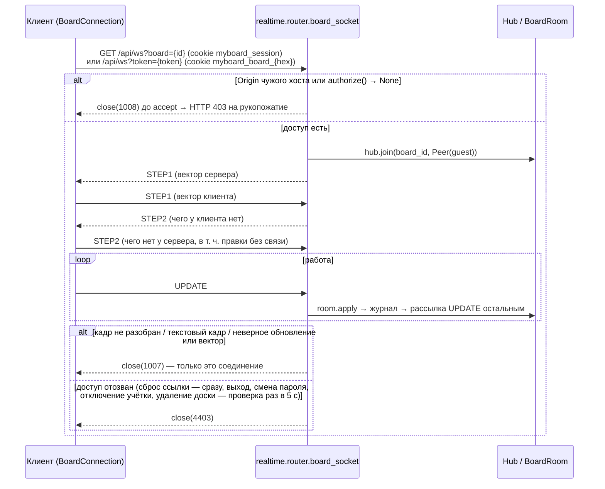

# Протокол WebSocket

Канал документа доски `/api/ws` (модуль `realtime`). Сервер — `app.realtime.protocol`, копия для клиента — `apps/web/src/realtime/messages.ts`; при изменении правятся обе. Реализован только тип `sync` (T4.1); `awareness` и `presence` появятся в T4.2.

## Сообщения



Кадр двоичный, в кодировке y-protocols (`lib0` на клиенте, свой `_Reader`/`_write_varuint` на сервере):

```text
varuint MessageType | varuint SyncKind | varuint длина | байты payload
```

| `SyncKind` | Кто шлёт | `payload` |
| --- | --- | --- |
| `STEP1` | сервер — сразу после `accept`; клиент — в `onopen` | вектор версии отправителя (`Doc.get_state()` / `Y.encodeStateVector`) |
| `STEP2` | ответ на `STEP1` | недостающие обновления (`Doc.get_update(sv)` / `Y.encodeStateAsUpdate(doc, sv)`); на пустой вектор `00` — полный снимок |
| `UPDATE` | клиент — каждая локальная правка; сервер — рассылка принятой правки остальным | обновление Yjs |

## Подключение и закрытие



| Код | Константа | Когда |
| --- | --- | --- |
| HTTP `403` | `POLICY_VIOLATION = 1008` до `accept` | нет права на доску: без параметра или оба `board` и `token`, без сессии, чужая/удалённая доска, сессия администратора, cookie участника на `?board=`, неизвестный или отозванный токен, cookie другой доски, `Origin` не совпадает с `Host` |
| `1007` | `INVALID_PAYLOAD` / `CloseCode.InvalidPayload` | `ProtocolError`: обрезанный кадр, varuint длиннее 10 байт, неизвестный тип или подтип, лишние байты, текстовый кадр, неприменимое обновление или вектор |
| `4403` | `ACCESS_REVOKED` / `CloseCode.AccessRevoked` | `Hub.close_participants` при сбросе ссылки; `_watch_access` раз в `ACCESS_CHECK_SECONDS = 5` (ошибка базы отзывом не считается) |

- Пустое обновление `00 00` (ответ `STEP2` клиента, у которого нет нового) не пишется в журнал и не рассылается (`EMPTY_UPDATE`).
- Клиент игнорирует кадры незнакомого типа и не отправляет обратно правки, пришедшие с сервера (`origin === this`).
- `awareness` и `presence` сервер пока не принимает: такой кадр — `1007`.

Актуально на: T4.1, 28e1b09. Требования: COL-01, SHR-04 (канал), SHR-06 (закрытие канала участника).
