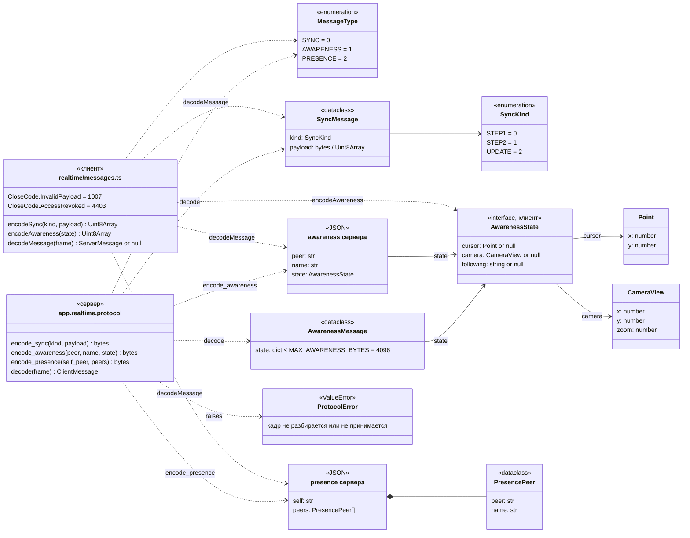
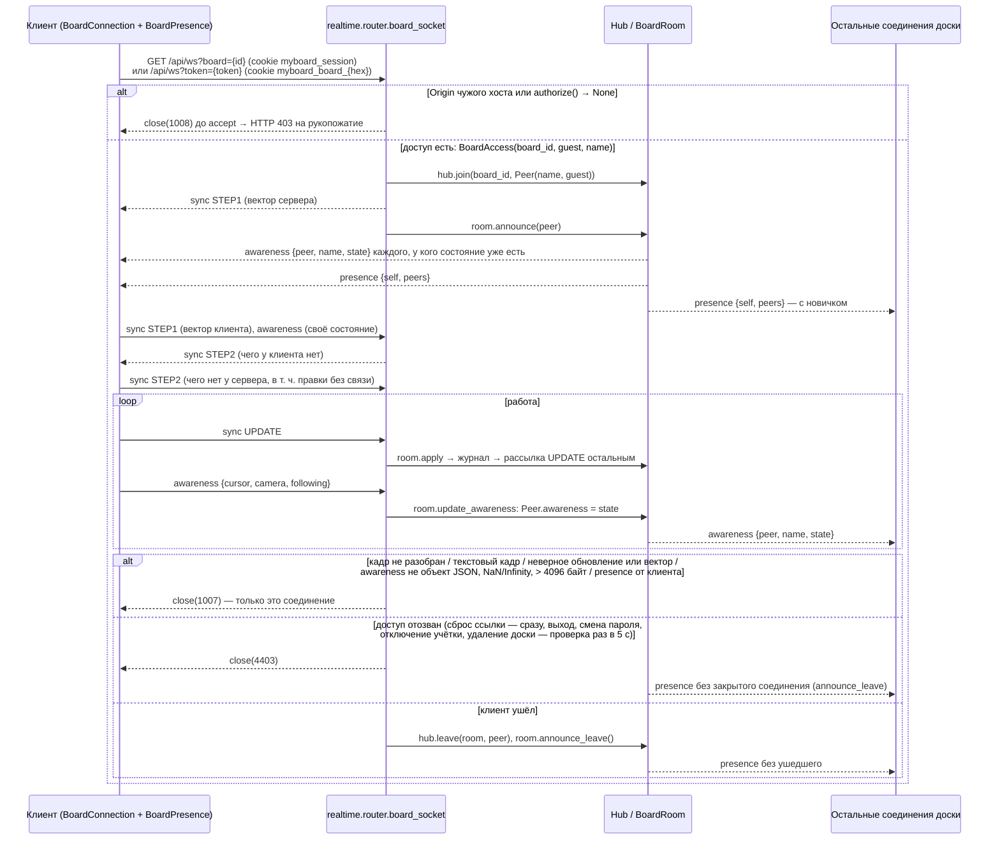

# Протокол WebSocket

Канал доски `/api/ws` (модуль `realtime`): документ (`sync`, T4.1) и присутствие (`awareness`, `presence`, T4.2). Сервер — `app.realtime.protocol`, копия для клиента — `apps/web/src/realtime/messages.ts`; при изменении правятся обе.

## Сообщения



Кадр двоичный, в кодировке y-protocols (`lib0` на клиенте, свой `_Reader`/`_write_varuint`/`_frame` на сервере):

```text
sync:      varuint 0 | varuint SyncKind | varuint длина | байты payload
awareness: varuint 1 | varuint длина | JSON в UTF-8
presence:  varuint 2 | varuint длина | JSON в UTF-8
```

| Сообщение | Кто шлёт | Содержимое |
| --- | --- | --- |
| `sync STEP1` | сервер — сразу после `accept`; клиент — в `onopen` | вектор версии отправителя (`Doc.get_state()` / `Y.encodeStateVector`) |
| `sync STEP2` | ответ на `STEP1` | недостающие обновления (`Doc.get_update(sv)` / `Y.encodeStateAsUpdate(doc, sv)`); на пустой вектор `00` — полный снимок |
| `sync UPDATE` | клиент — каждая локальная правка; сервер — рассылка принятой правки остальным | обновление Yjs |
| `awareness` клиента | `BoardPresence.flush`: при открытии канала и при изменении, не чаще раза в `AWARENESS_INTERVAL_MS = 50` | состояние целиком `{cursor, camera, following}` (координаты доски; `camera` — центр вида и масштаб). Сервер поля не интерпретирует |
| `awareness` сервера | `BoardRoom.update_awareness` — всем соединениям доски, кроме отправителя; `BoardRoom.announce` — новичку последние состояния остальных | `{peer, name, state}`; `peer` — случайный `Peer.id` (`token_hex(8)`), `name` — из сессии соединения (`BoardAccess.name`: имя учётки владельца или `display_name` участника), а не из присланного состояния |
| `presence` | только сервер (`BoardRoom._send_presence`) — всем соединениям доски при каждом входе и выходе | `{self, peers: [{peer, name}]}`: `self` — id получателя, `peers` — все открытые соединения доски по возрастанию id, включая получателя |

## Подключение и закрытие



| Код | Константа | Когда |
| --- | --- | --- |
| HTTP `403` | `POLICY_VIOLATION = 1008` до `accept` | нет права на доску: без параметра или оба `board` и `token`, без сессии, чужая/удалённая доска, сессия администратора, cookie участника на `?board=`, неизвестный или отозванный токен, cookie другой доски, `Origin` не совпадает с `Host` |
| `1007` | `INVALID_PAYLOAD` / `CloseCode.InvalidPayload` | `ProtocolError`: обрезанный кадр, varuint длиннее 10 байт, неизвестный тип (в т. ч. `presence` от клиента) или подтип, лишние байты, текстовый кадр, неприменимое обновление или вектор, состояние `awareness` не JSON-объект, с `NaN`/`Infinity` или больше `MAX_AWARENESS_BYTES` |
| `4403` | `ACCESS_REVOKED` / `CloseCode.AccessRevoked` | `Hub.close_participants` при сбросе ссылки; `_watch_access` раз в `ACCESS_CHECK_SECONDS = 5` (ошибка базы отзывом не считается). После закрытия остальные сразу получают новый `presence` |

- Пустое обновление `00 00` (ответ `STEP2` клиента, у которого нет нового) не пишется в журнал и не рассылается (`EMPTY_UPDATE`).
- Клиент игнорирует кадры незнакомого типа и неразобранный JSON (`decodeMessage` → `null`), не отправляет обратно правки, пришедшие с сервера (`origin === this`). Из чужого `state` берутся только поля правильной формы (`parseState`: `cursor` — конечные `x`, `y`; `camera` — плюс `zoom > 0`; `following` — строка).
- Присутствие живёт только в памяти: `Peer.awareness` на сервере и `BoardPresence` на клиенте. В документ, `board_updates` и рассылку `sync` оно не попадает и пропадает вместе с соединением; на разрыве клиент очищает список (`BoardPresence.detach`). Список и состояния — в пределах одной доски (`BoardRoom`).
- Сообщений T4.3 не добавила: `STEP2` на вектор клиента строится из серверной копии, собранной из последнего снимка `board_snapshots` и хвоста журнала, — поздний клиент после сжатия получает полное состояние. `awareness` не попадает и в снимки ([sequences/sync.md](sequences/sync.md)).
- Рассылки `apply`, `announce`, `announce_leave`, `update_awareness` идут под одной блокировкой `BoardRoom._lock` — один порядок кадров для всех соединений доски.

Актуально на: T4.3, 7477309. Требования: COL-01, COL-02, COL-03 (локально на клиенте, сообщений не требует), COL-04, COL-09, SHR-04 (канал), SHR-06 (закрытие канала участника).
